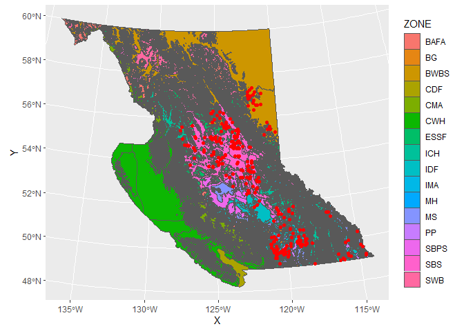
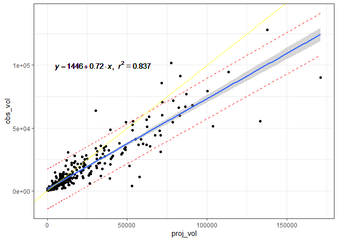
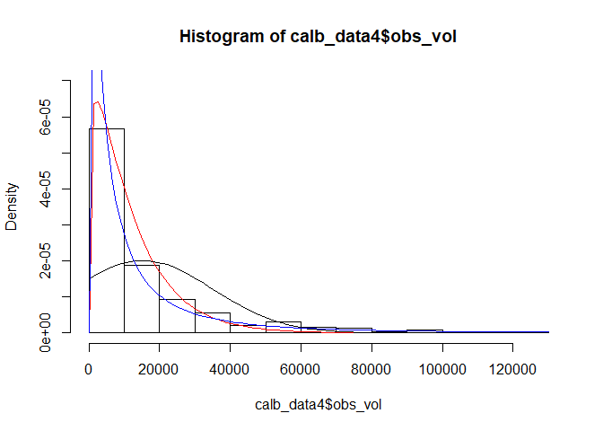
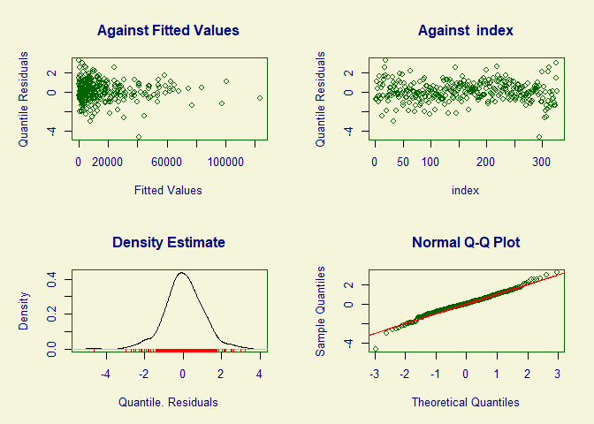

# Introduction

Estimates of merchantable tree volume yields are neccessaary inputs into timber supply forecasts and also serve as surrogates for many ecological processes of interest to decision makers (e.g., biomass, carbon, wildlife habitat). Often these estimates are forecasted through time using empirically derived growth and yield models. The input parameters for these models can vary from individual tree level to stand level attributes with a forest inventory providing the majority of this information. In particular, stand-level information is often used to paramterize these models given its availability across very large spatial scales. At a minimum the required stand-level parameters tend  to include: specific geographical or ecological zone, species compositions, a measure of site productivity (e.g., site index) and density (e.g., trees per ha or basal area per ha). However, projecting this information across very large scales or macroscales like the province of BC can be computationally restrictive; given the level of precision in the forest attributes could result in numerous projections. For example, in the [Vegetation Resources Inventory](https://www.for.gov.bc.ca/hfd/library/documents/bib106996.pdf) (VRI) of British Columbia (BC), forest attributes like site index are reported to the nearest decimeter, species compositions can contain up to 6 species with an estimate of the percentage for each species to the nearest 1%, stand height is reported to the nearest decimeter and basal area to the nearest squared meter. Thus, the combinations of these highly precise input parameters would result in millions of possible yield curves; that consume valuable computer resources to generate.

One approach to alleviate this problem is to aggregate the yield projections by yield curve groups or analysis units. Aggregation may be warranted, given the accuracy of the forest inventory attributes may not support such a high level of precision. The [current standard](https://www2.gov.bc.ca/assets/gov/environment/natural-resource-stewardship/nr-laws-policy/risc/vri_photo_interp_qa_proc_and_stds_v43_2019.pdf) for quality assurance of VRI variables varies by attribute with species compositions around 80% correspondance, height $\pm$ 3 - 4 m,  age $\pm$ 10 years, crown closure $\pm$ 10%, basal area $\pm$ 10-15 $m^2$, trees per ha (tph) $\pm$ 100 stems. However, aggregation may results in costs in terms of the loss of information; this may pose serious problems when simulating individal stand level decision making. 

Simulating forest management decision at very large scales involves a long list of assumptions; many based on volume yield estimates that contain error. Known sources of error arise from i.) the forest inventory (initial state of the forest); ii.) the projection of the forest inventory (i.e., the growth and yield model); iii.) the loss of information through aggregation into yield curves groups; and iv.) changes in forest policy. All of these sources of error propagate through time in complex ways which may provide barriers for confidentaly making forest management decisions. 

Recently, Robinson et al. (2016) recommended a simple way to incorpate error from volume yield projections into decision making through the use of observed scale data that is commonly collected following timber harvesting operations. They propose a calibration model approach to not only calibrate yields from a given growth and yield model but also to provide a measure of error around the volume yield estimate. Thus, the value of the Robinson et al. (2016) approach is two fold: 1.) a calibration of the yields for use when simulating the management decisions and 2.) the ability to simulate the error in volume yield. To further explain the later,  Robinson et al. (2016) estimated parameters of the error distribution (conditional mean and variance) for a given prediction. Once these parameters were estimated (conditional on the projected volume estimates), it was realtively simple to reconstruct the error distribution using these fitted parameters and then sample this error distribtuion many times (i.e., 10000). The result was a distribution of plausible yields that can be summarized into statistics like: the proportion or probability above a specifed threshold (i.e., AAC) or the estimation of a prediction interval. Note that the prediction interval is not the same as the confidence interval- the prediction interval takes into account two sources of uncertainty: i) the uncertainty of the distrbution of the process; and ii) the uncertainty of the location of the prediction within the distribution. The impetus of this work was a data set with both observed volume yield (as measured from scale data) and projected volume yields derived from linking a forest inventory with a growth and yield model. 

To apply this approach in the province of BC, this would require linking the harvest billing systemn (HBS) data which provides observed billable harvest volumes for a spatial unit known as a timber mark with VRI information before the date of harvest and then using this information as the neccessary inputs for a growth and yield model.The finest spatial resolution of the HBS is the timber mark which is a Unique identifer stamped or marked on the end of each log to associate the log with the specific authority to harvest and move timber. Timber marks can be assigned to many harvest units that may be not be sptailly contiguous nor contain a single harvest date.  Historically, linking HBS and VRI data has been difficult due to issues with the spatial accuracy in estimating the spatial boundaries of the timber marks. This has largely been due to spatialy estimating the net area being harvested (i.e., netting out roads, wildlife tree patches, etc). To achieve forest management objectives various amounts of forest may be retained in specific areas within a harvest unit and these areas can be difficult to determine for historical cutblocks. While a series of different data sources (i.e., Landsat, VRI) can be used, the accuracy of these products is unknown. These factors complicate linking the spatial boundary and its estimate of the net harvest area to the VRI.

In the following sections, the spatial (timber mark boundaries) and temporal (harvest date, inventory projection) data are linked to re-create the approach by Robinson et al. (2016). The specific objectives are: i) to calibrate the projected volume yields from an aggregated growth and yield model (hereafter termed the meta-model) with observed volume yields reported in the harvest billing system and ii) demonstrate the use of this model in landscape simulations for assessing error in yields. The proposed calibration model will be used in the caribou and landuse model (CLUS) to provide an indication of volume yield uncertainty which will help provide some context surrounding the quantification of impacts from conservation activities on harvest flows. 

# Methods


## Linking timber mark boundaries with VRI

In order to link the timber mark boundaries with the VRI which is needed to link to a growth and yield model the following steps were completed (see [code](https://github.com/bcgov/clus/blob/master/SQL/develop_vri2011table.sql))

1. Estimate the spatial boundaries of the timber marks

The spatial boundaries of the timber mark were estimated using two spatial data sets: i) [forest tenure cutblock polygons](https://catalogue.data.gov.bc.ca/dataset/forest-tenure-cutblock-polygons-fta-4-0) (aka. ftn_c_b_pl_polygon) and ii) [consolidated cutblock polygons](https://catalogue.data.gov.bc.ca/dataset/harvested-areas-of-bc-consolidated-cutblocks-) (a.k.a cns_cut_bl_polygon). Using the ftn_c_b_pl_polygon, all timber marks comprised of openings (harvest units) that had disturbance start dates between 2012-01-01 and 2016-12-31 were selected (i.e., removed possible timber marks with some openings not in this range). This selected subset of ftn_c_b_pl_polygon was then joined with cns_cut_bl_polygon by the harvest unit identifier (viz. opening_id) to link the timber mark to a spatial boundary. Lastly, timber marks were removed if they did not fully contain geometries reported by RESULTS (the most accurate form of reporting cutblock information). This ensured a more accurate net spatial description of the timber mark boundary (i.e., removed retention patches). The result of this process was 2390 unique timber marks; this list was then used to query the Harvest Billing System and retrieve the scaled or observed volumes.

2. Intersect the timber mark spatial boundaries of the s with the VRI

The resulting timber mark spatial boundaries were spatialy intersected with the 2011 VRI to provide the neccessary forest attribute information for linking to the growth and yield model. Only layer rank 1 forest attribution was used to link to the growth and yield model. However, as a result of this intersection, 1265 of the timber marks had a portion of their total area that faild to provide the neccessary VRI information (i.e., Tree Farm Licenses, private areas) for a forest yield projection. 

The following is the distribution of the percentage of the total timber mark area without the information:


```
## type is 0
```

```
## Warning: attribute variables are assumed to be spatially constant
## throughout all geometries
```


The majority (75%) of timber marks with harvest units that do not have the neccessary VRI attribution contribute less than 2.7% of the total area. After visually checking, two issues arose: i) the spatial boundaries of these timber marks extend into non-forested area as reported by the VRI; and ii) there wasn't enough information to parameterize the growth and yield model (outside the domain of the inputs, e.g., recently disturbed). In the case of the non-forested areas, these could be wrongfully classified given the accuracy and precision of the spatial boundaries determined in the VRI. From a practical view, these relatively small areas would result in little contribution to the total projected volume estimate. Thus, timber marks with less than or equal to 3 percent of their total area that contained inadequate VRI information were retained in the analysis.

Following the previous two steps, a total of 1672 timber marks remained in the analysis. 




## Growth and yield meta-model

Using the VRI (2018 vintage), each polygon was projected through time to 350 years using [Variable Density Yield projection](https://www2.gov.bc.ca/gov/content/industry/forestry/managing-our-forest-resources/forest-inventory/growth-and-yield-modelling/variable-density-yield-projection-vdyp) (VDYP). VDYP is a stand-level empirical growth and yield model that uses VRI attribution as inputs into its algortihums. The result of this process was a dataset with over 3.5 million yield curves which took 3 days to complete on a intel xeon, 3.5 ghz processor with 64 GB of RAM. Both the input (VRI information) and outputs (yields over time) were uploaded into a PostgreSQL database for further processing. Using the layer 1 rank information (the dominant layer),  yield curve groups (yc_grp) or anlaysis units were constructed using: BEC zone, site index (2 m interval), height class (5 classes as per the VRI) and crown closure class (5 classes as per the VRI). Each yc_grp was then aggregated by area weighting the respsective individual polygon level yield curves. The result was a provincial database of composite yield curves that directly link to the 2018 VRI through the layer 1 rank attribution described above.

## HBS volumes vs projected meta-model volumes

Each projected VRI polygon that intersected the timber mark boundary was summed to estimate the total projected volume for the timber mark.The HBS data was also aggregated by timber mark and matched with the projected volumes. The result is shown below that compares the projected volumes from the meta model with the observed volumes that were reported in the HBS.


```
## 
## Call:
## lm(formula = obs_vol ~ proj_vol, data = calb_data)
## 
## Residuals:
##    Min     1Q Median     3Q    Max 
## -53707  -3472  -1426   2830  64760 
## 
## Coefficients:
##              Estimate Std. Error t value Pr(>|t|)    
## (Intercept) 2.344e+03  3.135e+02   7.476 1.22e-13 ***
## proj_vol    8.447e-01  8.380e-03 100.804  < 2e-16 ***
## ---
## Signif. codes:  0 '***' 0.001 '**' 0.01 '*' 0.05 '.' 0.1 ' ' 1
## 
## Residual standard error: 9178 on 1679 degrees of freedom
## Multiple R-squared:  0.8582,	Adjusted R-squared:  0.8581 
## F-statistic: 1.016e+04 on 1 and 1679 DF,  p-value: < 2.2e-16
```

```
## Warning in predict.lm(model1, data = calb_data, interval = "prediction"): predictions on current data refer to _future_ responses
```




```r
 hist(calb_data2$proj_vol)
```




## Predictors of error

Following Robinson et al. (2016) the error between observed and projected volume yields was paritioned according to both forest quality class (high and low) and timber type (mature or mixedwood). This supported the conditional mean and variance to be modelled seperately for each of these factors. In the BC application, timber marks were subsetted by bclcs_level_2?, and further stand-level attribution was included to test hypotheses of which variables could be important predictors of error between observed and projected yield volumes.


```r
# get the bec zone that makes up the majority of the timber mark 
pv_timber_mrk<-merge(timbr_mrks, totalArea)
pv_timber_mrk[,wt:=as.numeric(area/totarea)]
pv_timber_mrk2<-pv_timber_mrk[, lapply(.SD, function(x) {wtd.mean (x, wt)}), by =timber_mrk, .SDcols=c("proj_height_1", "site_index", "crown_closure", "proj_age_1")]
setnames(pv_timber_mrk2, "timber_mrk" , "timber_mark" )
calb_data3<-merge(calb_data2, pv_timber_mrk2, by = "timber_mark")
calb_data3[, dif:=proj_vol-obs_vol]

mean(calb_data3$site_index)
```

```
## [1] 15.39729
```

```r
cor.test(calb_data3$proj_height_1, calb_data3$dif)
```

```
## 
## 	Pearson's product-moment correlation
## 
## data:  calb_data3$proj_height_1 and calb_data3$dif
## t = 5.1115, df = 1679, p-value = 3.561e-07
## alternative hypothesis: true correlation is not equal to 0
## 95 percent confidence interval:
##  0.07642845 0.17058702
## sample estimates:
##       cor 
## 0.1237864
```

```r
cor.test(calb_data3$site_index, calb_data3$dif)
```

```
## 
## 	Pearson's product-moment correlation
## 
## data:  calb_data3$site_index and calb_data3$dif
## t = 8.3773, df = 1679, p-value < 2.2e-16
## alternative hypothesis: true correlation is not equal to 0
## 95 percent confidence interval:
##  0.1539671 0.2457595
## sample estimates:
##       cor 
## 0.2003028
```

```r
cor.test(calb_data3$crown_closure, calb_data3$dif)
```

```
## 
## 	Pearson's product-moment correlation
## 
## data:  calb_data3$crown_closure and calb_data3$dif
## t = 7.6829, df = 1679, p-value = 2.627e-14
## alternative hypothesis: true correlation is not equal to 0
## 95 percent confidence interval:
##  0.1376910 0.2300712
## sample estimates:
##       cor 
## 0.1842881
```

```r
cor.test(calb_data3$proj_age_1, calb_data3$dif)
```

```
## 
## 	Pearson's product-moment correlation
## 
## data:  calb_data3$proj_age_1 and calb_data3$dif
## t = -0.11446, df = 1679, p-value = 0.9089
## alternative hypothesis: true correlation is not equal to 0
## 95 percent confidence interval:
##  -0.05059688  0.04502284
## sample estimates:
##          cor 
## -0.002793406
```


## The calibration model

In Robinson et al. (2016) a gamma model was used to model both the conditional mean and conditional variance of the error distribution. Gamma models are advantageous because they are highly flexible in the positive domain and allow the modeling of heteroskedastic variance. Below we try a few gamma models by incorporating site index and crown closure , however I prefer to soley use site index because crown closure may change with time which makes its harder to interpret. This area could be greatly improved to try other distributions (e.g., Exponential, Beta) or other parameters (e.g., variance of stand attributes, number of years projected?, dead pine?, BEC zones?, etc) 


```r
library(gamlss)
```

```
## Loading required package: splines
```

```
## Loading required package: gamlss.data
```

```
## 
## Attaching package: 'gamlss.data'
```

```
## The following object is masked from 'package:datasets':
## 
##     sleep
```

```
## Loading required package: gamlss.dist
```

```
## Loading required package: MASS
```

```
## 
## Attaching package: 'MASS'
```

```
## The following objects are masked from 'package:raster':
## 
##     area, select
```

```
## The following object is masked from 'package:dplyr':
## 
##     select
```

```
## Loading required package: nlme
```

```
## 
## Attaching package: 'nlme'
```

```
## The following object is masked from 'package:raster':
## 
##     getData
```

```
## The following object is masked from 'package:dplyr':
## 
##     collapse
```

```
## Loading required package: parallel
```

```
## Registered S3 method overwritten by 'gamlss':
##   method   from
##   print.ri bit
```

```
##  **********   GAMLSS Version 5.1-5  **********
```

```
## For more on GAMLSS look at http://www.gamlss.org/
```

```
## Type gamlssNews() to see new features/changes/bug fixes.
```

```r
library(cowplot)
```

```
## 
## ********************************************************
```

```
## Note: As of version 1.0.0, cowplot does not change the
```

```
##   default ggplot2 theme anymore. To recover the previous
```

```
##   behavior, execute:
##   theme_set(theme_cowplot())
```

```
## ********************************************************
```

```r
calb_data4<-calb_data3[proj_vol > 1,]

## Fit and compare some models
test.0 <- gamlss(obs_vol ~ proj_vol,
                 sigma.formula = ~ 1,
                 sigma.link = "log",
                 family = GA(),
                 data = calb_data4)
```

```
## GAMLSS-RS iteration 1: Global Deviance = 35492.18 
## GAMLSS-RS iteration 2: Global Deviance = 35492.18
```

```r
test.1 <- gamlss(obs_vol ~ log(proj_vol),
                 sigma.formula = ~ 1,
                 sigma.link = "log",
                 family = GA(),
                 data = calb_data4)
```

```
## GAMLSS-RS iteration 1: Global Deviance = 36065.87 
## GAMLSS-RS iteration 2: Global Deviance = 36065.87
```

```r
test.2 <- gamlss(obs_vol ~ proj_vol,
                 sigma.formula = ~ proj_vol,
                 sigma.link = "log",
                 family = GA(),
                 data = calb_data4)
```

```
## GAMLSS-RS iteration 1: Global Deviance = 35492.12 
## GAMLSS-RS iteration 2: Global Deviance = 35492.08 
## GAMLSS-RS iteration 3: Global Deviance = 35492.06 
## GAMLSS-RS iteration 4: Global Deviance = 35492.05 
## GAMLSS-RS iteration 5: Global Deviance = 35492.05 
## GAMLSS-RS iteration 6: Global Deviance = 35492.05
```

```r
test.3 <- gamlss(obs_vol ~ log(proj_vol),
                 sigma.formula = ~ log(proj_vol),
                 sigma.link = "log",
                 family = GA(),
                 data = calb_data4)
```

```
## GAMLSS-RS iteration 1: Global Deviance = 35412.05 
## GAMLSS-RS iteration 2: Global Deviance = 34205.65 
## GAMLSS-RS iteration 3: Global Deviance = 33742.07 
## GAMLSS-RS iteration 4: Global Deviance = 33675.39 
## GAMLSS-RS iteration 5: Global Deviance = 33671.07 
## GAMLSS-RS iteration 6: Global Deviance = 33670.88 
## GAMLSS-RS iteration 7: Global Deviance = 33670.87 
## GAMLSS-RS iteration 8: Global Deviance = 33670.87
```

```r
test.4 <- gamlss(obs_vol ~ log(proj_vol),
                 sigma.formula = ~ proj_vol,
                 sigma.link = "log",
                 family = GA(),
                 data = calb_data4)
```

```
## GAMLSS-RS iteration 1: Global Deviance = 36008.79 
## GAMLSS-RS iteration 2: Global Deviance = 35969.99 
## GAMLSS-RS iteration 3: Global Deviance = 35960.72 
## GAMLSS-RS iteration 4: Global Deviance = 35958.49 
## GAMLSS-RS iteration 5: Global Deviance = 35957.96 
## GAMLSS-RS iteration 6: Global Deviance = 35957.82 
## GAMLSS-RS iteration 7: Global Deviance = 35957.78 
## GAMLSS-RS iteration 8: Global Deviance = 35957.77 
## GAMLSS-RS iteration 9: Global Deviance = 35957.77 
## GAMLSS-RS iteration 10: Global Deviance = 35957.77
```

```r
test.5 <- gamlss(obs_vol ~ log(proj_vol),
                 sigma.formula = ~ log(proj_vol) + site_index,
                 sigma.link = "log",
                 family = GA(),
                 data = calb_data4)
```

```
## GAMLSS-RS iteration 1: Global Deviance = 35411.52 
## GAMLSS-RS iteration 2: Global Deviance = 34205.68 
## GAMLSS-RS iteration 3: Global Deviance = 33731.14 
## GAMLSS-RS iteration 4: Global Deviance = 33654.94 
## GAMLSS-RS iteration 5: Global Deviance = 33649.11 
## GAMLSS-RS iteration 6: Global Deviance = 33648.78 
## GAMLSS-RS iteration 7: Global Deviance = 33648.76 
## GAMLSS-RS iteration 8: Global Deviance = 33648.76 
## GAMLSS-RS iteration 9: Global Deviance = 33648.76
```

```r
LR.test(test.3, test.5)
```

```
##  Likelihood Ratio Test for nested GAMLSS models. 
##  (No check whether the models are nested is performed). 
##  
##        Null model: deviance= 33670.87 with  4 deg. of freedom 
##  Altenative model: deviance= 33648.76 with  5 deg. of freedom 
##  
##  LRT = 22.11439 with 1 deg. of freedom and p-value= 2.568775e-06
```

```r
summary(test.5)
```

```
## ******************************************************************
## Family:  c("GA", "Gamma") 
## 
## Call:  
## gamlss(formula = obs_vol ~ log(proj_vol), sigma.formula = ~log(proj_vol) +  
##     site_index, family = GA(), data = calb_data4, sigma.link = "log") 
## 
## Fitting method: RS() 
## 
## ------------------------------------------------------------------
## Mu link function:  log
## Mu Coefficients:
##               Estimate Std. Error t value Pr(>|t|)    
## (Intercept)    1.11759    0.09342   11.96   <2e-16 ***
## log(proj_vol)  0.88635    0.00883  100.38   <2e-16 ***
## ---
## Signif. codes:  0 '***' 0.001 '**' 0.01 '*' 0.05 '.' 0.1 ' ' 1
## 
## ------------------------------------------------------------------
## Sigma link function:  log
## Sigma Coefficients:
##                Estimate Std. Error t value Pr(>|t|)    
## (Intercept)    3.400250   0.104225  32.624  < 2e-16 ***
## log(proj_vol) -0.412745   0.008362 -49.358  < 2e-16 ***
## site_index    -0.025225   0.005341  -4.723 2.52e-06 ***
## ---
## Signif. codes:  0 '***' 0.001 '**' 0.01 '*' 0.05 '.' 0.1 ' ' 1
## 
## ------------------------------------------------------------------
## No. of observations in the fit:  1672 
## Degrees of Freedom for the fit:  5
##       Residual Deg. of Freedom:  1667 
##                       at cycle:  9 
##  
## Global Deviance:     33648.76 
##             AIC:     33658.76 
##             SBC:     33685.87 
## ******************************************************************
```

```r
chosen<-test.5
saveRDS(chosen, "calb_ymodel.rds")
trajectory.l <-
  with(calb_data4,
       expand.grid(proj_vol =
                   seq(from = min(proj_vol),
                       to = max(proj_vol),
                       length.out = 100),
                   site_index = min(site_index),
                   crown_closure = mean(crown_closure)
                   ))

new.dist.l <- predictAll(chosen, newdata = trajectory.l)

trajectory.l$mu <- new.dist.l$mu
trajectory.l$sigma <- new.dist.l$sigma
trajectory.l$upper.2 <- with(new.dist.l, qGA(0.95, mu = mu, sigma = sigma))
trajectory.l$lower.2 <- with(new.dist.l, qGA(0.05, mu = mu, sigma = sigma))
trajectory.l$upper.1 <- with(new.dist.l, qGA(0.67, mu = mu, sigma = sigma))
trajectory.l$lower.1 <- with(new.dist.l, qGA(0.33, mu = mu, sigma = sigma))

trajectory.h <-
  with(calb_data4,
       expand.grid(proj_vol =
                   seq(from = min(proj_vol),
                       to = max(proj_vol),
                       length.out = 100),
                   site_index = max(site_index),
                   crown_closure = mean(crown_closure)
                   ))

new.dist.h <- predictAll(chosen, newdata = trajectory.h)

trajectory.h$mu <- new.dist.h$mu
trajectory.h$sigma <- new.dist.h$sigma
trajectory.h$upper.2 <- with(new.dist.h, qGA(0.95, mu = mu, sigma = sigma))
trajectory.h$lower.2 <- with(new.dist.h, qGA(0.05, mu = mu, sigma = sigma))
trajectory.h$upper.1 <- with(new.dist.h, qGA(0.67, mu = mu, sigma = sigma))
trajectory.h$lower.1 <- with(new.dist.h, qGA(0.33, mu = mu, sigma = sigma))

p.l <-
  ggplot(calb_data4, aes(x = proj_vol, y = obs_vol) ) +
  geom_point(alpha=0.4) +
  #facet_wrap(~ ForestQualityClass) +
  xlab(expression(paste("Projected Volume Yield ", m^3, ")"))) +
  ylab(expression(paste("Observed Volume Yield ", m^3, ")"))) +
  geom_line(aes(y = mu, x = proj_vol), color = 'blue', data = trajectory.l, lwd = 1.75) +
  geom_line(aes(y = lower.2, x =  proj_vol), linetype = "dashed", color = 'red', data = trajectory.l) +
  geom_line(aes(y = upper.2 , x =  proj_vol), linetype = "dashed", color = 'red', data = trajectory.l) +
  geom_line(aes(y = lower.1 , x =  proj_vol), linetype = "dotted", color = 'blue', data = trajectory.l) +
  geom_line(aes(y = upper.1 , x =  proj_vol), linetype = "dotted", color = 'blue', data = trajectory.l) +
  geom_abline(intercept =0, slope=1, col ="yellow")

p.h <-
  ggplot(calb_data4, aes(x = proj_vol, y = obs_vol) ) +
  geom_point(alpha=0.4) +
  #facet_wrap(~ ForestQualityClass) +
  xlab(expression(paste("Projected Volume Yield (", m^3, ")"))) +
  ylab(expression(paste("Observed Volume Yield (", m^3, ")"))) +
  geom_line(aes(y = mu, x = proj_vol), color = 'blue', data = trajectory.h, lwd = 1.75) +
  geom_line(aes(y = lower.2, x =  proj_vol), linetype = "dashed", color = 'red', data = trajectory.h) +
  geom_line(aes(y = upper.2 , x =  proj_vol), linetype = "dashed", color = 'red', data = trajectory.h) +
  geom_line(aes(y = lower.1 , x =  proj_vol), linetype = "dotted", color = 'blue', data = trajectory.h) +
  geom_line(aes(y = upper.1 , x =  proj_vol), linetype = "dotted", color = 'blue', data = trajectory.h) +
  geom_abline(intercept =0, slope=1, col ="yellow")


plot_grid(p.l, p.h, labels = c("min(SI)", "max(SI)"))
```




Observations- Larger projected volumes inherantly have more variation in acheiving the actual volumes. Thus, uncertainty can be reduced with smaller harvest unit sizes. Lower site index stand have great uncertainty in achviving volume yields as indicated by the 90% prediction intervals being wider with the min(SI) relative to the max(SI)

There is likely a correlation with larger harvest units having smaller site indexes? Do large harvest units include many unproductive areas lowering the site index? 

In conclusion, the distribution of the projected volumes and their average site indexes are major determinant in the level of uncertainty in volume yield. 

## Exercises

To demonstrate use of the calibration model we implemented a yield calibration module in [forestrycLUS](https://github.com/bcgov/clus/tree/master/R/SpaDES-modules/forestryCLUS). 

# References

Robinson, A.P., McLarin, M. and Moss, I., 2016. A simple way to incorporate uncertainty and risk into forest harvest scheduling. Forest Ecology and Management, 359, pp.11-18.
