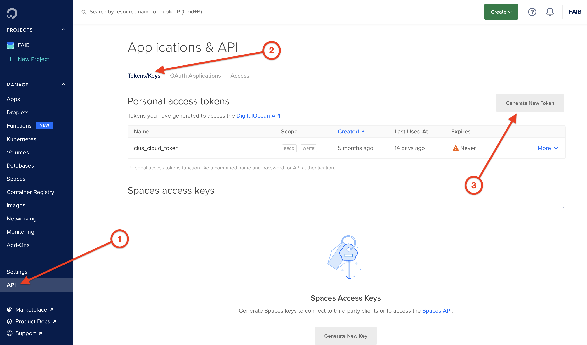
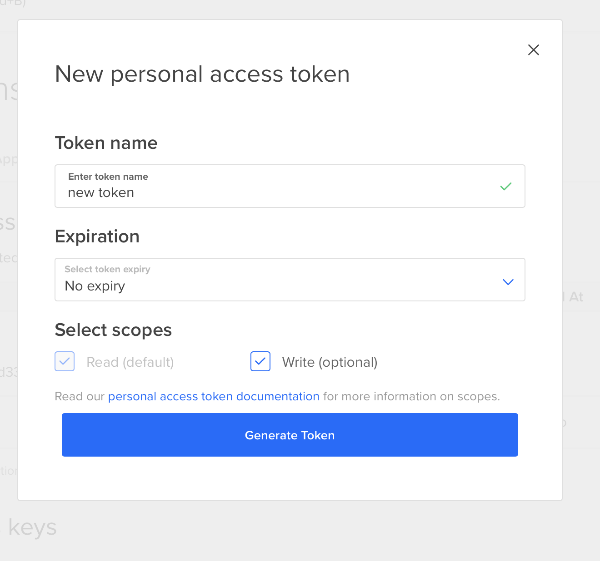
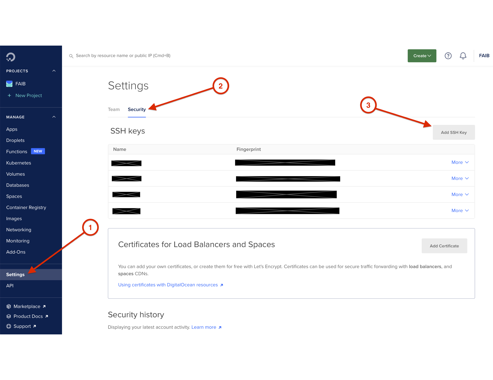

# FLEX Cloud Deployment

## About

FLEX Cloud Deployment (FCD) is a Shiny app that uses the power of cloud computing to offload the memory- and CPU-intensive simulations performed using SpaDES package and FLEX module in a distributed manner.

The engine of the FCD is the `{analogsea}` R package (<https://pacha.dev/analogsea/index.html>), which is a wrapper around Digital Ocean REST API (<https://docs.digitalocean.com/reference/api/api-reference/>).

## Installation

FCD app is available as a part of the main FLEX repo (<https://github.com/bcgov/flex>), in the `R/apps/flex_cloud` directory relative to the root directory of the FLEX repo.

### Required R Packages

R packages required to run the app are imported as the first step in `app.R` file. The required packages are:

-   `{shiny}`
-   `{httr}`
-   `{jsonlite}`
-   `{dplyr}`
-   `{magrittr}`
-   `{dplyr}`
-   `{analogsea}`
-   `{DBI}`
-   `{shinyFiles}`
-   `{shinyWidgets}`
-   `{shinydashboard}`
-   `{shinyjs}`
-   `{future}`
-   `{future.callr}`
-   `{rlist}`
-   `{fs}`
-   `{stringr}`
-   `{glue}`
-   `{ssh}`
-   `{ipc}`
-   `{purrr}`
-   `{filelock}`
-   `{ColinFay/glouton}`
-   `{shinyWidgets}`
-   `{raster}`
-   `{ggplot2}`
-   `{tictoc}`

and they need to be installed on the host running the app.

## Authentication

In order to use the application to manage cloud resources on Digital Ocean platform and run the simulations, there are steps that need to be taken to authenticate the user and the application.

**IMPORTANT:** Each end user running the simulations has to perform these authentication steps in order to use the app.

### Digital Ocean Personal Access Token

The first step and prerequesitite is to authenticate the application to the Digital Ocean using the token. The token needs to be obtained from the [Digital Ocean control panel](https://cloud.digitalocean.com). Navigate to the "API" link in the left navigation sidebar and activate the "Tokens" tab in the main panel.

Click `Generate New Token` button. In the popup, give token a name, select the desired expiry period, make sure that `Write` scope is checked, and click `Generate Token` button.

When the token is created, it will be visible in the list of tokens. Copy the new token (it won't be shown again for security reasons). It now needs to be added in `.Renviron` file in the root directory of the `castor` repo, with the key name `DO_PAT`. The format of this assignment in `.Renviron` is:

    DO_PAT=actual_token_pasted_here

This will authenticate the application with Digital Ocean so that new resources (droplets, volumes, snapshots) can be created and deleted as necessary.

### SSH Public-Private Key Pair

There is another layer of authentication, and that is the SSH key that the application will use to securely connect to the droplets using SSH, in order to be able to perform actions like issuing required shell commands which prepare and execute R commands to run the simulations.

In [Digital Ocean control panel](https://cloud.digitalocean.com), navigate to "Settings" link in the left sidebar and activate the Security tab in the main panel. Click the `Add SSH Key` button and follow the instructions in the popup to create a new SSH key and add it to the Digital Ocean.

You will need to select the private key from this key pair when using the application to run the simulations.

## Running the Simulations

This is the central point of the application and it satisfies the requirement to run a big number of simulation iterations of the same scenario by running the iterations in parallel. 

The parallelization happens on two levels. First level are multiple cloud servers that run in parallel. The second level is the parallelization that happens on each cloud server so that a number of iterations can run in parallel on each.

For example, if we run 80 simulation iterations and the local machine has 4 CPU cores, the job can be completed by creating it configurations like:

1. 2 cloud servers that can support running 40 parallel processes each.
2. 4 cloud servers that can support running 20 parallel processes each.

### Selecting the Options

The user needs to select the following options before running the simulations:

-   **Scenario** - The TIFF file containting the scenario to be used in the simulation.

-   **Number of iterations** - The number of iterations to be run for the simulation. The results of all iterations will be aggregated for the output analysis.

-   **Cloud server config** - Server configuration (in terms of RAM and CPU cores). The options available for selection are limited by number of CPU cores on the local machine (this number limits the number of servers that can be created) and number of simulation iterations. Each seAfter benchmarking the performance, it was established that each iteration requires up to 4GB of RAM. The listed options include information about the hourly cost of running such server, and relative cost per iteration per hour.

-   **Settings (optional)** - In addition, sumulation settings can be changed from default values by clicking the Settings button and changing any settings as needed.

### Running the simulations

When the options are selected, clicking the `Run scenario` button will kick off the process. Simulations are run asynchronously, with the help of `{future}` and `{future.callr}` R packages. This has several benefits:

-   The iterations can be run in parallel, reducing the overall time to get the results.

-   The application can report in real time about the current stage each simulation is at (with the help of `{ipc}` R package), as well as about the overall progress.

-   The app UI is not blocked.

The overall process consists of the following steps:

1.  Parse the given input options.

2.  Create a small droplet that will host the scenario during the execution stage.

3.  Create required number of cloud servers using `lapply` function and apply the `run_simulation` function for each server, where each server is created a new `{future}` asynchronous process in parallel.

4.  Observe changes in simulation log file (using `shiny::reactivePoll` function) to report on progress on each server, as well as the overall process.

### Asynchronous Processes

The simulation iterations run on each server in a background R process by calling the `run_simulation` function. The following steps are performed in this function:

1.  Fetch environment variables (DO_PAT for authentication with Digital Ocean, and any other).

2.  Create the droplet.

3.  Clone the main `castor` repo.

4.  Connect to the droplet that hosts the scenario TIFF file and download it to the droplet.

5.  Run the simulation by executing `run_iteration` function. This function executes remotely `R/SpaDES-modules/FLEX2/fisher.R` R script and passes in the settings that were set in the selected options. The remote `R/SpaDES-modules/FLEX2/fisher.R` in itself will spin a number of parallel processes that can run the cloud server.

6.  Download generated output files to be used for the simulation analysis. On the local machine, a folder is created for each simulation in `R/apps/flex_cloud/inst/app` folder. The simulation ID (and folder name) is the timestamp when the simulation ran, in the `YYYY-MM-DD_HHiiss` format, for example `2023-03-12_143930`. Each folder contains the `downloads` folder where all `.csv` and `.tif` files that were created as simulation output are contained. The individual filenames are prefixed with server and iteration identifiers in the format `dXiY...` where X is the server number and Y is the iteration number on each server. For example, if four iterations ran on two servers, the file prefixes are d1i1*, d1i2*, d1i3*, d1i4*, d2i1*, d2i2*, d2i3*, and d2i4* and files are saved in `R/apps/flex_cloud/inst/app/2023-03-12_143930/downlaods` folder.

7. Get the droplet cost and delete it.

### Simulation Log

Each server logs its progress to the simulation log file. The log file is created in the temporary folder (using `tempfile` R function). This file is observed for changes in the main application thread, and is used to report on the progress of the execution on each droplet in the DataTables object in Simulation Log tab of the main panel.

### Previewing Results

Simulation analysys is performed on the "Simulation output" tab. The application facilitates the analysis of current simulation, or previous simulations, depending on the selected option of "Select simulation" radio button.

If "Current" option is selected, "Previous simulations" dropdown can remain empty. If "Previous" option is selected, the simulation has to be selected in "Previous simulations" dropdown.

The plots are created by clicking the "Generate simulation report" button.

The application creates two plots:

1. Scatterplot of number of female fisher adults per time period from each simulation iteration, which also includes plotted mean values with 95% confidence intervals for each time period.
2. Composite heatmap which contains the aggregated final fisher habitat from all simulation iterations.

### Saved simulation parameters

The parameters used with the selected simulation are also shown for the reference. The parameters are saved as a dataframe in the simulation output forlder (for example `R/apps/flex_cloud/inst/app/2023-03-12_143930/`).

### Saved plots

When the report with plots is generated after clicking the "Generate simulation report" button, both plots (scatterplot with mean values and the heatmap) are also saved in the simulation output folder (for example `R/apps/flex_cloud/inst/app/2023-03-12_143930/`).

## Cloud Servers

**Resources** screen is used to manage existing Digital Ocean droplets. At this moment, it only retrieves the list of any currently existing droplets when the `Refresh` button is clicked.

Normally, clicking the `Refresh` button would return any results only while running the simulations or uploading new databases, because the droplets are deleted once these operations are completed. However, it might also show some "dangling" droplets that were created during the simulations or database uploads that had an error during the run and didn't fully complete to reach the stage of deleting the used droplets.

In the future, this screen can also include buttons to manage the droplets (e.g. `Delete` button in each DataTables row for each individual droplets). For the time being, this needs to be performed in the [Digital Ocean control panel](https://cloud.digitalocean.com).

## Billing

This section was intended to run the reports on the cost for each individual simulation run.

At this moment this function is not available because persistent storage is required where the cost would be stored when the simulation is finished. Instead, the cost of each server is reported in the Simulation Log table.

## Settings

These are required to be set before running the simulations. Currently two settings are being persisted into cookies. They are:

1.  The path to SSH key on local machine (so it doesn't have to be selected each time the simualations are being run).
2.  Number of CPU cores on the local machine. This setting is important for resolving the Digital Oceal droplet configurations that can support the required number of simulation iterations. The number of CPU cores currently limits the number of cloud servers that can be created at the same time.

The cookie expires 7 days after being set.

## Core Team

Joanna Burgar, Carnivore Conservation Biologist, Ecosystems Branch, Ministry of Water, Land and Resource Stewardship

Tyler Muhly, Team Lead, Strategic Analysis, Forest Analysis and Inventory Branch, Office of the Chief Forester, Ministry of Forests, Lands, Natural Resource Operations and Rural Development

## Contributors

Sasha Bogdanovic, Ruby Industries Inc.

## License

Copyright 2020-2021 Province of British Columbia

Licensed under the Apache License, Version 2.0 (the "License"); you may not use this file except in compliance with the License. You may obtain a copy of the License at

<http://www.apache.org/licenses/LICENSE-2.0>

Unless required by applicable law or agreed to in writing, software distributed under the License is distributed on an "AS IS" BASIS, WITHOUT WARRANTIES OR CONDITIONS OF ANY KIND, either express or implied. See the License for the specific language governing permissions and limitations under the License.
