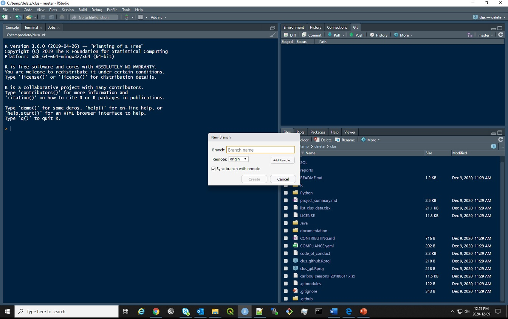
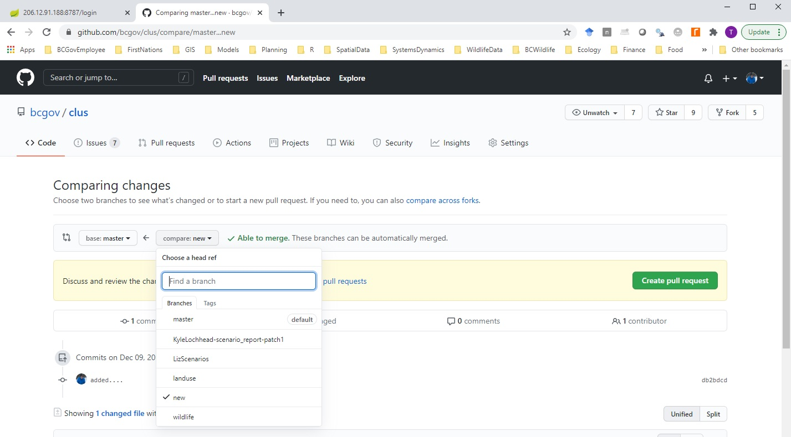
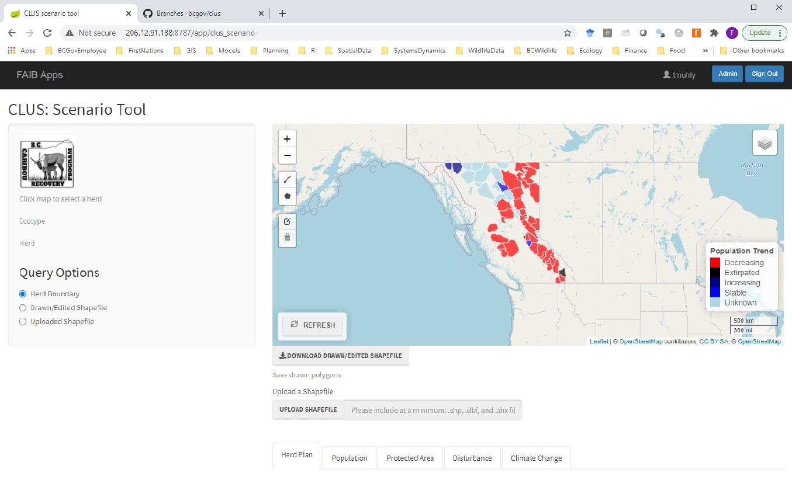

## Caribou and Land Use Simulator (CLUS) Quick Start Tutorial
The CLUS quick-start tutorial provides step-by-step instructions on how to use CLUS. It is designed to familiarize you with creating and running a simple forest harvest scenario analysis with CLUS. It takes you through all the steps needed to set-up and run CLUS from scratch.

## 1. Download Software
CLUS is primarily built using the [R programming language](https://www.r-project.org/), and thus requires you to install R software. You can download program R for Windows [here](https://cran.r-project.org/bin/windows/base/). Program R has a very simple graphical user interface, and therefore we also recommend that you download the free version of [RStudio](https://rstudio.com/products/rstudio/download/). RStudio is an integrated development environment for working with R code. It provides various windows and tabs for interacting with and running R code, downloading and loading R packages, interfacing with GitHub (more on that below), and managing R ['objects'](https://www.datacamp.com/community/tutorials/data-types-in-r). Thus, we also recommend you download ['git' software](https://gitforwindows.org/) to interface and work with the model code. 

To work with our databases, you will need to download [pgAdmin](https://www.pgadmin.org/) software. This software will allow you to connect to and work with postgreSQL databases, which are the key data structure used by CLUS. 

To manage and work with spatial data, you will also need download [OSGeo4W](https://trac.osgeo.org/osgeo4w/). This contains QGIS, GDAL/OGR, and GRASS open source software programs

If you are a government employee, you may want to download these software as approved by your information technology deparment.  

## 2. Download the Model Code from GitHub
Once you are up and running with R Studio you can 'clone' the model code (i.e., make local copy of it) so you can run it from your computer. We store the CLUS model code in the [BC government GitHub repositories](https://github.com/bcgov). If you are a BC government employee, we recommend that you sign-up for a GitHub account, and review the [BC government policies](https://github.com/bcgov/BC-Policy-Framework-For-GitHub/blob/master/BC-Open-Source-Development-Employee-Guide/README.md) on its use. 

The CLUS repository is located at https://github.com/bcgov/clus.git. You will notice the GitHub webpage contains a 'folder' structure with all the code. This can be considered as a 'master' copy of the code. GitHub allows for multiple people to work with the code simultaneously. You will work with a local copy of the code. In the next section we will desribe more how to use Git and GitHub.

To clone the CLUS repository, open RStudio, click on the "File" tab in the top left and then click "New Project". This will open a new window:

In this window, select "Version Control" and then select "Git". This will open a window where you enter the Repository URL (https://github.com/bcgov/clus.git), the name of the direcxotry (clus) and then location where you want to save a copy of the repository. We recommend copying hte code to a local folder.

Once you create the repository, it will copy the code to the folder directory you created. You will notice it has the same folder stucture as the website. 

In your RStudio console, the bottom-right window "Files" tab shows the directory for the code repository. We will describe later how to navigate these folders to run CLUS. 

### 3. Version Control and Working with GitHub
In the top-right window you will see a "Git" tab. If you click on that you will see a series of buttons: "Diff", "Commit", "Pull", "Push", "History" and "More". The text beside the top-right "R-box" symbol indicates the repository you are currently using. It should say "clus". You will also notice a symbol with two purple rectangles, beside some text that says "master". This indicates the 'branch' of the repository you are working in.

GitHub branches can be considered as 'working copies' of code (see image below). Conceptually, they are used to 'split off' working code from the master branch. This work flow is designed to minimize changes to the 'master' copy of the code. However, this also requires you to re-intergrate your branch with the main branch (called a "Pull Request") when you want to incorporate your changes to the code into the master branch. This work flow allows you to   

For now, we will create a new branch of the master code for you to work in. This will minimize the potential for creating errors in the model code. To create a new branch click on the symbol with two purple rectangles. This will open a new window called "New Branch" where you can enter a branch name (we recommend you use your last name for now). Leave the Remote as "origin" and "Sync branch with remote" checked.

You will notice the name of the new branch appears in the text drop-down. Now you are workign in a seperate branch of the code. Any changes you make to the code will only occur in the branch you created, as long as it is the selected branch in the drop-down text box. 

Now, in the "File" tab of the bottom-right window of RStudio, click on the "README.md" file. This should open document in the top-left window of RStudio, and you should see some text describing CLUS. The README.md file is a 'front page' for the CLUS GitHub repository, providing users some basic inforamtion abotu what CLUS is and how to learn more. 

Scroll down to the "Contributors" section of the README.md file and add your name and contact details to the list of contributors. Save the edits (you can click the floppy disk symbol in the top left of the window), and then click on the "Git" tab in the top-right window of RStudio. You should see the README.md file show up in the window under "Path". 

Click on the "Commit" button and it opens a new window with three windows in it. This window is used to commit changes to the code to the repository. In the top-left you will see the file name under "Path", with a check box (under 'staged') and a blue box with 'M' in it under "Status". Beneath that window you will see a window with the 'code' (simple text in this case), and the code you added highlighted in green. In the top-right is a window where you an add text to add a message to the commit (e.g., a description of the changes you made to the code).  

In this window, click the "Staged" box; this defines the files that you want to change. Add a message (e.g., "added Dwight Schrute to list of contributors"), then click the "Commit" button. Another window will open with the command line git code that was run to make the commit, and the result fo the commit (e.g., "1 file changed, 1 insertion(+)"). Close that box, then click the "Push" button. Anotehr window will open, again with command line git code that was run to push the comit to the GitHub repository. This 'saves' the changes to the file to the GitHub repository. Congratulations, you are now a contributor to CLUS!

If other people are working in the same branch of the repository, it is good to get in the habit of clickng the "Pull" button (top right window of RStudio). This will integrate changes to the code made by others into your code. 

Since you are working in an independent branch, you will mostly be commiting changes to your own version of the model code. However, at some point you will likely want to integrate your code back to the "Master" branch, or intgrate changes to the "Master" branch of code into your branch of code. These are managed through "Pull Requests". 

Pull Requests are managed through the [CLUS GitHub website](https://github.com/bcgov/clus). You will see a tab called "Pull Request" on the main page of the website. Click on this tab and you will see a green button on the middle-right of the page labelled "New pull request". 

Click on the "New pull request" button. This will open a new page with "Comparing changes" at the top. Underneath that you will see two buttons "base:master" and "compare:master" with an error between them pointing right to left. Click on the "base" button and yuo will get a drop-down menu with the name of teh different branches. Select your branch and then click the green "Create pull request" button. This will open a new page where you can add a messaeg to describe the pull request (e.g., "added my name to the conributors list"). Click again on the the green "Create pull request" button. This will send a request to the CLUS team to integrate chanegs to the code to the master. They will review and approve those changes. 

Now you have a working understanding of how to use Git and GitHub to manage edits to your CLUS code.

## 4. Set-up a Keyring
CLUS uses networked PostgreSQL databases. To keep these databases and the netwrok secure, we do not post the database access credentials (e.g., password) in the CLUS code. Instead we use the [R package "keyring"](https://cran.r-project.org/web/packages/keyring/keyring.pdf) to store credentials locally and use the "keyring" function to call those credentials from R scripts. 

We have developed an R markdown document for setting up a keyring. In the CLUS repository, navigate to R-> fucntions->keyring_init.Rmd and open the file. Follow the instructions in the document to set-up the keyring on your local computer. Contact the CLUS core team (Kyle.Lochhead@gov.bc.ca or Elizabeth.Kleynhans@gov.bc.ca or Tyler.Muhly@gov.bc.ca) to obtain the credentials for the PostgreSQL databases. 

Once you are set-up with keyring, you can also use the credentials information to connect to the PostgreSQL databases using PGAdmin software. You may want to conenct to teh databases adn examine some of the data to familiarize yourself with the data structure. In the 'clus' database on our local network computer, within teh "public" schema, there is a trable called "pgdbs_data_list". This table describes all the data in the PostgreSQL databases. Within the 'documentation'  folder of CLUS, there is also a "data_management_guide.Rmd" that describes the "pgdbs_data_list" table, and in the event that you need to add or update data at some point, instructions on how to update the table. 

## 5. Create a Shapefile for a Hypothetical Forest Harvest Scenario
At this point you're probably itching to do some modeling. However, before we do that, we want to introduce you to the process of developing a model to address alternate, hypothetical forest management scenarios. To do that, you will use one of CLUS' web applications to create a shapefile, then develop a land use constraint parameter from this shapefile that you will use in the hypothetical model you are going to buidl and run.

To create the shapefile, go to the [FAIB apps webpage](http://206.12.91.188:8787/login). Note that you will need to contact Kyle.Lochhead@gov.bc.ca for a username and password. Once you have that login, and click on the "CLUS Scenario Tool" link. This will take you to a web application with a map on it, and several tabs at the bottom. However, you will note that the app was designed for caribou recovery planning, dn thus much of teh inforamtion is tailored to support that. Neverthless, conceptually the app can apply to any forest managrment planning problem, i.e., to implement a hypothetical management regime requires a location (e.g., polygon) and an order (i.e., the constraint to apply within the defined location).

Here we will use the app to draw a polygon, download it and then create a parameter from it to apply in the CLUS model. We will use the Columbia North cariobu herd and the Revlstoke timebr supply area (TSA) as our 'example'. Click on the "Columbia North' herd boundary (located north of Revelstoke). The app will zoom into that herd area. In the top right box of the map, turn on the world imagery, ungulate winter ranges (UWRs) and wildlife habtiat areas (WHAs). 

Now 'zoom in' to a portion of the map where you can see cutblocks around the UWRs. Within that area, draw a new polygon (click on the button with a pentagon shape on the left side of the map) in an area between the UWRs, preferably that is forested and where you can see some forestry activity. Once you are done, name the polygon and click on the "Drawn" drop down box; this should display it on the map. You can also edit this polygon by clicking on the button with the box with a pen in it on the left side of the map. 

Once you have a reasonable polygon that covers a large area, click the "Download Crawn/Edited Shapefile". This will save a shapefile in a zipped folder of your downloads folder. Unzip the folder and copy the shapefile to your working folder.  

## 6. Create a Spatial Model Parameter for CLUS Usign the Shapefile
Here we use the shapefile you created to create a spatial model parameter in CLUS. This spatial parameter will be a new spatial constraint on forest harvest activity. We will make it fairly constainign to show it's effect.

To create a spatial parameter, you will need to upload the polygon data to the PostgreSQL database 

"Quick Start" Steps
1.  Download R and R STudio
2. clone the repository https://docs.github.com/en/github/creating-cloning-and-archiving-repositories/cloning-a-repository)
3. Set-up keyring
4. Create a shapefile in sceanrio tool
5. create a parameter
- osgeo?
6. create a sql lite db
 

##  Creating a Business-as-Usual Harvest Flow
Now you should have all of the software and code you need to run CLUS models. Here we descirbe how to get a 

## Alterante harvest flow

### Running Scenarios (forestryCLUS)
- to run sceanrios, satrt with teh forestryCLUS module
  - this module estalshises forest harvest queue and harvest objectives from which forestry activity 
  is simulated

#### Time Intervals
- specify in times 
  - start = 0
  - end = number of intervals, e.g., if using a 5 year interval and want to sim over a 200 year period, end = 40

  
#### harvestPriority
- The harvest queue is established using the 'harvestPriority' parameter
  - the paramter is an SQL query for how to prioritize stand characteristics 
  - it queires the pixels table (i.e., you can prirotize based on any values in teh pixels table)
  - for example 'dist, age DESC, vol DESC' says to priortize based on:
      - 'dist', i.e., distance to disturbed pixel (closest first), then
      - 'age DESC', i.e., descending age (oldest first), then
      - 'vol DESC', i.e., descending volume (highest volume first)
- also need to set the adjacency height constraint (adjacencyConstraint)

#### growingStockCLUS
- you  set the time interval between simulating forest stand characteristics within the growingStockCLUS parameters 
  - growingStockCLUS = list (periodLength = 5); here we simulate teh parameters every 5 years   

#### scenario 
- there is a parameter ('scenario') to name the scenario and provide a brief description of it
  - this can be used to track scenarios and will be uploaded to the server with the app for interfacing with results  
  - for BAU scenario, may need to do several 'test' runs to identify the appropriate harvest flow
  - keep all scenarios and variations in aprametrs as you run them (comment them out) so there is a record

#### harvestFlow
- harvestFlow parameter is where the annual cut level is set
  - will likely need to do multiple test runs to identify an appropriate BAU sceanrio
  - can use AAC dtermination or base-case models form last TSR for analysis unti workign in, but as our model may output differ then these, will likely nee dto test and adjust different leveles.
  - goal for BAU is to get a susitaned flow over 200 year period 
  - creates a list of data.tables where you can set the harvest level by TSA or TFL and for specific time periods 
  - can also set a 'partition' to identify other criteria for allocatign harvest
    - for example, a minimum volume havest criteria of 110m^3^/ha (' vol > 110 ')
  - remeber that if simualting with time intervals >1 year to multiply annual harvest flwo target by the interval

#### patchSizeDist
  - establsihes the size of cutblocks to be harvested adn the frequency to haveset them by natural disturabcen type (ndt), as defined in the Forest Practices Code [Biodiversity Guidebook](https://www.for.gov.bc.ca/hfd/library/documents/bib19715.pdf); NDT's are associated with biogeolcimatic units
  
#### Outputs
- define where table ouputs get uploaded (via 'uploaderCLUS')
- currently we upload to a postgres on a VM server; 
  -  define the area of interest name that (aoiName); this sets the name of the schema wehre tables get uploaded to postgres

- decalre in outputs(mySim) which 'reports', i.e., tables to save and uplaod to the vritual machine
  - "harvestReport" = reports inforamtion on harvest volume and area harvested, age of harvested stand, by time interval and comaprtment
  - "growingStockReport" = reports on growing stock (forest stand ????) by time interval adn compartment
  - "tableSurvival" = 
  - "disturbanceReport"
  - "volumebyareaReport" = reports volume harvested by the model within a specified area 
    - the 'specified area(s)' can be defined using the Params -> areaofinterestRaster.Rmd
        - this create a raster and vat table for the area(s) of interest based 
    - does nto need to be implemented as part of teh sql lite db; can be included after the fact, because it referes to       the data in the CLUS db
    - then, need to identify the report in the parameter list, modules list and outputs within the forestryCLUS.Rmd    
      (can see 'forestryCLUS_tfl48_volumebyarea_example.Rmd' for an example)
      
  
