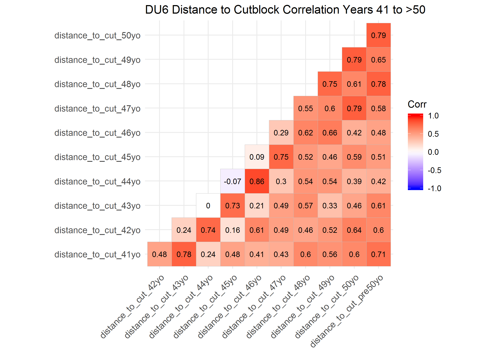
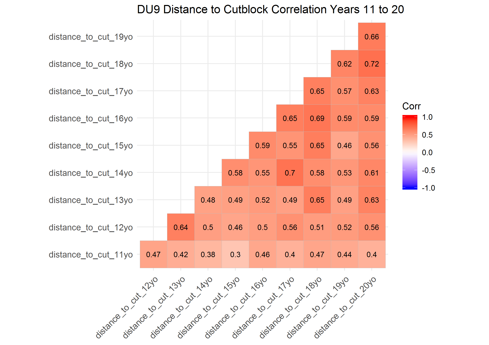

## Introduction
Here I summarize the data visualization and exploration done to identify which forestry cutblokc covariates to include in cairobu reserocue selction fucntion (RSF) models. This was doen across three seasons (early witner, ater winter adn summer) adn across four designatable units (DUs). I had data that estiametd the disatnce of each cariobu telemerty and each sampled available location to the nearest cutblock, by year, from one year old cuts up to greater than 50 year old cuts. I can't have 51 disatnce to cutblock covariaets int eh model, so here I look at whether distande to cublcok acorss eyars are correalted with each other. I also fit signle covairate genelaized lieanr models to look at changes in slection of ctublocks acorss years. I use this information to group years that are correalted in a meaningful way that will help simplify the model. 

I then also fit distance to cutblcok models usign  fucntional responses adn egeralized addtive models (GAMs) to look for non-lienar fits to the data. In the former case, I am testing whetehr slection of cublcoks is a fucntion of available disatnce to cutblocks within the caribou home range For the latter I am lookign for non-linear realtionhsips between cariobu selction and distance to cutblock.  

## Methods

### Correlation of Distance to Cutblock across Years
Here I tested whether distance to cutblock at locations in caribou home ranges tended to be correlated across years. The hypothesis was that distance to cutblock would be more correlated in proximate years (e.g., within 5 years) than years further apart. If distance to cutblock was highly correlated across proximate years, then it would be possible (and indeed necessary) to reduce the number of distance to cutblock covaraites in an RSF by grouping years together.   

I used a Spearman ($\rho$) correlation and correlated distance to cutblock between years in 10 years increments. Data were divided by designatable unit (DU) to comapre correaltions within similar types of caribou. Caribou DU's  in British Columbia include DU 6 (boreal), DU7 (northern mountain), DU8 (central mountain) and DU9 (sourthern mountain) [see COSEWIC 2011](https://www.canada.ca/content/dam/eccc/migration/cosewic-cosepac/4e5136bf-f3ef-4b7a-9a79-6d70ba15440f/cosewic_caribou_du_report_23dec2011.pdf). 

The following is an example of the code used to calculate and display the correaltion plots:

```r
# data
rsf.data.cut.age <- read.csv ("C:\\Work\\caribou\\clus_data\\caribou_habitat_model\\rsf_data_cutblock_age.csv")

# Correlations
# Example code for first 10 years
dist.cut.1.10.corr <- rsf.data.cut.age [c (10:19)] # sub-sample 10 year periods
corr.1.10 <- round (cor (dist.cut.1.10.corr, method = "spearman"), 3)
p.mat.1.10 <- round (cor_pmat (dist.cut.1.10.corr), 2)
ggcorrplot (corr.1.10, type = "lower", lab = TRUE, tl.cex = 10,  lab_size = 3,
            title = "All Data Distance to Cutblock Correlation Years 1 to 10")
```

### Generalized Linear Models (GLMs) of Distance to Cutblock across Years
Here I test whether cariobu selection of distance to cutblock changes across years. The intent was to identify if there are temporal patterns in how cariobu slect cublocks, depending on teh age of the cutblock. This would also help with temporally grouping distance to cutblock, by identifying groups of years when caribou consistently selected or avodied cutblocks.  

I compared how caribou selected distance to cutblock across years by fitting seperate resource selection functions (RSFs), where each RSF had a single covariate for distance to cublock for each year since cut. For example, a RSF was fit with a single covariate for distance to one year old cutblock. RSFs were fit using binomial generalized linear models (GLMs) with a logit link (i.e., comparing used to available caribou locations). RSFs were fit for each season and DU to test whether patterns in distance to cutblock selection varied by each. 


The following is an example of the code used to calculate RSFs:

```r
dist.cut.data.du.6.ew <- dist.cut.data %>%
  dplyr::filter (du == "du6") %>% 
  dplyr::filter (season == "EarlyWinter")
glm.du.6.ew.1yo <- glm (pttype ~ distance_to_cut_1yo, 
                        data = dist.cut.data.du.6.ew,
                        family = binomial (link = 'logit'))
glm.du.6.ew.2yo <- glm (pttype ~ distance_to_cut_2yo, 
                        data = dist.cut.data.du.6.ew,
                        family = binomial (link = 'logit'))
....
....
....
glm.du.6.ew.51yo <- glm (pttype ~ distance_to_cut_pre50yo, 
                         data = dist.cut.data.du.6.ew,
                         family = binomial (link = 'logit'))
```

The beta coefficients of the distance to cutblock covariate were outputted from each model and plotted against the year age of the cutblock to illustrate how selection changed depending on the age of the cutblock. 

### Grouping Data


## Results
### Correlation Plots of Designatable Unit (DU) 6
In the first 10 years (i.e., correlations between distance to cutblocks 1 to 10 years old), distance to cublock at locations in caribou home ranges were generally highly correlated. Correlations were particularly strong within two to three years ($\rho$ > 0.45). Correlations generally became weaker ($\rho$ < 0.4) after three to four years. Correlation between distance to cutblock 11 to 20, 21 to 30 and 31 to 40 years old were highly correlated across all 10 years ($\rho$ > 0.45). However, correlation between distance to cutblock in years 41 to 50 were gnerally not as strong, but also highly variable ($\rho$ = -0.07 to 0.86). 




### Correlation Plots of Designatable Unit (DU) 7
Distance to cutblock was highly correlated across years within all the 10 years periods (\rho > 0.5). 


### Correlation Plots of Designatable Unit (DU) 8
In the first 10 years, distance to cublock at locations in caribou home ranges were generally highly correlated. Correlations were typically stronger within two to three years ($\rho$ > 0.35) and weaker after three to four years. In years 11 to 20, 21 to 30 and 31 to 40, distance to cutblock was highly correlated within one year ($\rho$ > 0.41), but less correlated when greater than one year apart. In years 41 to greater than 50 years, correlations were generally weak between years


### Correlation Plots of Designatable Unit (DU) 9
In the first 10 years, distance to cublock at locations in caribou home ranges were generally highly correlated within one year ($\rho$ > 0.44), and generally weaker thereafter. Correlation between distance to cutblock 11 to 20, 21 to 30, 31 to 40 adn 41 to greater than 50 years old were generally highly correlated across all 10 years, with few exceptions.





### Resource Selection Function (RSF) Distance to Cutblock Beta Coefficients bu Season and Designatable Unit (DU)

In DU6, distance to cutblock generally had a weak effect on caribou resource selection across years. There was not a clear pattern in selection of cutblocks across years, however, the pattern was generally consistent across seasons. In general, caribou in DU6 appear to avoid cutblocks less than 3 years old, select cutblocks four to seven years old and then avoid cutblocks over seven years old.  

<!-- -->


In DU7, 

<!-- -->


- DU7
    - late and early winter patterns generally the same; weak selection to no selection of cuts 
      years 1-25, then general avoidance >25
    - summer, select cuts years 1 to 30-35, then egenrally avoid

- DU8
  - all seasons, generally select cut years 1-10to20, then generally avoid years >20
  
  
<!-- -->
  


  
- DU9
  - general avoidance acorss all years, but some selection between eyars 5-10
  
  
- categorize as years 1-4, 5-9, 10-29, >30


<!-- -->


## Conclusions
### Designatable Unit (DU) 6
Given the high correaltions across years, likely need to group into few categories to avoid autocorrelation. Selection generally weak and patern not clear, but first few years coudl be grouped together into 3-5 year groups, but genrally older than 10 years old cutblocsk coudl be greouped toegther. 


### Designatable Unit (DU) 7
Given the high correaltions across years, likely need to group into few categories to avoid autocorrelation

### Designatable Unit (DU) 8
generally not that correlated if more than 1 or two years apart, so less need to group


### Designatable Unit (DU) 8
In more recent cuts, nerally not that correlated if more than 1 or two years apart, so less need to group, but in older cuts, likely need to group into few categories to avoid autocorrelation


- categorize as years 1-4, 5-9, 10-29, >30
  -take minimum ditance to cut for these grousp of years


- test with correaltion adn GLMs again
  - DU6
      - high corealtion between 10to29 and >29
      - covariate efefct simialr @ 10to29 and >29 so may  combine these
  
  - DU7
      - high correlation between 5to9, 10to29 and >29 
      - 
      
  - DU8
      - generally low correaltion; some better 1to4 and 5to9
      
  - DU9
      - high corealtion between 10to29 and >29


