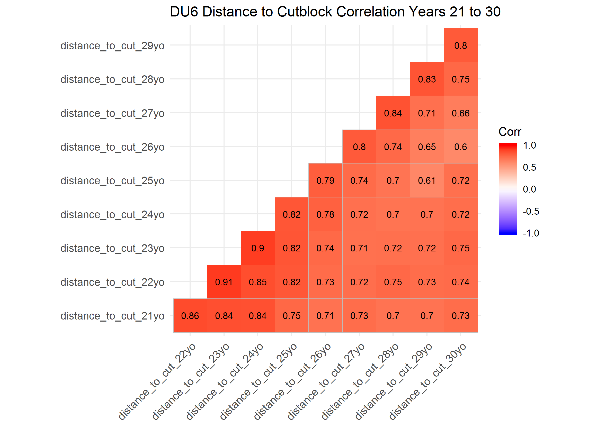
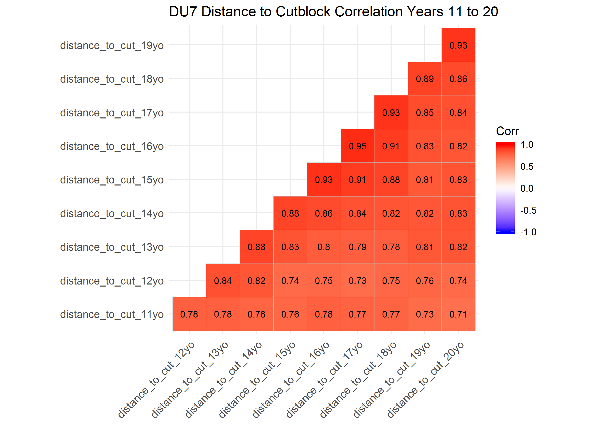
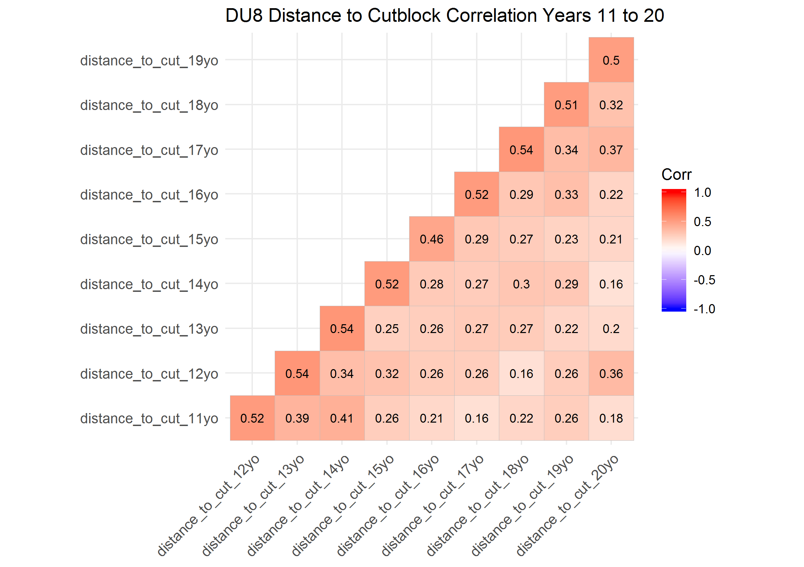
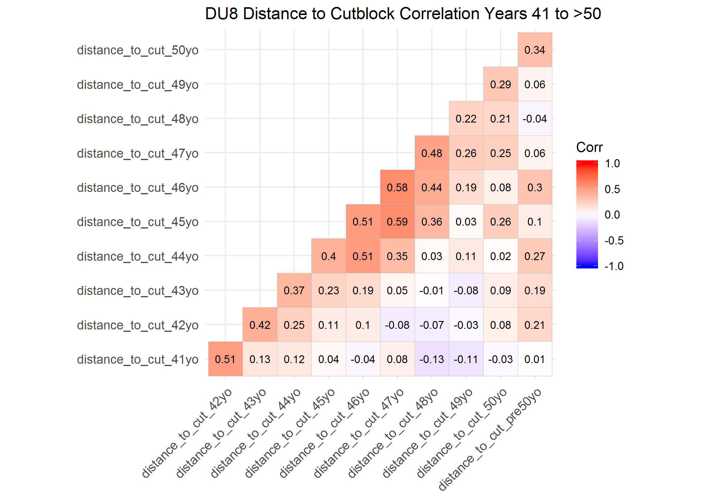

## Introduction
Here I summarize the data visualization and exploration done to identify which forestry cutblokc covariates to include in cairobu reserocue selction fucntion (RSF) models. This was doen across three seasons (early witner, ater winter adn summer) adn across four designatable units (DUs). I had data that estiametd the disatnce of each cariobu telemerty and each sampled available location to the nearest cutblock, by year, from one year old cuts up to greater than 50 year old cuts. I can't have 51 disatnce to cutblock covariaets int eh model, so here I look at whether distande to cublcok acorss eyars are correalted with each other. I also fit signle covairate genelaized lieanr models to look at changes in slection of ctublocks acorss years. I use this information to group years that are correalted in a meaningful way that will help simplify the model. 

I then also fit distance to cutblcok models usign  fucntional responses adn egeralized addtive models (GAMs) to look for non-lienar fits to the data. In the former case, I am testing whetehr slection of cublcoks is a fucntion of available disatnce to cutblocks within the caribou home range For the latter I am lookign for non-linear realtionhsips between cariobu selction and distance to cutblock.  

## Methods

### Correlation of Distance to Cutblock across Years
I looked tested whether distance to cutlbock at locations in cariobu home ranges tend to be correlated across years. I used a Spearman ($\rho$) correlation and correlated distance to cutblock between years in 10 years increments. Data were divided by designatable unit (DU) to comapre correaltions within similar types of caribou. Caribou DU's  in British Columbia include DU 6 (boreal), DU7 (northern mountain), DU8 (central mountain) and DU9 (sourthern mountain) [see COSEWIC 2011](https://www.canada.ca/content/dam/eccc/migration/cosewic-cosepac/4e5136bf-f3ef-4b7a-9a79-6d70ba15440f/cosewic_caribou_du_report_23dec2011.pdf). 


```r
require (ggplot2)
require (ggcorrplot)

# data
rsf.data.cut.age <- read.csv ("C:\\Work\\caribou\\clus_data\\caribou_habitat_model\\rsf_data_cutblock_age.csv")

# Correlations
# Example code for first 10 years
dist.cut.1.10.corr <- rsf.data.cut.age [c (10:19)] # sub-sample 10 year periods
corr.1.10 <- round (cor (dist.cut.1.10.corr, method = "spearman"), 3)
p.mat.1.10 <- round (cor_pmat (dist.cut.1.10.corr), 2)
ggcorrplot (corr.1.10, type = "lower", lab = TRUE, tl.cex = 10,  lab_size = 3,
            title = "All Data Distance to Cutblock Correlation Years 1 to 10")
```

## Results
### Correlation Plots of Designatable Unit (DU) 6
In the first 10 years (i.e., correlations between distance to cutblocks 1 to 10 years old), distance to cublock at locations in caribou home ranges were generally highly correlated. Correlations were particularly strong in the first two to three years ($\rho$ > 0.45). Correaltions generally became weaker ($\rho$ < 0.4) after three to four years. Correlation between distance to cutblock 11 to 20, 21 to 30 and 31 to 40 years old were highly correlated across all 10 years ($\rho$ > 0.45). However, correlation between distance to cutblock in years 41 to 50 were gnerally not as strong, but also highly variable ($\rho$ = -0.07 to 0.86). 





### Correlation Plots of Designatable Unit (DU) 7
Distance to cutblock was highly correlated across years within all the 10 years periods (\rho > 0.5). 





### Correlation Plots of Designatable Unit (DU) 8
In the first 10 years, distance to cublock at locations in caribou home ranges were generally highly correlated. Correlations were typically strongeer in the first two to three years ($\rho$ > 0.35) and weaker after three to four years. In years 11 to 20, distance to cutblock was highly correlated within 


DU8; first 10 years distance to cutblock generally highly corealted first 2-4 years, less correaltd 5-10 years; years 11-20 adn 21-30 adn 31-40, highkly correalted within a year, but less so >1 year; years 41 to >50 not very correalted, but morseos 2-3 years








### Correlation Plots of Designatable Unit (DU) 9


DU9; first 10 years distance to cutblock generally highly corealted first 2-3 years, but not much after; years 11-20 gebnerally correlated; years 21->50 very highly correalted 

here it looks like corealtiosn are generaly strong across teh entire 50 years, but generaly correaltiosn are stonger within 3-4 years of each other. 


## Conclusions
### Designatable Unit (DU) 6
Given the high correaltions across years, better to group


### Designatable Unit (DU) 7
Given the high correaltions across years, better to group


## group into ~5-year periods; try corr again ##


next tried GLMs
single covariate models, by year adn comapred beta coeeficents across years
break out by DU and season adn made a table of it then illsutrated

conlcusions:
- DU6
    - almost no effect of cutblocks across years; likely due to low density of cutblocks in boreal
    - all seasons, first 3 years avoid cut
    - late and early winter patterns generally the same; select cuts years 4-7, then generally avoid
    - summer, select cuts years 4-11, then hihgly cyclical across years 

- DU7
    - late and early winter patterns generally the same; weak selection to no selection of cuts 
      years 1-25, then general avoidance >25
    - summer, select cuts years 1 to 30-35, then egenrally avoid

- DU8
  - all seasons, generally select cut years 1-10to20, then generally avoid years >20
  
- DU9
  - general avoidance acorss all years, but some selection between eyars 5-10
  
  
- categorize as years 1-4, 5-9, 10-29, >30


- categorize as years 1-4, 5-9, 10-29, >30
  -take minimum ditance to cut for these grousp of years


- test with correaltion adn GLMs again
  - DU6
      - high corealtion between 10to29 and >29
      - covariate efefct simialr @ 10to29 and >29 so may  combine these
  
  - DU7
      - high correlation between 5to9, 10to29 and >29 
      - 
      
  - DU8
      - generally low correaltion; some better 1to4 and 5to9
      
  - DU9
      - high corealtion between 10to29 and >29


