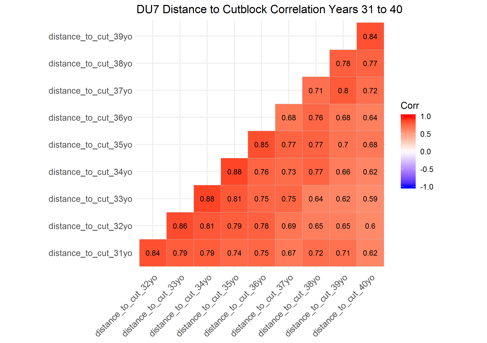
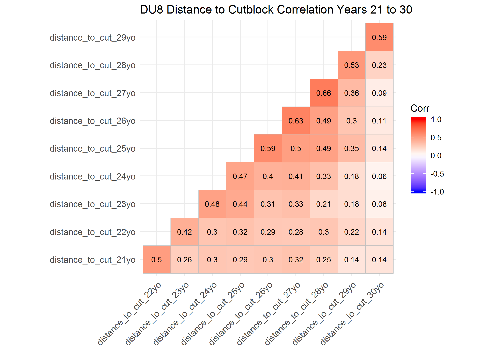
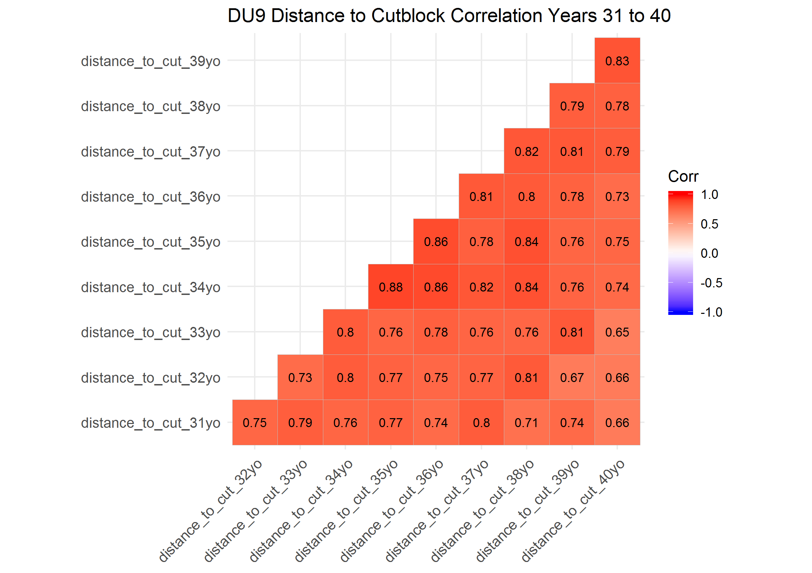
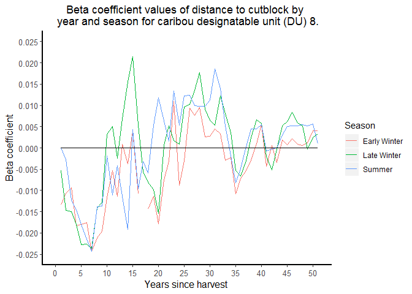
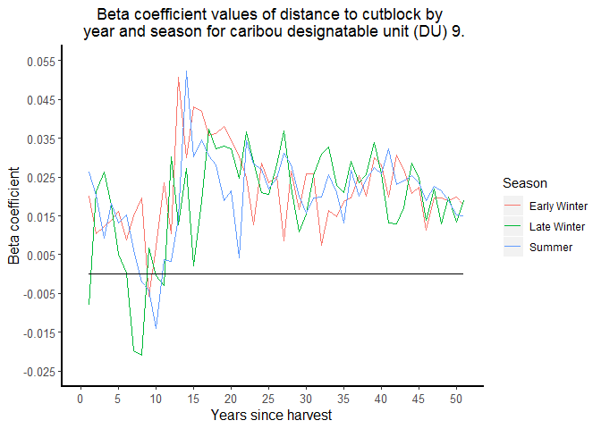
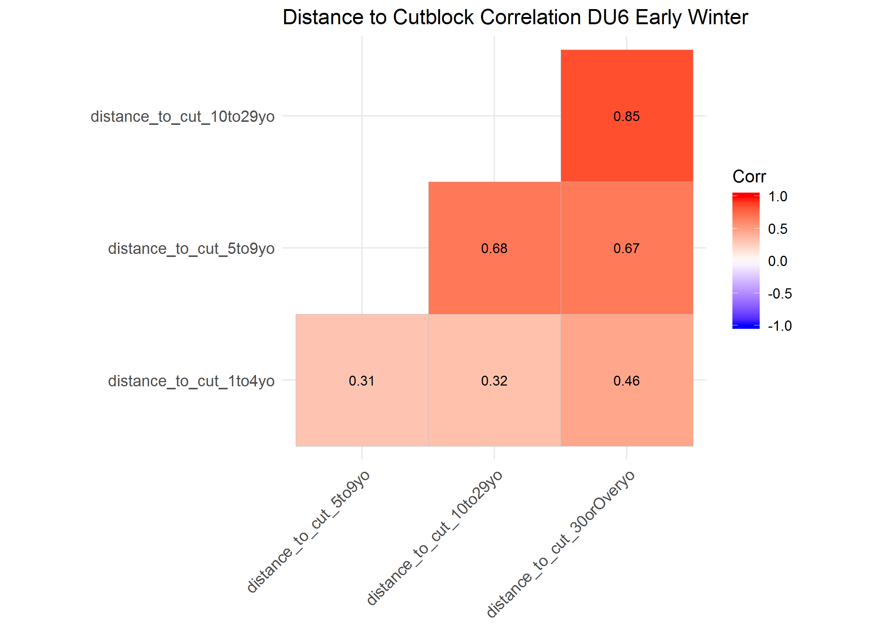
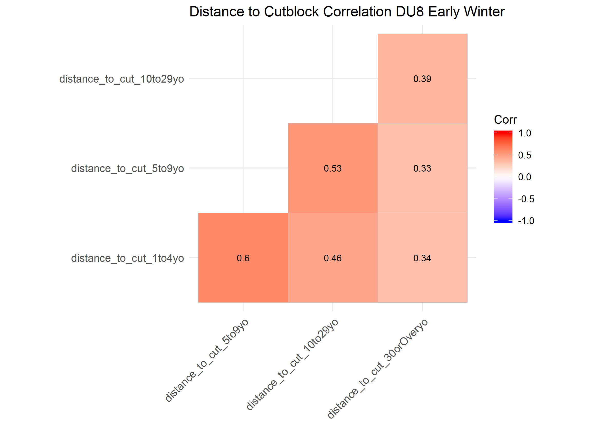
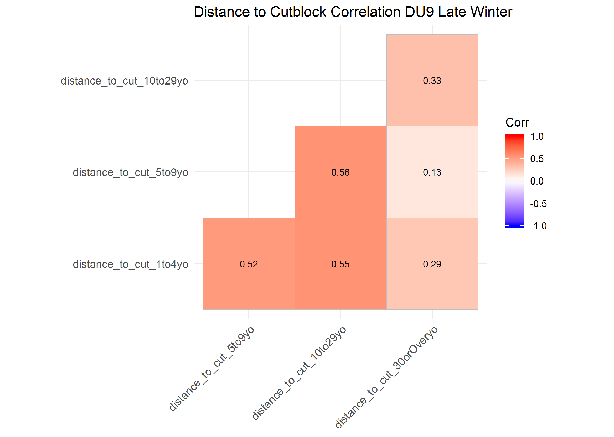

## Introduction
Here I summarize the data exploration and model selection process done to identify how to parsimoniously include distance to cutblock covariates in caribou resource selection function (RSF) models (Boyce et al. 1999; Manly et al. 2007). RSF models will be calculated for three seasons (early winter, late winter and summer), and across four caribou designatable units (DUs), i.e., ecological designations of caribou. Caribou DU's  in British Columbia include DU 6 (boreal), DU7 (northern mountain), DU8 (central mountain) and DU9 (sourthern mountain) [see COSEWIC 2011](https://www.canada.ca/content/dam/eccc/migration/cosewic-cosepac/4e5136bf-f3ef-4b7a-9a79-6d70ba15440f/cosewic_caribou_du_report_23dec2011.pdf)

I had data that estimated the distance of each caribou telemetry location, or randomly sampled location within caribou home ranges (i.e., 'available' locations), to the nearest cutblock, by cutblock age, from one year old cutblocks up to greater than 50 year old cutblocks. The hypothesis was that distance to cutblock would be more correlated in proximate years (e.g., within 5 years) than years further apart. Also, I likely could not properly fit a RSF model with 51 distance to cutblock covariates, therefore I did these preliminary analyses to identify a parsimonious number of distance to cutblock covariates to inlude in a RSF model. These analyses included testing for correlation between distance to cutblock measures across years and fitting single covariate generalized linear models to look at changes in caribou selection of distance to cutblock acorss years. I use this information to group the distance to cutblock measures across years in a way that reduces the number of covariates, but still captures variability in how caribou respond to cutblocks as they age. 

After temporally grouping the distance to cutblock data, I did further data exploration and correlation analyses of tehse covariates by season and DU. I then fit distance to cutblock RSF models using functional responses (Matthiopolous et al. 2010) and generalized additive models (GAMs). In the former case, I am testing whether caribou selection of cutblocks is a function of the available distance to cutblocks within the caribou's home range. Specifically, I am testing the hypothesis whether caribou are more likely to avoid cutblocks in home ranges located closer to cutblocks. In the latter case I am testing for non-linear relationships between caribou selection and distance to cutblock. These models were comapred using Akaike Information Criterion (AIC)  

## Methods
### Correlation of Distance to Cutblock Across Years
Here I tested whether distance to cutblocks of different ages, from one year old to greater than 50 years old, at locations in caribou home ranges, were correlated. If distance to cutblock was highly correlated across proximate years, then it would be possible (and indeed necessary) to reduce the number of distance to cutblock covariates in an RSF model by grouping cutblock ages together.   

I used a Spearman ($\rho$) correlation and correlated distance to cutblock between years in 10 year increments. Data were divided by designatable unit (DU). The following is an example of the R code used to calculate and display the correlation plots:

```r
# data
rsf.data.cut.age <- read.csv ("C:\\Work\\caribou\\clus_data\\caribou_habitat_model\\rsf_data_cutblock_age.csv")

# Correlations
# Example code for first 10 years
dist.cut.1.10.corr <- rsf.data.cut.age [c (10:19)] # sub-sample 10 year periods
corr.1.10 <- round (cor (dist.cut.1.10.corr, method = "spearman"), 3)
p.mat.1.10 <- round (cor_pmat (dist.cut.1.10.corr), 2)
ggcorrplot (corr.1.10, type = "lower", lab = TRUE, tl.cex = 10,  lab_size = 3,
            title = "All Data Distance to Cutblock Correlation Years 1 to 10")
```

### Generalized Linear Models (GLMs) of Distance to Cutblock across Years
Here I tested whether caribou selection of distance to cutblock changed as cublocks aged. This helped with temporally grouping distance to cutblock data by age, by illustrating if and when caribou consistently selected or avoided cutblocks of similar ages. 

I compared how caribou selected distance to cutblock across years by fitting seperate caribou RSFs, where each RSF had a single covariate for distance to cublock for each cutblock age. For example, a RSF was fit with a single covariate for distance to one year old cutblock. RSFs were fit using binomial generalized linear models (GLMs) with a logit link (i.e., comparing used to available caribou locations, where used locations are caribou telmetry locations and available locations are randomly sampled locations within the extent of estimated caribou home ranges). RSFs were fit for each season and DU. The following is an example of the R code used to calculate RSFs:

```r
dist.cut.data.du.6.ew <- dist.cut.data %>% # sub-sample the data by season and DU
  dplyr::filter (du == "du6") %>% 
  dplyr::filter (season == "EarlyWinter")
glm.du.6.ew.1yo <- glm (pttype ~ distance_to_cut_1yo, 
                        data = dist.cut.data.du.6.ew,
                        family = binomial (link = 'logit'))
glm.du.6.ew.2yo <- glm (pttype ~ distance_to_cut_2yo, 
                        data = dist.cut.data.du.6.ew,
                        family = binomial (link = 'logit'))
....
....
....
glm.du.6.ew.51yo <- glm (pttype ~ distance_to_cut_pre50yo, 
                         data = dist.cut.data.du.6.ew,
                         family = binomial (link = 'logit'))
```

The beta coefficients of the distance to cutblock covariate were outputted from each model and plotted against the age of the cutblock to illustrate how selection changed as the cutblock aged.  

### Resource Selection Function (RSF) Model Secltion fo Distance to Cutblock Covariates by Cutblock Age
Based on the results of the analysis described above, I grouped distance to cutblock into four age categories: one to four years old, five to nine years old, 10 to 29 years old and over 29 years old (see Results and Conclusion, below, for rational). I then tested for correaltion between these covariates using a Spearman-rank ($\rho$) correlation and by calculating variance inflation factors (VIFs) from GLMs. If covariates had a $\rho$ > 0.7 or VIF > 10 (Montgomery and Peck 1992; manly et al. 2007; DeCesare et al. 2012), then one fo the covariates was removed from analysis, or distance to cutblock was further grouped into larger age classes. 

I a GLM and calculated VIFs using the vif() function from the 'car' package in R. The VIF scores for each covairate were less than 1.7, incidating they were not highly correlated. 

```r
model.glm.du6.ew <- glm (pttype ~ distance_to_cut_1to4yo + distance_to_cut_5to9yo + 
                          distance_to_cut_10yoorOver, 
                         data = dist.cut.data.du.6.ew,
                         family = binomial (link = 'logit'))
vif (model.glm.du6.ew) 
```

Next, I tested whether models with a fucntional repsonse (*sensu* Matthiplolus et al. 2010) improved model fit by comaprign models with adn without interaction terms for available disatnce to buclobk, by age class. 

I fit a mixed effects regression models usign the glmer() fucntion in the lme4 package of R. I fit models with correlated random effect intercepts and slopes for each distacne to cutblock covariate by each unique indivdual cariobu and year in the model (i.e., a unique identifier). I fit models with all combinations of distance to cutblock covariates and comapred them using AIC. To faciliate model converngence, I standardized the distance to cutblock covaraites by subtracting the mean and dividing by the standard deviation of the covariate.


```r
# Generalized Linear Mixed Models (GLMMs)
# standardize covariates  (helps with model convergence)
dist.cut.data.du.6.ew$std.distance_to_cut_1to4yo <- (dist.cut.data.du.6.ew$distance_to_cut_1to4yo - mean (dist.cut.data.du.6.ew$distance_to_cut_1to4yo)) / sd (dist.cut.data.du.6.ew$distance_to_cut_1to4yo)
dist.cut.data.du.6.ew$std.distance_to_cut_5to9yo <- (dist.cut.data.du.6.ew$distance_to_cut_5to9yo - mean (dist.cut.data.du.6.ew$distance_to_cut_5to9yo)) / sd (dist.cut.data.du.6.ew$distance_to_cut_5to9yo)
dist.cut.data.du.6.ew$std.distance_to_cut_10yoorOver <- (dist.cut.data.du.6.ew$distance_to_cut_10yoorOver - mean (dist.cut.data.du.6.ew$distance_to_cut_10yoorOver)) / sd (dist.cut.data.du.6.ew$distance_to_cut_10yoorOver)

# fit correlated random effects model
model.lme.du6.ew <- glmer (pttype ~ std.distance_to_cut_1to4yo + std.distance_to_cut_5to9yo + 
                            std.distance_to_cut_10yoorOver + 
                            (std.distance_to_cut_1to4yo | uniqueID) + 
                            (std.distance_to_cut_5to9yo | uniqueID) +
                            (std.distance_to_cut_10yoorOver | uniqueID) , 
                          data = dist.cut.data.du.6.ew, 
                          family = binomial,
                          REML = F, 
                          verbose = T)
AIC (model.lme.du6.ew)
# AUC 
pr.temp <- prediction (predict (model.lme.du6.ew, type = 'response'), dist.cut.data.du.6.ew$pttype)
prf.temp <- performance (pr.temp, measure = "tpr", x.measure = "fpr")
plot (prf.temp)
auc <- performance (pr.temp, measure = "auc")
auc <- auc@y.values[[1]]
```

Next I fit functional response models where I included covariates representign teh mean diatsance to cutblcok (for each age class) within each individual cariobu's annual seasoanal hoem rnage as interactions with disatnce to cutblcok at each lcoation. 


```r
### Fit model with functional responses
# Calculating dataframe with covariate expectations
sub <- subset (dist.cut.data.du.6.ew, pttype == 0)
std.distance_to_cut_1to4yo_E <- tapply (sub$std.distance_to_cut_1to4yo, sub$uniqueID, mean)
std.distance_to_cut_5to9yo_E <- tapply (sub$std.distance_to_cut_5to9yo, sub$uniqueID, mean)
std.distance_to_cut_10yoorOver_E <- tapply (sub$std.distance_to_cut_10yoorOver, sub$uniqueID, mean)
inds <- as.character (dist.cut.data.du.6.ew$uniqueID)
dist.cut.data.du.6.ew <- cbind (dist.cut.data.du.6.ew, 
                                "std.distance_to_cut_1to4yo_E" = std.distance_to_cut_1to4yo_E [inds],
                                "std.distance_to_cut_5to9yo_E" = std.distance_to_cut_5to9yo_E [inds],
                                "std.distance_to_cut_10yoorOver_E" = std.distance_to_cut_10yoorOver_E [inds])

model.lme.fxn.du6.ew <- glmer (pttype ~ std.distance_to_cut_1to4yo + std.distance_to_cut_5to9yo + 
                               std.distance_to_cut_10yoorOver + std.distance_to_cut_1to4yo_E +
                               std.distance_to_cut_5to9yo_E + std.distance_to_cut_10yoorOver_E +
                               std.distance_to_cut_1to4yo:std.distance_to_cut_1to4yo_E +
                               std.distance_to_cut_5to9yo:std.distance_to_cut_5to9yo_E +
                               std.distance_to_cut_10yoorOver:std.distance_to_cut_10yoorOver_E +
                               (1 | uniqueID), 
                               data = dist.cut.data.du.6.ew, 
                               family = binomial (link = "logit"),
                               verbose = T,
                               control = glmerControl (calc.derivs = FALSE, 
                                                       optimizer = "nloptwrap",
                                                       optCtrl = list (maxfun = 2e5)))
```


I calculated the AIC for both models and compared them to asses the most parsimonious model fit. I also calcaulated area under the curve (AUC) of Receiver Operating Characteristic (ROC) curve for each model using teh ROCR package in R to test the accuracy of predcitons. The model with the highest AIC weight but also a reaasonaby high AUC score (i.e., teh abiliy of the model to accurately predict cariobu loations) was consdiered the best distance to cutblock model.


## Results
### Correlation Plots of Distance to Cutblock by Year for Designatable Unit (DU) 6
In the first 10 years (i.e., correlations between distance to cutblocks 1 to 10 years old), distance to cublock at locations in caribou home ranges were generally highly correlated. Correlations were particularly strong within two to three years ($\rho$ > 0.45). Correlations generally became weaker ($\rho$ < 0.4) after three to four years. Correlation between distance to cutblock 11 to 20, 21 to 30 and 31 to 40 years old were highly correlated across all 10 years ($\rho$ > 0.45). However, correlation between distance to cutblock in years 41 to 50 were gnerally not as strong, but also highly variable ($\rho$ = -0.07 to 0.86). 


### Correlation Plots of Distance to Cutblock by Year for Designatable Unit (DU) 7
Distance to cutblock was highly correlated across years within all the 10 years periods (\rho > 0.5). 





### Correlation Plots of Distance to Cutblock by Year for Designatable Unit (DU) 8
In the first 10 years, distance to cublock at locations in caribou home ranges were generally highly correlated. Correlations were typically stronger within two to three years ($\rho$ > 0.35) and weaker after three to four years. In years 11 to 20, 21 to 30 and 31 to 40, distance to cutblock was highly correlated within one year ($\rho$ > 0.41), but less correlated when greater than one year apart. In years 41 to greater than 50 years, correlations were generally weak between years





### Correlation Plots of Distance to Cutblock by Year for Designatable Unit (DU) 9
In the first 10 years, distance to cublock at locations in caribou home ranges were generally highly correlated within one year ($\rho$ > 0.44), and generally weaker thereafter. Correlation between distance to cutblock 11 to 20, 21 to 30, 31 to 40 adn 41 to greater than 50 years old were generally highly correlated across all 10 years, with few exceptions.





### Resource Selection Function (RSF) Distance to Cutblock Beta Coefficients by Year, Season and Designatable Unit (DU)
In DU6, distance to cutblock generally had a weak effect on caribou resource selection across years. There was not a clear pattern in selection of cutblocks across years, and this lack of  pattern was consistent across seasons. In general, it appears that caribou in DU6, across all seasons, appear to avoid cutblocks less than three years old, select cutblocks four to ten years old and then avoid cutblocks over seven to ten years old.  
<!-- -->

In DU7, there was a more distinct pattern in caribou selection of cutblocks, and this pattern was different among the winter adn summer seasons. The early witner and late winter seasons were generally consistent. The  efefct of disatcne to cutblcoks was realtively weak across years, but the effect shifted from little or no selection of more recent cutlbocks (cutblocks less than 25 years old), to greater avoidance of older cutblocks (greater than 25 years old). In the summer, cutblocks less than four years old appeared to have little effect on caribou. However, there was realtively stong slection fo cutblcoks five to 30 years old adn then general avoidance of cutblocks older than 30 to 35 years old. 
<!-- -->

In DU8, selection of cutblocks was realtively strong and consistent across all saeosns, btu the apptern of selction was highly variable. However, in general, caribou selected younger cutblocks (approximately one to 20 years old) and avoided older cutblocks(greater than 20 years old). 
<!-- -->
  
In DU9, teh efefct of cutblocks was realtively strong and consistent acorss saesons. In egenral, cariobu qavoidd cutblocks, although avoidacne of younger (less than 10 year old) cutblocks was weaker than older (greater htan 10 years old) cutlbocks. 
<!-- -->


### Resource Selection Function (RSF) Model Selection
#### DU6
##### Early Winter
The correlation plot indicated that distance to cutblocks 10 to 29 years old and 30 or over years old were highly correlated ($\rho$ = 0.85), therefore, I grouped these two age categories together (i.e., disatnce to cutblcoks greater than 10 years old).



The maximum VIF from the simple GLM covariate model (i.e., including distance to cutblock 1 to 4, 5 to 9 and over 10 years old) was <1.7, indicating covariates were not highly correalted. 

The top-ranked model included covariates of distance to cutblock ages five to nine years old and over nine years, but no functional response, and had an AIC weight (AIC*~w~*) of 1.00. In addition, the top model had the second highest AUC (AUC = 0.604), which was very close to the highest AUC value in teh model set (AUC = 0.607).

##### Late Winter
The correlation plot indicated that distance to cutblocks 10 to 29 years old and 30 or over years old were highly correlated ($\rho$ = 0.79), therefore, I grouped these two age categories together (i.e., disatnce to cutblcoks greater than 10 years old).


The maximum VIF from the simple GLM covariate model was <1.6, indicating covariates were not highly correlated. The top-ranked model included covariates of distance to cutblock for each cutblock age class, but no functional response,and had an AIC*~w~* of 1.00. In addition, the top model had the highest AUC (AUC = 0.665).

##### Summer
The correlation plot indicated that distance to cutblocks 10 to 29 years old and 30 or over years old were highly correlated ($\rho$ = 0.82), therefore, I grouped these two age categories together (i.e., disatnce to cutblcoks greater than 10 years old).


The maximum VIF from the simple GLM covariate model was <1.7, indicating covariates were not highly correlated. The top-ranked model included covariates of distance to cutblock for each cutblock age class, but no functional response, and had an AIC*~w~* of 1.00. In addition, the top model had the highest AUC (AUC = 0.698).

#### DU7
##### Early Winter
The correlation plot indicated that distance to cutblocks 10 to 29 years old and 30 or over years old were highly correlated ($\rho$ = 0.81), therefore, I grouped these two age categories together (i.e., distance to cutblocks greater than 10 years old).


The maximum VIF from the simple GLM covariate model (i.e., including distance to cutblock 1 to 4, 5 to 9 and over 10 years old) was <4.1, indicating covaraites were not highly correlated. The AIC*~w~* of the top model was 1.00. It included all distance to cutblock covariates, but not a functional response in caribou selection for cutblocks. The AUC of the top model (AUC = 0.679) was better than all other models.

##### Late Winter
The correlation plot indicated that distance to cutblocks 10 to 29 years old and 30 or over years old were highly correlated ($\rho$ = 0.82) and distance to cutblocks 5 to 9 years old and 10 to 29 years old were highly correlated ($\rho$ = 0.71) therefore, I grouped these three age categories together (i.e., distance to cutblocks greater than 5 years old).


The maximum VIF from the simple GLM covariate model (i.e., including distance to cutblock 1 to 4, over 5 years old) was <1.8, indicating covariates were not highly correlated. The AIC*~w~* of the top model was 1.00. It included all distance to cutblock covariates, but not a functional response in caribou selection for cutblocks. The AUC of the top model (AUC = 0.690) was better than all other models.

##### Summer
The correlation plot indicated that distance to cutblocks 10 to 29 years old and 30 or over years old were highly correlated ($\rho$ = 0.80) and distance to cutblocks 5 to 9 years old and 10 to 29 years old were highly correlated ($\rho$ = 0.87) therefore, I grouped these three age category covariates together (i.e., distance to cutblocks greater than 5 years old).


The maximum VIF from the simple GLM covariate model (i.e., including distance to cutblock 1 to 4, over 5 years old) was <1.6, indicating covariates were not highly correlated. The AIC*~w~* of the top model was 1.00. It included all distance to cutblock covariates, but not a functional response in caribou selection for cutblocks. The AUC of the top model (AUC = 0.694) was better than all other models.

#### DU8
##### Early Winter
The correlation plot indicated that none of the distance to cutblock covariates were highly correlated ($\rho$ < 0.61). Therefore, I did not group any of the age covariates together.



The maximum VIF from the simple GLM covariate model was <1.9, indicating covariates were not highly correlated. The AIC*~w~* of the top model was 1.00. It included all distance to cutblock covariates, but not a functional response in caribou selection for cutblocks. The AUC of the top model (AUC = 0.698) was better than all other models.

##### Late Winter
The correlation plot indicated that none of the distance to cutblock covariates were highly correlated ($\rho$ < 0.57). Therefore, I did not group any of the age covariates together.


The maximum VIF from the simple GLM covariate model was <1.7, indicating covariates were not highly correlated. The AIC*~w~* of the top model was 1.00. It included all distance to cutblock covariates, but not a functional response in caribou selection for cutblocks. The AUC of the top model (AUC = 0.715) was better than all other models.

##### Summer
The correlation plot indicated that none of the distance to cutblock covariates were highly correlated ($\rho$ < 0.54). Therefore, I did not group any of the age covariates together.


The maximum VIF from the simple GLM covariate model was <1.8, indicating covariates were not highly correlated. The AIC*~w~* of the top model was 1.00. It included all distance to cutblock covariates, but not a functional response in caribou selection for cutblocks. The AUC of the top model (AUC = 0.701) was better than all other models.

#### DU9
##### Early Winter
The correlation plot indicated that none of the distance to cutblock covariates were highly correlated ($\rho$ < 0.67). Therefore, I did not group any of the age covariates together.


The maximum VIF from the simple GLM covariate model was <6.6, indicating covariates were not highly correlated. The AIC*~w~* of the top model was 0.90. It included all temporal distance to cutblock covariates with a functional response in caribou selection for cutblocks for each covariate. The AUC of the top model (AUC = 0.636) was about average for the model set, and slightly less than the most predictive model (i.e., AUC = 0.648).

##### Late Winter
The correlation plot indicated that none of the distance to cutblock covariates were highly correlated ($\rho$ < 0.57). Therefore, I did not group any of the age covariates together.



The maximum VIF from the simple GLM covariate model was <3.5, indicating covariates were not highly correlated.


 The AIC*~w~* of the top model was 0.90. It included all temporal distance to cutblock covariates with a functional response in caribou selection for cutblocks for each covariate. The AUC of the top model (AUC = 0.636) was about average for the model set, and slightly less than the most predictive model (i.e., AUC = 0.648).


## Conclusions
Based on the high correaltion of annual distacne to cutblock measures across years, there is a need to group into few categories to avoid correlation of covaraites in the RSF model. At a minimum it appears that disatnce to cutblock measures are correalted 2-5 years apart. Patterns in cariobu selciton of cutlbocks suggest that cariobu may avoid or have weak responses to cutblocks when they are realtively new (less than five years old), but selection of cutblocks from five up to 30 years old (dpending on teh DU and season) adn avoidance of cutblocks over 10 to 30 years old. Therefore, I reclassifed disatcne to cutblock into four classes: one to four years old, five to nine years old, ten to 29 years old and 30 and over. 


which covariates to inlcude


Cutblocks not all that improant in DU6 early winter; eefct was nto that strong when look at fit plots adn AUC, but stogner in summer than witner seasons; probably generally slectect younger cutblocks 1 to 9, esp. 5 to 9 and aovid older


DU7, cublcoks storner, more improatn efefct


## Literature Cited
DeCesare, N. J., Hebblewhite, M., Schmiegelow, F., Hervieux, D., McDermid, G. J., Neufeld, L., ... & Wheatley, M. (2012). Transcending scale dependence in identifying habitat with resource selection functions. Ecological Applications, 22(4), 1068-1083.

Montgomery, D. C., and E. A. Peck. 1992. Introduction to linear regression analysis. Wiley, New York, New York, USA

