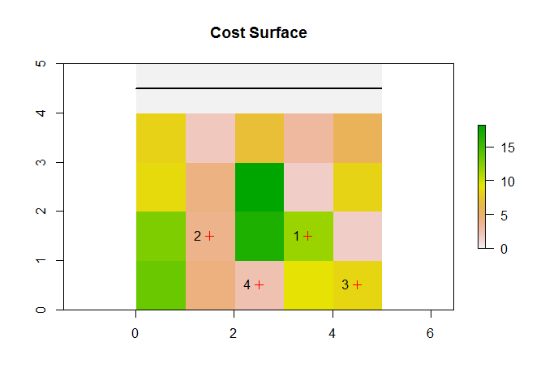
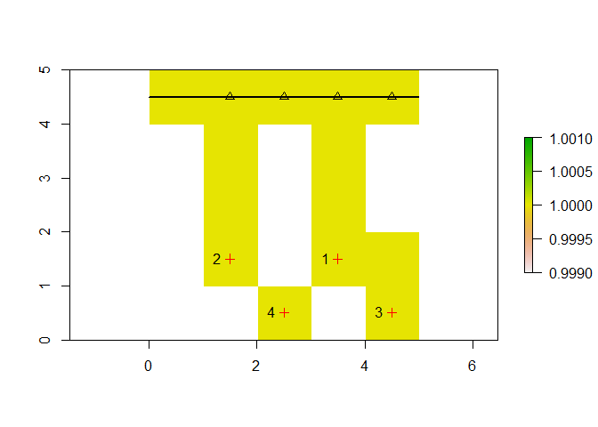
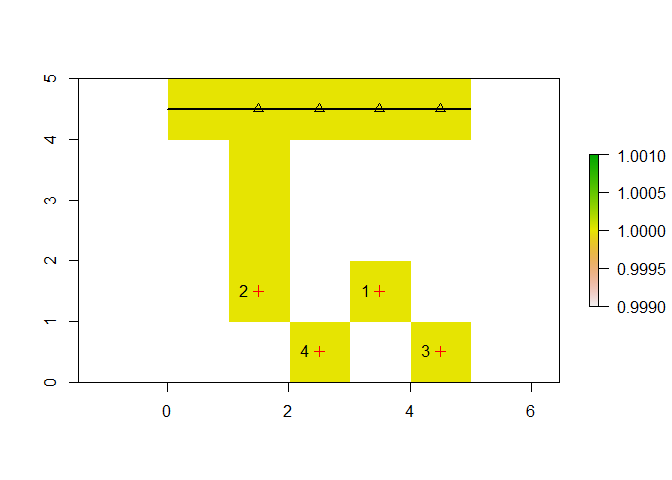
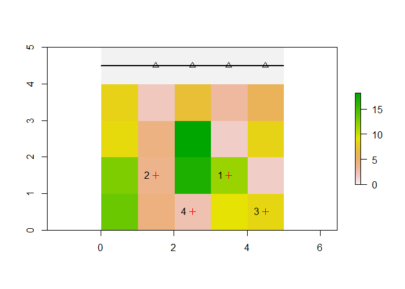
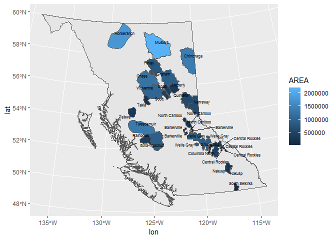
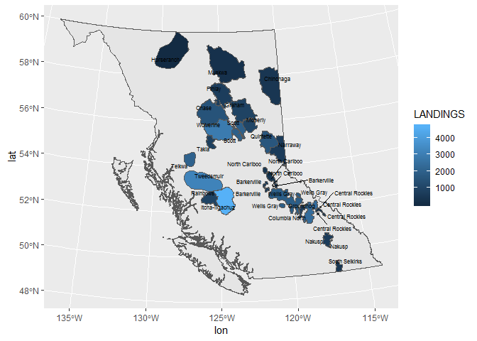
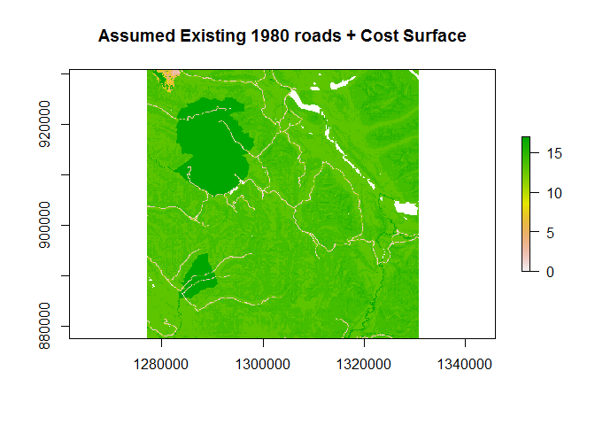
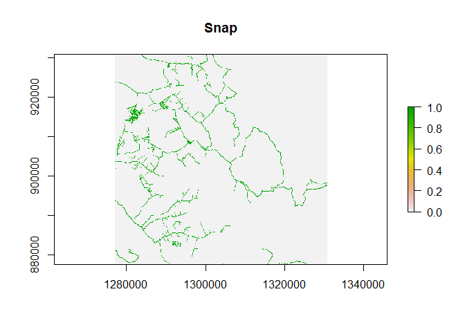
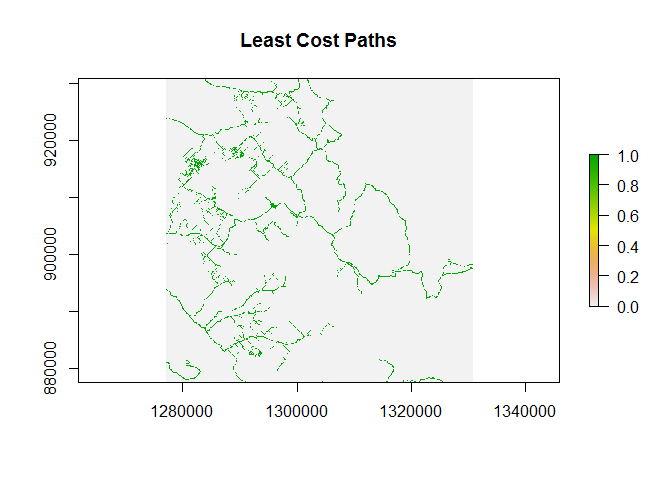
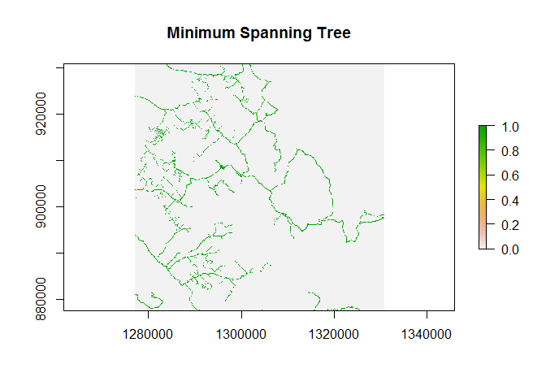

# Introduction

Roads are a consequence of resource development that influences both future resource development opportunites and other landscape values, such as wildlife. For example, caribou are a threatened species in some regions of British Columbia that are highly sensitive to road development and use. As such, restrictions on future road development may be implemented in caribou habitat areas as part of caribou conservation and recovery actions. To test the implications of alternative recovery policies to caribou, there is a need to spatially simulate future roads as a consequence of alternative resource development scenarios. 

Short term planning has been the historical approach to road development because it is an enormous task to manually project road networks (e.g., depending on computer processign speed, it may take up to ½ day for an individual Timber Supply Area). Further, we rarely have a long term view on the life cycle of each road segment, including how much volume will be hauled over the road, which makes it hard to determine the best decision regarding deactivation and reactivation. Lastly, there are limited tools available to assess strategic questions such as, for example, how yarding distance and road design parameters affect the total length and cost of the network, area of land lost to roads, and the amount of caribou habitat sensitive to future road networks.

Our interest is in the automated process of simulating future roads, the speed in preforming this process and the realism of the assumptions and outputs (i.e., the simulated road network). While optimal road construction strategies including activation and deactivation have been developed (Murray 1998; Anderson et al. 2006), optimizing very large landbases is problematic in terms of speed in computer processing, generating the estimates needed to parameterize the formulation and in the level of integration with other modelling approaches. Research has shown there are trade-offs between optimized routing and the time to solve the problem (Dean 1997; Picard et al. 2006).

Simulation models offer an alternative approach to optimization that link nicely to strategic models developed to assess the impact of resource development across very large landscapes (i.e., involving multiple regions and Timber Supply Areas). These models employ heuristic algorithms for road design which may not be optimal but rather close to it. However, many assumptions are needed to parameterize road simulations and these need careful consideration. The following vignette looks at various road simulation assumptions used by Forest Analysis and Inventory Branch (FAIB).    

# Problem Defintion

## Road Spacing and Multiple Target Access
Generally, forestry road simulators assume that simulated forest cutblocks (i.e., landings), determined by a harvest scheduler, will be connected to an existing road network. These include: an "as the crow flies" (i.e., snapping) method where the simulated road simply connects the landing in a straight line to the nearest point on the nearest existing road; a "least cost distance" method which simulates a road between a landing and a nearby exsiting road by minimizing costs and obstacles of traversing the landscape (a.k.a., "as the wolf runs"); and a Minimum Spanning Tree (MST) with Least Cost Paths (LCP) method which simulates roads based on obstacles but also in consideration of the least costly way to connect multiple landings, as used in the Spatial Timber Supply Model in the Spatially Explicit Landscape Event Simulator  (StTSM-SELES) platform.

Current road simulators used in FAIB have a similar problem in the forest management context, i.e., how to design a future road network that connects landings to an existing road network under the objective of minimizing cost. This problem can be addressed with one of two approaches: i) as a road spacing problem (RSP) where every point is potentially a target, or ii) as a multiple target access problem (MTAP) which considers _m_ point-shaped targets (i.e., landings) that have to be connected to an existing road network (the source).

The first approach simulates roads by finding a network as densely as possible under a constraint of a maximum total cost. This approach ideally requires a long term plan for harvest locations (i.e., all future harvest locations are known), which allows for a long term view of road development to help inform road saturation and activation/deactivation decisions. If all the harvest locations are known, this approach can be implemented at a single time step in a simulation model, typically during the simulation initialization or start up period through 'pre-solving'. Examples of pre-solving the road network can be found in jfssam (FAIB -internal model) or through StTSM-SELES roading. Conversely, the second approach simulates roads dynamically, at defined time intervals, i.e., roads are simulated in response to dynamically simulated cutblocks. This approach may more accurately reflect short-term forest planning. The difference between these two approaches concerns the amount of information given to the model, with the first approach assuming perfect information of harvest locations across the simulation time horizon which would result in a lower cost (i.e., fewer simulated roads). The second approach assumes limited information concerning harvest locations (i.e., a single period of locations) or _m_ point-shaped targets, and thus has a higher cost. This lack of information may be more realistic given the temporal scale of imformation used in road planning and thus, is of interest to assess the economic and ecological impacts of resource development. 

A common objective when simulating paths between landings and an existing road network is to minimize cost. In the simplest case, the minimum cost will be a straight line path between the existing road network and a landing. However, a more realistic cost may include various impedance attributes, e.g., terrain, length of roads, risk of fire or watercourse crossings. Some examples of a cost surface include: [Tobler's hiking function](https://en.wikipedia.org/wiki/Tobler%27s_hiking_function), expert opinion from operational researchers, or an empircally derived function relating various topographical and biophyiscal variables to existing roads. An estimate of cost is required across the study area and the cost of a road segment is the sum of the costs associated with the pixels traversed by the segment. The total costs of a road segment form the edges of a mathematical graph with the vertices or nodes representing possible locations to build the road. For a raster data-structure, nodes are located on a square grid and spatially neighbouring nodes are connected by edges (or arcs). In general, adding additional impedance attributes will increase the complexity of simulated paths, which will result in an increased cost of the network (i.e., greater road density). Further, the path of a landing to the existing road network assumes each road is planned independant of other landing locations. This may create parallel roads/paths that may seem redundant. To overcome this effect a more centrailized approach to road planning can be considered.

To account for the effect of multiple simulated landings on a simulated road network (i.e., the MTAP), the road simulation algorithm must determine which landings will connect to other landings versus the existing road network (i.e., also known as road branching). This can be approximated with a MST algorithm, which considers as nodes in a graph both the paths between each landing to the existing road network and the paths between landings. A more detailed description of the LCP and MST methods follows.

## Least-Cost Path (LCP)
The MTAP reuqires connecting a single target point to a source point based on a LCP or shortest path. To solve this problem [Dijkstra’s algorithm](https://en.wikipedia.org/wiki/Dijkstra%27s_algorithm) is often implemented (see [ArcGIS Network Analyst](http://help.arcgis.com/en/arcgisdesktop/10.0/pdf/network-analyst-tutorial.pdf) or [QGIS Network anlaysis library](https://docs.qgis.org/testing/en/docs/pyqgis_developer_cookbook/network_analysis.html). In this algorithm, the edge between each node is calculated, which provides information on the LCP for every target-source combination. This works by first initializing the graph by setting all the points to ‘unvisited’ and storing this as a set (called the unvisited set). The values of the points are set to infinity except for the origin or source point which is set to zero. A series of iterations then determine the LCP. In the first iteration the current node is the source point. Then, the cost between the current node and each of the neighbour nodes is calculated. This cost includes the cost from the current node (in the first iteration this will be 0). These nodes are then stored in a priority queue so that the least cost is first (highest priority). In the next iteration the cost between the highest priority node and each neighbouring node is calculated (this is taken from the edge). Again, the least cost values are stored. At each subsequent iteration the previous least cost node is removed from the unvisted set. The process is iterated until all the node targets have been reached. A complete graphical example can be found [here](http://optlab-server.sce.carleton.ca/POAnimations2007/DijkstrasAlgo.html). Note Djikstra's algorithum  has limtations with negative costs and solving time and thus, various modifications of this algorithum have been proposed (eg., [A*](https://en.wikipedia.org/wiki/A*_search_algorithm), [Johnson's Algorithm](https://en.wikipedia.org/wiki/Johnson%27s_algorithm))

## Minimum Spanning Tree
A minimum spanning tree (MST) connects all nodes in a graph without any loops or cycles. In the forestry context, the nodes of the MST are cutblock locations and existing road networks and the edges represent routes solved using a LCP algorthium (eg., [Dijkstra’s algorithm](https://en.wikipedia.org/wiki/Dijkstra%27s_algorithm)). To solve the MST, [Kruskal's algorithm](https://en.wikipedia.org/wiki/Kruskal%27s_algorithm) is often used , however, this algrotihum is 'greedy' (finds a locally optimal choice using a problem solving heuristic with the intent of finding a global optimum) and thus various alternatives exist  (see [Prim's algorithm](https://en.wikipedia.org/wiki/Prim%27s_algorithm)). [Kruskal's algorithm](https://en.wikipedia.org/wiki/Kruskal%27s_algorithm) begins by sorting graph edges with respect to their weights (these are the total cost of the least cost path). Then, add edges to the MST by starting with the edges with the smallest weight and going until the edge of the largest weight. Lastly, they only add edges that do not form a loop or cycle. A complete graphical example can be found [here](http://optlab-server.sce.carleton.ca/POAnimations2007/MinSpanTree.html).

# Comparing Road Simulation Algorithums
Various approaches to simulating road development in BC were compared for the purpose of evaluating trade-offs between computer processing speed and accruacy of road outputs. To provide this comparison, the approaches were first contrasted based on their conceptual and structural assumptions. Using these assumptions, versions of road simulation approaches were then developed in the R programming language within the [SpaDES](https://cran.r-project.org/web/packages/SpaDES/index.html) package to support a consistent comparison between accuracy and speed of execution. The following describes the approaches and provides a comparison of the simulated outcomes.

## Description of Approaches

All of the methods are dependent on two considerations: i) the road building cost and ii) the view of road branching. First, road building cost is given as a surface constructed from many spatial layers including hydrology, slope, biogeoclimatic zone, etc. However, the cost can also deal with transportation cost, destruction risk or negative impacts to the environment or wildlife habitat. Second, a degraded version of the MTAP is considered by forcing the only possible branching points of the simulated road network to be targets. However, allowing greater branch points increases the time and complexity of the algorithm which severely limits the number of possible scenarios that can be run. For the remainder of this analysis, the degraded version of the MTAP is considered.

The following figure represents a simple raster with values pertaining to road build costs.

<!-- -->


```r
#NOTE: black line is a road. Red crosses are targets (i.e., landing locations)
```

### The 'Snapping' Approach 
This approach simply 'snaps' a landing (i.e., cutblock location) to the nearest existing road segment. Since the snapping is done for each landing it is also called an independent path method. First, using the existing road network, the closest road point is determined using rgeos [gDistance](https://www.rdocumentation.org/packages/rgeos/versions/0.3-28/topics/gDistance) function.


```r
#convert the raster pixels that are roads (i.e., cost = 0) to points
roads.pts <- rasterToPoints(ras, fun=function(x){x == 0})  
#get the distance between the two geometries (road points and targets) and select the minimum
closest.roads.pts <- apply(rgeos::gDistance(SpatialPoints(roads.pts),SpatialPoints(sC), byid=TRUE), 1, which.min) 

#The top row corresponds to the landing ID and the bottom row corresponds to the closest road point. Note the raster is labeled from 1 to n cells starting from left to right, top to bottom.
closest.roads.pts
```

```
## 1 2 3 4 
## 2 2 3 4
```

```r
# convert to a matrix
roads.close.XY <- as.matrix(roads.pts[closest.roads.pts, 1:2,drop=F]) 
plot(ras)
title('Cost Surface')
plot(sC, col ='red', add=TRUE)
segments(0,5,5,5, lwd =2)
text(sC, labels=sC$ID, pos=2)
lines(c(0,5),c(4.5,4.5), lwd =2)
plot(SpatialPoints(roads.close.XY), col='black', pch =2, add=TRUE)
```

<!-- -->

```r
#NOTE: black triangles are closest point on the existing road"
```

Second, connecting the closest road points (i.e., roads.close.XY) to the targets (landings) simply involves drawing a line between the two points using the [sf](https://cran.r-project.org/web/packages/sf/vignettes/sf1.html) and [dplyr](https://cran.r-project.org/web/packages/dplyr/vignettes/dplyr.html) packages.


```r
rdptsXY<-data.frame(roads.close.XY) #convert to a data.frame
rdptsXY$id<-as.numeric(row.names(rdptsXY))
landings<-data.frame(sC)
landings<-landings[,2:3]
landings$id<-as.numeric(row.names(landings))

coordMatrix<-rbind(rdptsXY,landings)
coordMatrix$attr_data<-100
mt<-coordMatrix %>% 
  st_as_sf(coords=c("x","y"))%>% 
  group_by(id) %>% 
  summarize(m=mean(attr_data)) %>% 
  st_cast("LINESTRING")

#plot the results
plot(ras)
title('Cost Surface')
plot(sC, col ='red', add=TRUE)
segments(0,5,5,5, lwd =2)
text(sC, labels=sC$ID, pos=2)
lines(c(0,5),c(4.5,4.5), lwd =2)
plot(SpatialPoints(roads.close.XY), col='black', pch =2, add=TRUE)
plot(mt$geometry,add=TRUE, lwd= 2)
```

<!-- -->

Using this approach, a few issues would arise: 1) parrallel roads are not realistic since there is no branching and this ultimately leads to increases in the amount of roads; 2) costs are not included (i.e., slope and barriers like large waterbodies). This means this approach, while simple to implement, would over estimate the amount of simulated roads

### Least Cost Paths (LCP) Approach 
This approach builds upon the snapping approach by assuming a 'cost directed' path (i.e., "as the wolf runs") for each landing to the existing road network. This includes the cost of barriers and impedance attributes. However, this approach requires a cost surface that needs to be estimated, then updated within the simulations and thus, requires greater computational time relative to the snapping approach. First, the cost surface raster is converted to a data.table (a faster data structure when storing large amounts of data; see [Is R fast enough?](https://cran.r-project.org/web/packages/SpaDES.core/vignettes/i-introduction.html)). This data.table is then used to build a mathematical [graph](https://en.wikipedia.org/wiki/Graph_theory) using [igraph](http://igraph.org/r/) 


```r
#convert the cost surface raster to a matrix
ras.matrix<-raster::as.matrix(ras)
weight<-c(t(ras.matrix)) #transpose then vectorize. This follows how raster layer objects are read

#This matrix is simply the values from the raster. Notice that the first 5 elements are 0 indicating the road.
weight
```

```
##  [1]  0.000000  0.000000  0.000000  0.000000  0.000000 15.252714  3.428279
##  [8]  3.610509  6.918847  9.358293  5.012063  6.404868 15.873776  5.604006
## [15]  3.025890 10.787227  5.417648 14.548936 11.002254  1.222092  7.464592
## [22]  2.601070  1.789767  5.726157  2.625032
```

```r
weight<-data.table(weight) #convert to a data.table
weight$id<-as.integer(row.names(weight)) # add an ID

#---------------
#build the graph
#---------------

#get the adjaceny
edges<-adj(returnDT= TRUE, numCol = 5, numCell=25, directions =8, cells = 1:25)
#merge and average between the to and from 
test<-merge(x=edges, y=weight, by.x= "from", by.y ="id")
setnames(test, c("from", "to", "w1"))

test2<-setDT(merge(x=test, y=weight, by.x= "to", by.y ="id"))
setnames(test2, c("from", "to", "w1", "w2"))
test2$weight<-(test2$w1 + test2$w2) /2 # take the average between the two pixels
edges.weight<-test2[complete.cases(test2), ]

edges.weight$id<-1:nrow(edges.weight)

g<-graph.edgelist(as.matrix(edges.weight)[,1:2], dir = FALSE)
#assign weights to the graph
E(g)$weight<-as.matrix(edges.weight)[,5]

#From this grah you can see the verticies labeled according to the raster cell number and the edges that connect a pixel to its neighbours
plot(g)
```

<!-- -->

Once the graph is built, it is simple to get the least cost path between any two verticies. Using [Dijkstra’s algorithm](https://en.wikipedia.org/wiki/Dijkstra%27s_algorithm), the [shortest_paths](http://igraph.org/r/doc/distances.html) function is called in [igraph](http://igraph.org/r/doc/#R). Further, the graph can be easily updated to simulate the change in the cost surface from dynamically developing roads during the simulation. Note, that this dynamic behaviour would not be possible in a pre-solve of the road network. To implement a pre-solve approach the [igraph](http://igraph.org/r/doc/#R) function [all_shortest_paths](http://igraph.org/r/doc/distances.html) can be used to calculate all shortest paths between pairs of vertices; however, this is not included in the comparison.


```r
paths.matrix<-cbind(cellFromXY(ras,sC ), cellFromXY(ras, roads.close.XY ))
paths.list<-split(paths.matrix, 1:nrow(paths.matrix)) #convert to a list for lapply

#get the shortest paths
paths<-unlist(lapply(paths.list, function(x) get.shortest.paths(g, x[1], x[2], out = "both"))) #both the epath (edge paths) and vpath (vertex path) are required
paths.v<-NULL
paths.v<-unique(rbind(data.table(paths[grepl("vpath",names(paths))] ), paths.v)) #remove same paths
paths.e<-paths[grepl("epath",names(paths))] #get the edge paths because these have the raster id labels

#rasteruze the paths
r<-raster(ras)
r[]<-1:25 #assign the cell number ID as raster values
r2<-r
r[!(r[] %in% as.matrix(paths.v))] <- NA

#rearrange the raster to plot 1's for roads
r[r[]>0] <- 1
r[1:5]<- 1
plot(r)
plot(sC, col ='red', add=TRUE)
segments(0,5,5,5, lwd =2)
text(sC, labels=sC$ID, pos=2)
lines(c(0,5),c(4.5,4.5), lwd =2)
plot(SpatialPoints(roads.close.XY), col='black', pch =2, add=TRUE)
```

<!-- -->

```r
#show comparison to the cost surface
plot(ras)
plot(sC, col ='red', add=TRUE)
segments(0,5,5,5, lwd =2)
text(sC, labels=sC$ID, pos=2)
lines(c(0,5),c(4.5,4.5), lwd =2)
plot(SpatialPoints(roads.close.XY), col='black', pch =2, add=TRUE)
```

<!-- -->

The main disadvantage of this approach is the view of independence of road development. The least cost path may produce parallel or redundant roads given a path is made for each target to the corresponding closest point. This may mimic road development given road tenures are able to all licensees the right to limit other industrial users from using their road (i.e., gated roads); thereby forcing the other industrial user to consider building a nearly paralell road. In some cases there will be branching, where two roads connecting two landings to an existing road network will use the same least cost path; however, this will be conditional on the spatial configuration of the local cost surface and the existing road network. Thus, the amount of road being developed from the LCP is dependant on the local cost surface and may be either higher or lower than the corresponding snap approach.

### Minimum Spanning Tree (MST) with Least Cost Paths (LCP) Approach 
The MST approach builds upon the LCP approach by determining if landings should be connected to one another before being connected to the existing road network. In the MST approach, LCPs are estimated both between the landings and between landings and the existing road network. These distances are then used as nodes for solving a minimum spanning tree (MST). The sequence of verticies from the LCPs are then constructed following the solution to the MST. This approach allows for greater branching in simulated roads which would reduce the road building cost relative to the LCP approach. However, the computational time would increase over the LCP approach given the extra steps of getting LCP distances and then solving the MST.


```r
mst.v <- as.vector(rbind(cellFromXY(ras,sC ), cellFromXY(ras, roads.close.XY )))
paths.matrix<-as.matrix(mst.v)
paths.matrix<- paths.matrix[!duplicated(paths.matrix[,1]),]

mst.adj <- distances(g, paths.matrix, paths.matrix) # get an adjaceny matrix given then cell numbers
mst.adj
```

```
##           [,1]      [,2]      [,3]     [,4]      [,5]     [,6]      [,7]
## [1,]  0.000000  6.630713  9.920617 11.13932  6.630713 13.27293  6.630713
## [2,]  6.630713  0.000000 15.158525 11.36517  0.000000 13.29969  0.000000
## [3,]  9.920617 15.158525  0.000000 14.65507 15.158525  5.95338 15.158525
## [4,] 11.139322 11.365167 14.655071  0.00000 11.365167 17.62606 11.365167
## [5,]  6.630713  0.000000 15.158525 11.36517  0.000000 13.29969  0.000000
## [6,] 13.272927 13.299686  5.953380 17.62606 13.299686  0.00000 13.299686
## [7,]  6.630713  0.000000 15.158525 11.36517  0.000000 13.29969  0.000000
```

```r
# set the verticies names as the cell numbers in the costSurface
rownames(mst.adj)<-paths.matrix 
# set the verticies names as the cell numbers in the costSurface
colnames(mst.adj)<-paths.matrix 

mst.g <- graph_from_adjacency_matrix(mst.adj, weighted=TRUE) # create a graph
mst.paths <- mst(mst.g, weighted=TRUE) # get the the minimum spanning tree
paths.matrix<-noquote(get.edgelist(mst.paths, names=TRUE)) #get the paths needed for solving the LCP
class(paths.matrix) <- "numeric"
paths.list<-split(paths.matrix, 1:nrow(paths.matrix))

#Get the LCP's
paths<-unlist(lapply(paths.list, function(x) get.shortest.paths(g, x[1], x[2], out = "both")))
paths.v<-NULL
paths.v<-unique(rbind(data.table(paths[grepl("vpath",names(paths))] ), paths.v))
paths.e<-paths[grepl("epath",names(paths))]
#The edge lists
paths.e
```

```
## 1.epath1 1.epath2 2.epath1 2.epath2  3.epath 4.epath1 4.epath2 5.epath1 
##       28       67      129       96       71       34       67      141 
## 5.epath2 6.epath1 6.epath2 6.epath3 
##      135       14       34       67
```

```r
#plot the resulting paths
r<-raster(ras)
r[]<-1:25
r2<-r
r[!(r[] %in% as.matrix(paths.v))] <- NA
r[r[]>0] <- 1
r[1:5]<- 1
plot(r)
plot(sC, col ='red', add=TRUE)
segments(0,5,5,5, lwd =2)
text(sC, labels=sC$ID, pos=2)
lines(c(0,5),c(4.5,4.5), lwd =2)
plot(SpatialPoints(roads.close.XY), col='black', pch =2, add=TRUE)
```

<!-- -->

```r
#compare to the cost surface
plot(ras)
plot(sC, col ='red', add=TRUE)
segments(0,5,5,5, lwd =2)
text(sC, labels=sC$ID, pos=2)
lines(c(0,5),c(4.5,4.5), lwd =2)
plot(SpatialPoints(roads.close.XY), col='black', pch =2, add=TRUE)
```

<!-- -->

The MST approach will produce the least amount of roads (relative to the other approaches), given targets are allowed to connect to other target locations. This approach simulates a realistic view of road branching relative to the other two approaches. However, given the need to get LCP distances, solve a MST and then construct the LCPs, it will likely be the most costly in terms of computation time.

# Case study

To compare the three approaches (snap, LCP and MST), based on accuracy and computational time we: 
1. Developed a schedule of historical harvest locations or landings queried (starting from 1980 to 2018) from the consolidated cutblocks polygon spatial data for British Columbia conditional on the boundary of the selected study area representing, a caribou herd boundary (_n_=24);
2. Identified the putative road network in 1980 and spatially queried it based on the bounding box of these study areas;
3. Simulated road development using each of the three approaches over an estimated cost surface from 1980 to 2018; 
4.Compared the resulting simulated road density to the current (2018) desnity of 'forest tenure' roads. 

This comparison was coded using the [SpaDES](http://predictiveecology.org/SpaDES/) package in R with a Intel(R) Xeon(R) CPU-1620 @ 3.5GHz and 64 GB of RAM. A description of the datasets is provided in the methods.

# Methods
## Study Areas

The study areas included various [caribou herd locations](https://catalogue.data.gov.bc.ca/dataset/caribou-herd-locations-for-bc) around the province. In the north-west, the herd locations are relatively large in area but with little forestry activity. Conversely the south-eastern herd locations are smaller in area but with a greater density of landings.

<!-- --><!-- -->

## Landings

Landings represent a single point with X, Y, coordinates. Selecting the landings involved getting a single point from within a cutblock polygon. The cutblock polygons were sourced from [cns_cut_bl_polygon](https://catalogue.data.gov.bc.ca/dataset/harvested-areas-of-bc-consolidated-cutblocks-) The following query was used:


```sql
Create Table cutseq as
  SELECT a.areaha, a.harvestyr, ST_X(a.point) as X , ST_Y(a.point) as Y, point 
  FROM (SELECT areaha, harvestyr, ST_PointN(ST_Exteriorring(wkb_geometry) , 1) as point
  FROM cns_cut_bl_polygon) a 

```

Note that the ST_Exteriorring function was used to query a landing of the cutblocks rather than querying the cutblock centroid. The reasoning for this is that a centroid would only by applicable to a spatially contiguous cutblock. For cutblocks that are not spatially contiguous the selection of a randomly selected exterior point would resemble an actual location of a landing. However, this query could be further improved by selecting for exterior points that were closest to an existing road network (i.e., a likely location for a landing).

## Existing Roads
The spatially comprehensive roads data for the province of BC does not contain dates of road creation. Therefore, a series of assumptions were used to query the roads data that would be indicative of the road network in 1980. This dataset was created by using the [Cumulative Effects Framework](https://www2.gov.bc.ca/gov/content/environment/natural-resource-stewardship/cumulative-effects-framework) (CEF) integrated roads dataset and augmenting it with some additional road classifications from the Digital Roads Atlas (DRA) and Forest Tenure Administration (FTA) roads. The CEF integrated roads have a script to classify roads into High, Moderate and Low use (1,2,3) respectively. (See query). The ‘high’ use roads were mainly paved roads and were missing some primary resource roads such as mainlines as well as other ‘local’ roads that are well established. To attempt to better incorporate these missing roads the following classification logic was applied and then added to the dataset. The end product is the CEF integrated roads data where High use with classes 1B,1C,1D and 1E features merged in, which created a permanent road product. Overall, the 1980 roads network were assumed to be permanant or 'main line' roads.

<table class="table table-striped table-condensed" style="width: auto !important; margin-left: auto; margin-right: auto;">
 <thead>
  <tr>
   <th style="text-align:left;"> Road Class </th>
   <th style="text-align:left;"> Description </th>
  </tr>
 </thead>
<tbody>
  <tr>
   <td style="text-align:left;"> 1 </td>
   <td style="text-align:left;"> ‘High’ Use – from CEF Script </td>
  </tr>
  <tr>
   <td style="text-align:left;"> 1B </td>
   <td style="text-align:left;"> DRA-Local,Loose,Named </td>
  </tr>
  <tr>
   <td style="text-align:left;"> 1C </td>
   <td style="text-align:left;"> DRA-Resource,Mainline </td>
  </tr>
  <tr>
   <td style="text-align:left;"> 1D </td>
   <td style="text-align:left;"> FTA-Current and Main Branches,Mainlines </td>
  </tr>
  <tr>
   <td style="text-align:left;"> 1E </td>
   <td style="text-align:left;"> FTA-Current and GT 10km </td>
  </tr>
</tbody>
</table>


1 - High Use Road Class (from CEF Script)

```sql
Road_Class in (alleyway, arterial, collector, driveway, freeway, highway, lane, ramp, strata)
Road_Class = ‘local’ and Road_Suface = ‘paved’
Road_Class = ‘resource’ and Road_Suface = ‘paved’
```
1B - DRA – Local, Loose surface roads with Names. Roads that are local and named with a loose surface are still very likely to be permanently established infrastructure for local use. Permanent on the landbase.

```sql
(UPPER(ROAD_CLASS) = 'LOCAL' AND UPPER(ROAD_SURFACE) = 'LOOSE' AND ROAD_NAME_FULL IS NOT NULL)
```
1C - DRA – Resource Roads, Mainline
Roads that are local and named with a loose surface are still very likely to be permanently established infrastructure for local use. Permanent on the landbase

```sql
(UPPER(ROAD_CLASS) = 'RESOURCE' AND UPPER(ROAD_SURFACE) = 'LOOSE' AND UPPER(ROAD_NAME_FULL) LIKE '%MAINLINE%')
```
1D - FTA Roads – Current Main Branches (01) and Mainlines
An attempt to model roads that are trunk, main sections based on road branch number being 01 (Main Branch) for FSR’s or named with ‘Mainline’ for Road Permit features

```sql
((FILE_TYPE_DESCRIPTION = 'Road Permit' and UPPER(ROAD_SECTION_NAME) LIKE '%MAINLINE%')
OR
(FILE_TYPE_DESCRIPTION = 'Forest Service Road' and UPPER(ROAD_SECTION_ID) = '01'))
AND RETIREMENT_DATE IS NULL
```
1E - FTA Roads – Current Roads > 10km
An attempt to model roads that are trunk, main sections based on feature length of tenured roads equal to, or longer than, 10km

```sql
FILE_TYPE_DESCRIPTION IN ('Forest Service Road', 'Road Permit') AND RETIREMENT_DATE IS NULL and FEATURE_LENGTH >= 10000
```

The existing road network was rasterized using the [fasterize](https://cran.r-project.org/web/packages/fasterize/index.html) R package to match the resolution and extent of indicators from [Hectares BC](https://www.hectaresbc.org/app/habc/HaBC.html) (e.g., nrows = 15744, ncols = 17216, xmn = 159587.5, xmx = 1881187.5, ymn = 173787.5, ymx = 1748187.5) 

## Cost Surface
A road cost surface was created using road cost estimates from the [Interior](https://www2.gov.bc.ca/gov/content/industry/forestry/competitive-forest-industry/timber-pricing/interior-timber-pricing/interior-appraisal-manual) and [Coast Appraisal Mannual](https://www2.gov.bc.ca/gov/content/industry/forestry/competitive-forest-industry/timber-pricing/coast-timber-pricing/coast-appraisal-manual). These cost estimates were conditional on region (Timber Supply Areas), slope, biogeoclimatic zone, pipeline crossings, and watercourse crossings. Major waterbodies (lakes) were also included to act as barriers to road development. The pixels of these barriers were not included in the graph and thus the labels (i.e., ID's) of these raster pixels were not possible verticies from which to build a path. Note the snapping approach does not consider barriers or costs to road development. All datasets were projected in [BC Albers](https://epsg.io/3005) and resampled to match the extent and resolution (100m x 100m) of the existintg roads network raster.

# Results
## Timing
All of the approaches resulted in computer processing execution times that were nearly linear with the number of landings analyzed (i.e., Pearson Correlation Coeffiecents ranged 0.91 to 0.94). The 'snap' approach was the fastest (slope = 0.000743) with execution times of less than 4 minutes for very large study areas (e.g., 2.1 Mha) and many (e.g., 4,704) landings. The LCP was on average ~12 times slower and the MST was ~37 times slower than the 'snap' approach. 

<!-- -->

## Accuracy
The 'snap' approach resulted in the greatest number of predicted roaded pixels, followed by the LCP approach. The root mean squared error (RMSE) for predicting the total number of roaded pixels in each study area (_n_=24) was the smallest with the MST approach. Both the 'snap' and LCP approaches had similar RMSEs, but t he LCP had a slightly smaller RMSE than the 'snap'. The MST approach had the highest user accuracy, followed by the LCP approach.

<table class="table table-striped table-condensed" style="width: auto !important; margin-left: auto; margin-right: auto;">
 <thead>
  <tr>
   <th style="text-align:left;"> METHOD </th>
   <th style="text-align:right;"> NUM_ROAD_OBS </th>
   <th style="text-align:right;"> NUM_ROAD_PRED </th>
   <th style="text-align:right;"> NUM_RMSE </th>
   <th style="text-align:right;"> USERS_ACCURACY </th>
  </tr>
 </thead>
<tbody>
  <tr>
   <td style="text-align:left;"> snap </td>
   <td style="text-align:right;"> 486579 </td>
   <td style="text-align:right;"> 684033 </td>
   <td style="text-align:right;"> 11568.784 </td>
   <td style="text-align:right;"> 45.06240 </td>
  </tr>
  <tr>
   <td style="text-align:left;"> lcp </td>
   <td style="text-align:right;"> 486579 </td>
   <td style="text-align:right;"> 686012 </td>
   <td style="text-align:right;"> 12069.050 </td>
   <td style="text-align:right;"> 45.13484 </td>
  </tr>
  <tr>
   <td style="text-align:left;"> mst </td>
   <td style="text-align:right;"> 486579 </td>
   <td style="text-align:right;"> 605096 </td>
   <td style="text-align:right;"> 6803.726 </td>
   <td style="text-align:right;"> 49.21403 </td>
  </tr>
</tbody>
</table>

## Example
<!-- --><!-- --><!-- --><!-- --><!-- -->

# Conclusion
Based on our preliminary analysis, we believe the MST method is the best approach for simulating road impacts on wildlife, including caribou. The MST method was the most accurate in terms of representing road density and thus is particularly recommended if road density is used as a predictor of wildlife density or distribution (e.g., Leblond et al. 2011; DeCesare et al. 2012). Other approaches will likely overestimate the density of roads and lead to overestimating the impacts of roads on wildlife. 

Computer processing time is an important consideration when conducting, complex, large scale spatial modeling. There may be instances where the 'snap' method is more desirable because there is a need to minimize the time needed to complete an analysis. In these cases, we recommend that this methods limitations are clearly stated with interpretation of the outputs, i.e., that the amount of roads are likely overestimated, which may bias the assessment of impacts to wildlife. It may be that the 'snap' method is less biased if the impact of roads on wildlife is a distance based measure, rather than density based. For example, distance to nearest road is often used as a predictor of caribou avoidance of roads (e.g., Dyer et al. 2001; Polfus et al. 2011). However, the spatial accuracy of the simulation output needs to be carefully considered.

A more detailed analysis is needed to test the effects of the different approaches on wildlife metrics of interest (e.g., resource selection fucntion predictions) to fully understand the implcaitions of each approach to estimating impacts to wildlife. In the absence of that, we recommend using the MST method unless computer processing time is a signficant limitation.   

# References
Anderson, A. E. and J. Nelson. 2004. Projecting vector based road networks with a shortest path algorithm. Can. J. For. Res., 34(7):1444–1457.[Cross-ref](http://www.nrcresearchpress.com/doi/abs/10.1139/x04-030#.WyFgGu4vxEY)

Dean, D. J. Finding optimal routes for networks of harvest site access roads using GIS-based techniques. Can. J. For. Res., 27:11–22, 1997.[Cross-ref](http://www.nrcresearchpress.com/doi/abs/10.1139/x96-144#.WyFgPu4vxEY)

DeCesare, N. J., Hebblewhite, M., Schmiegelow, F., Hervieux, D., McDermid, G. J., Neufeld, L., ... & Wheatley, M. (2012). Transcending scale dependence in identifying habitat with resource selection functions. Ecological Applications, 22(4), 1068-1083.

Dyer, S. J., O'Neill, J. P., Wasel, S. M., & Boutin, S. (2001). Avoidance of industrial development by woodland caribou. The Journal of Wildlife Management, 531-542.

Leblond, M., Frair, J., Fortin, D., Dussault, C., Ouellet, J. P., & Courtois, R. (2011). Assessing the influence of resource covariates at multiple spatial scales: an application to forest-dwelling caribou faced with intensive human activity. Landscape Ecology, 26(10), 1433-1446.

Murray, A. T. 1998.Route planning for harvest site access. Can. J. For. Res., 28(7):1084–1087.[Cross-ref](http://www.nrcresearchpress.com/doi/abs/10.1139/x98-122#.WyFgWu4vxEY)

Picard, N., Gazull, L. and Freycon, V. 2006. Finding optimal routes for harvesting tree access. International Journal of Forest Engineering. 17(2): 35-50.[Cross-ref](https://journals.lib.unb.ca/index.php/ijfe/article/view/5695/6700)

Polfus, J. L., Hebblewhite, M., & Heinemeyer, K. (2011). Identifying indirect habitat loss and avoidance of human infrastructure by northern mountain woodland caribou. Biological Conservation, 144(11), 2637-2646.

