## Introduction
The purpose of this report is to compare [Castor, a forestry and land use simulator model](https://github.com/bcgov/castor) built using the [Spatial Discrete Event Simulation (SpaDES)](https://spades-core.predictiveecology.org/) package in program R, to the Spatially Explicit
Timber Supply Model (STSM) built using the [SELES](https://citeseerx.ist.psu.edu/document?repid=rep1&type=pdf&doi=14729e8f5430035cead9f38e708f4507c543ff9d) platform. These models were compared to test whether Castor approximates results from STSM when using the same input data to complete a timber supply analysis. 

Castor and STSM are not optimization models, i.e., they do not use an objective function to find a timber harvest pattern that will maximize the amount of timber volume that can be harvested from a forest. Instead, they spatially simulate timber harvest patterns based on heuristics regarding harvest practices, and estimate timber volume that can be harvested given those practices. Both models are programmed to harvest timber based on meeting a timber volume demand, following a harvest priority queue (e.g., oldest stands first), potentially with 'partitions' of the volume (i.e., spatial sub-zones or 'compartments', or forest stand types), and within the legal requirements of the land base (i.e., satisfy the requirements of zones with rules that restrict forest harvest in some way to meet some other objective, such as wildlife habitat). Both Castor and STSM estimate timber supply by simulating changes to forests and forest harvest activity over space and time. 

STSM has been used to estimate timber supply in support of allowable annual cut (AAC) determinations in British Columbia since the mid-2000's. Therefore, it has been refined over a relatively long-period of time and it is accepted as a valid model for completing timber supply reviews in the province. Castor was more recently developed, starting in 2017, by the Strategic Analysis Team in the Forest Analysis and Inventory Branch as an open source tool using the [R programming language](https://www.r-project.org/), which provides a relatively large user and developer base with a diversity of analytical functions (including data wrangling, statistical analyses and data visualization). To date it has primarily been used to support strategic decisions around habitat protections for species-at-risk such as caribou (*Rangifer taranadus caribou*) and fisher (*Pekania pennanti*). Therefore, Castor has not been as widely used as STSM and has not yet been approved for use in timber supply reviews.

If Castor closely approximates STSM in estimating timber supply, than it will improve confidence in output results from Castor and open the opportunity to use Castor as a model for timber supply reviews. This comparison also provides an opportunity to explore and discuss alternative approaches to simulating timber harvest and future forest conditions. 

## Methods
To compare the two models, a small timber supply area (approximately 350,000 ha in size) was created in the center of British Columbia. Both models used the same data within that area, including the same forest inventory to provide current (2022) forest stand characteristics, growth and yield estimates for natural and planted stands in the inventory, estimated from the the Variable Density Yield Projection (VDYP) and Table Interpolation Program for Stand Yields (TIPSY) models, respectively, and the timber harvest land base (THLB) to define the area of forest available to harvest.

### Model Parameters
In addition to using the same initial and projected forest conditions, the models were set-up with the same timber supply modeling parameters. This included a minimum harvest age of 80 years old, minimum harvest volume of 150 m^3^/ha, and no adjacency constraints. Each timber supply scenario (described below) was simulated to achieve a maximum sustainable harvest flow, i.e., the maximum volume that could be harvested across all time intervals without ever going down, over a 250 year simulation period. The spatial resolution of both models was 1 ha (here referred to as a *pixel*), and thus the area of interest was represented spatially as a 1 ha grid. 

Functionally, the models were set up the same way, but it is important to note that there were key differences between how these models are instantiated. STSM used a combination of raster Tag Image File Format (TIFF) images and text tables, whereas Castor used an SQLite database containing relational tables. Both models had flexibility in how things like minimum harvest criteria and the harvest queue were parameterized, but how they interacted with data was different due to the fundamental differences in their data structures. 

Castor's approach was to have the user input simple SQL queries of forest stand characteristics (e.g., age, volume, height) for setting model parameters. For example, the minimum harvest and age criteria used here was parameterized as ' vol > 149 AND age > 79 '. Similarly, and oldest first priority queue was parameterized as ' age DESC '. These queries were integrated into the model as parameters that were called within functions created in program R, and these functions were organized and scheduled using the SpaDES framework. 

STSMs approach was to use TIFFs and text files with parameter definitions specific to the [SELES modeling language](http://www.ncgia.ucsb.edu/SANTA_FE_CD-ROM/sf_papers/fall_andrew/fall.html). These get integrated into functions, and are organized and scheduled within the SELES program.

Other important differences between Castor and STSM functionality worth mentioning here were that STSM updated its harvest queue four times a year, whereas Castor's queue was calculated once at the start of a time interval, and STSM included a 'look-ahead' function, where the model determined whether a pixel or harvest block achieved the minimum harvest criteria (minimum 80 years old and volume 150 m^3^/ha) by the end of the time interval. For example, it checked whether the target was achieved at year 10 in a 10 year interval, and if it met the criteria by the end of the interval than the stand was available for harvest at any time during the interval, otherwise it was not. Castor did not have this functionality at the time of this analysis. 

### Model Scenarios
We simulated five scenarios:

1. annual time step; no blocking, no roads

2. decadal time step; no blocking, no roads

3. blocking; decadal time step; no roads

4. blocking and roads; decadal time step

5. no harvest constraint; decadal time step; no blocking, no roads 

6. forest cover constraint; annual time step; no blocking, no roads 

The first two scenarios had no roading and no harvest block definition, i.e., each 1 ha pixel was considered a harvest 'block'. Of these two scenarios, one was simulated with an annual time step to compare the two models without the effect of interpolating yield values between decadal periods (see the *Yield Update* section below for details). A second scenario was simulated with a decadal time step to show the effect of the different yield interpolation methods used by each model. The blocking and road scenarios allowed for comparison of how each model simulated harvest blocks and roads (see the *Harvest Blocking* and *Roads* sections below for details). The no harvest constraint scenario essentially removed a hypothetical zone of interest from the THLB. The forest cover constraint scenario applied an age-based constraint to the zone of interest (see the *Forest Cover Constraints* section below for details).    

### Yield Update
The Castor and STSM models had different approaches for updating growth and yield values (e.g., volume, height) of forest stands at simulation period intervals. The effect of these different approaches on timber supply estimates were tested.  

#### Castor
The Castor model updated growth and yield estimates at the mid-point of a simulation interval. Therefore, if a simulation interval was a decade, in the first interval Castor updated the growth and yield estimates of forest stands to year five of the simulation by interpolating the estimates between the initial age and initial plus ten year age from the growth and yield model. For example, if the initial stand volume was 150 m^3^/ha at year 0 of the simulation, and 170 m^3^/ha ten years from year 0, then the Castor model would use 160 m^3^/ha as the volume estimate for the stand at the first simulation interval. Castor then updated stand age and growth and yield estimates at ten year intervals from there. For any stands that were harvested in an interval, Castor updated the stand age to 0 at the mid-point. Therefore, in subsequent mid-points the stand would age 10 years. The key point here is that the amount of volume harvested is first accounted for by Castor at the middle of the first simulation interval, not the beginning or end of the interval.  

#### STSM
In contrast to Castor, STSM estimated growth and yield at each year of a simulation. When a simulation interval was longer than a year, STSM divided the harvest request equally by the number of years in the interval, and updated growth and yield estimates at each year when a stand was harvested in an interval. Therefore, if a stand was harvested in year one of a ten year interval, volume estimates were interpolated to the first year of the growth and yield estimates. For example, if the initial stand volume was 150 m^3^/ha at year 0 of the simulation, and 170 m^3^/ha ten years from year 0, and the stand was harvested in the first year of the interval, then the STSM model would use 152 m^3^/ha as the volume estimate for the stand at the first simulation interval. The year that each stand was harvested in an interval was then multiplied by -1 (e.g., year 1 = -1, year 2 = -2, year 3 = -3,  etc.) and then in the next interval stands were aged 10 years (i.e., stand ages became 9, 8, 7, etc.) and growth and yield estimates were updated accordingly. Therefore, in STSM the amount of volume harvested in an interval was accounted for annually and then summed across the simulation interval. 

###  Harvest Blocking
Scenarios with and without blocking were simulated to compare how the two models created harvest blocks, and their potential effects on harvest flow. When blocking was not simulated, both models selected harvest areas at a 1 ha spatial resolution (a pixel) using the harvest priority criteria (i.e., oldest first). Therefore, each pixel was harvested independently, in order of its age, and there was no defined spatial pattern or aggregation of pixels to form blocks.    

#### Castor
Castor used an agglomerative hierarchical clustering method to pre-define harvest blocks prior to the simulation. This method searches the landscape and groups pixels with similar forest characteristics (i.e., crown closure and height) and in close spatial proximity (i.e., Euclidean distance) into clusters that can be defined as homogeneous forest types. It evaluated whether to cluster pixels together using the Mahalanobis distance statistic, which measures how far a pixels characteristics are from the distribution of the mean value of those characteristics in neighbouring pixels. If the Mahalanobis distance was below a threshold (in this case the default value of 6), then a pixel was grouped into a cluster, otherwise it was grouped into another cluster, or formed its own cluster. Once clustering was complete, block sizes were determined by drawing from a distribution of block sizes defined for natural disturbance types (see table below), and fitting those blocks onto the landscape within the defined clusters. Larger blocks were harder to find and were therefore placed on the landscape first and subsequently smaller blocks were added until blocking was complete.

| Natural Disturbance Type | Size Class (ha) | Frequency |
|:------------------------:|:---------------:|:---------:|
|            1             |       40        |   0.300   |
|            1             |       80        |   0.300   |
|            1             |       120       |   0.100   |
|            1             |       160       |   0.100   |
|            1             |       200       |   0.100   |
|            1             |       240       |   0.100   |
|            2             |       40        |   0.300   |
|            2             |       80        |   0.300   |
|            2             |       120       |   0.100   |
|            2             |       160       |   0.100   |
|            2             |       200       |   0.100   |
|            2             |       240       |   0.100   |
|            3             |       40        |   0.200   |
|            3             |       80        |   0.300   |
|            3             |       120       |   0.125   |
|            3             |       160       |   0.125   |
|            3             |       200       |   0.125   |
|            3             |       240       |   0.125   |
|            4             |       40        |   0.100   |
|            4             |       80        |   0.020   |
|            4             |       120       |   0.020   |
|            4             |       160       |   0.020   |
|            4             |       200       |   0.020   |
|            4             |       240       |   0.800   |
|            5             |       40        |   0.300   |
|            5             |       80        |   0.300   |
|            5             |       120       |   0.100   |
|            5             |       160       |   0.100   |
|            5             |       200       |   0.100   |
|            5             |       240       |   0.100   |

#### STSM
STSM did not pre-define harvest blocks, but instead used a spreading algorithm to create blocks during the simulation. It selected pixels to harvest based on the harvest priority queue, then selected a block size from a uniform distribution (defined using the block size outputs obtained form Castor). The model then 'spread' from the selected pixel to neighbouring pixels based on age threshold criteria, where it was only able to spread to a neighbouring pixel that was within 20% of the age of the origin pixel, up to the selected block size. Block size targets were considered 'soft', i.e., they were approximate targets, and they were required to be a minimum of 10 ha in size.   

### Roads
Castor and STSM had different approaches to creating road networks related to forest harvest. Simulations of both models were run to compare outputs of the roading algorithms and assess whether they achieved similar results. Below provides a description of the different approaches used by each model. 

#### Castor
Castor could simulate roads using multiple approaches, but the preferred method, described here, used a dynamic minimum spanning tree (MST) to create roads within a simulation. Castor pre-defined potential road networks by identifying a pixel on the edge of each pre-defined harvest block (see *Harvest Blocking*, above) as a 'landing' from which timber would be hauled. Castor then solved the least-cost path of interconnected pixels from each landing to other landings, existing roads and pixels on the edge of the area of interest using [Dijkstra’s algorithm](https://en.wikipedia.org/wiki/Dijkstra%27s_algorithm). The least cost paths could follow a queen's case, where all eight neighbouring pixels were considered in a path. 

During the simulation, as harvest blocks were selected by the harvest priority queue, Castor 'built' the network of roads dynamically by connecting the landings in the selected blocks to existing roads (or the edge of the area of interest), following the identified least cost path in a MST. The MST connected all of the selected landings using [Kruskal's algorithm](https://en.wikipedia.org/wiki/Kruskal%27s_algorithm), which sorted the potential routes by their cost, and added the least costly road connections, without a loop or cycle, until the network was completed.

The least-cost path was solved using a spatial cost-surface model, where each pixel was attributed a cost of building a road based on factors such as terrain, water and land designations. The same cost-surface model was used in both the Castor model and STSM, but the relative difference in cost values were inflated for use in Castor by taking the square of the cost values. Therefore, instead of values between 1 and 62, the values were scaled between 1 and 3844. We found this was necessary to fit reasonable least-cost paths in Castor based on review of the outputs.

#### STSM
STSM also pre-processed the road network, but the network was not dynamically created during a simulation, Instead the entire network was 'built' at the start of the simulation and roads were dynamically activated or deactivated during the simulation as they were needed to access blocks selected in the harvest queue.

Similar to Castor, inputs to the STSM model included a cost-surface and existing road network. In addition, STSM required the location of 'exit points' (i.e., destinations), which were locations where timber hauling ended, such as mills or the exit locations of highways from the area of interest.  

STSM pre-processed a simulated road network by randomly selecting locations in areas of the THLB that were greater than 1 km from an existing road. Locations further from an existing road had a higher probability of being selected. STSM then iteratively connected the random locations to destination points following a least-cost path until all locations were within 1 km from an existing road. Therefore, an entire road network that could connect to all locations within 1 km of any portion of THLB was created prior to the simulation. During the simulation, as blocks were selected in the harvest queue, a landing was selected in the block and a straight line (as a crow flies) road was created to connect it to the road network (existing or simulated roads).    

When running the STSM simulation, an additional constraint was included to limit the harvest queue to blocks less than 2 km from an active road. This had the effect of limiting the extent of road development from one time interval to the next. This constraint was not implemented in Castor. 

### Forest Cover Constraints
Here we included two scenarios to compare how Castor and STSM set aside areas to meet forest cover constraints. We created a 'dummy' zone over the THLB in the eastern portion of the area of interest. In one scenario we set this as a no harvest zone, and in a second scenario we created a forest cover constraint where 75% of the productive forest (i.e., forested areas with a site index > 5) within teh zone had to be greater than or equal to 175 years old. The no harvest scenario was run on a decadal time step and the forest cover constraint scenario was run with an annual time step to facilitate comparison.  

Both models used the same general approach to defining cover constraints, where a variable of interest (i.e., the forest stand or landscape condition that is desired), must achieve a desired threshold (i.e., greater than or less than a target value for the variable), over a specific percentage of the zone, within a land base definition (i.e., denominator) for the zone. However, there were differences in how each model selected areas to achieve forest cover constraints. These differences are described in more detail below. 

#### Castor
The Castor model set forest cover constraints by reserving pixels in the zone that were above the desired threshold for the variable of interest (e.g., age, height, volume), in order from the highest to lowest values of the variable, up to when a sufficient percentage of area had been reserved. For example, in this analysis Castor reserved areas of productive forest in the zone that were greater than 175 years old, starting with the oldest pixels, up to when 75% of the productive forest in the zone had been reserved. If the reserve area was not achievable, than it became a *de facto* no harvest area. Otherwise areas in the zone outside of the reserved pixels could be harvested, assuming they met the minimum harvest criteria and were selected in the harvest queue. Constraints were re-calculated at each interval of the simulation period. Note that in more complex cases (not tested here) with multiple overlapping zones with different forest cover constraints, Castor also prioritized selecting pixels in a zone that both met the desired condition of the zone and were previously reserved to meet a constraint in another zone. 

#### STSM
STSM used a slightly different approach to reserving pixels in forest cover constraint zones. STSM reserved pixels above the desired threshold of the variable of interest in the area of interest in ascending order of the variable until a sufficient percentage of area had been reserved. Therefore, a key difference between Castor and STSM was that STSM was more likely to allow harvest of areas well above the threshold value of the variable of interest whereas Castor was more likely to allow harvest of areas slightly above the threshold. For example, in this analysis Castor would reserve the oldest pixels of the productive forest in the constraint zone, whereas STSM could allow for harvest of the oldest pixels, assuming the desired condition was met by reserving pixels just above the 175 year old threshold. 

If the percentage of reserve area was not met by reserving pixels in ascending order above the threshold, then STSM reserved additional pixels below the threshold in descending order of the variable, until the threshold was met. In cases where the percentage of area was not met than it became a no harvest zone. STSM re-calculated constraints four times a year in a simulation, regardless of the time interval used.     

##	Results
The initial states of both models were checked to confirm that they were the same. The study area was 355,253 ha in size, of which 73,300 hectares was THLB, and the initial merchantable growing stock was 9,717,000 m^3^. In both models, the long-run sustained yield (LRSY) of current stands was calculated at 108,881 m^3^, the mean volume/ha was 179 m^3^ and the average mean annual increment (MAI) was 1.48 m^3^. The LRSY of managed stands was calculated at 235,930 m^3^. 

Below we compare the maximum non-declining harvest flow of each model for each scenario. As these harvest flows differed between both models, we also ran scenarios where we adjusted the Castor maximum non-declining harvest flow to fit the STSM harvest flow and compared the outputs, including average harvest age, area harvested and merchantable growing stock (i.e., amount of volume available to be harvested in the THLB).   

### Annual Harvest Simulation
#### Harvest Flow
When modeling the maximum non-declining harvest flow of each model on an annual basis, the Castor model was able to harvest approximately 136,000 m^3^ per year. STSM was able to harvest approximately 133,600 m^3^ per year. Thus, Castor was able to harvest slightly more volume (~1,400 m^3^ per year, or 2%).

<!-- -->

#### Area Harvested 
When modeling a harvest flow of approximately 133,600 m^3^ per year, the Castor model and STSM had comparable harvest area patterns, i.e., peaks and troughs in area harvested over time generally coincided in both models. However, the models began to diverge slightly at approximately year 130, where STSM harvested more area than the Castor model. From that point on, while both models followed a similar general trend in area harvested (i.e., a trough between approximately years 150 to 175 and a peak at approximately year 180) there were approximately 5-year differences in the timing of the peaks and troughs.

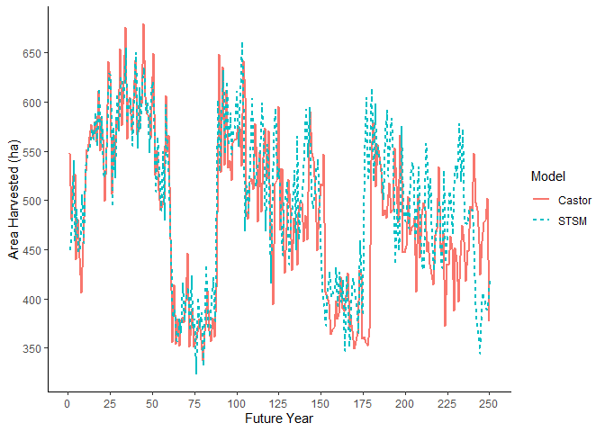<!-- -->

#### Average Age Harvested
The Castor model and STSM harvested similar aged stands for the first 100 years when modeling a harvest flow of approximately 133,600 m^3^ per year. However, during the first 10 to 15 years of the simulation, the Castor model appears to harvest stands at maximum 250 years old, compared to STSM which harvested stands 310 to 250 years old. This was because the Castor model was set-up to make stands greater than 250 years old equal to 250 years old to make stand ages consistent with the yield curves, i.e., the yield curves used in both models only went to 250 years old. Therefore, volumes were the same in both models for stands greater than 250 years old, but Castor tracked these stands as 250 year old stands. Despite this difference, both models harvested essentially identical aged stands from approximately year 15 to 100. The average age of harvested stands differed from years 100 to 250, where the age in the Castor model steadily increased over time, whereas the age in STSM was essentially level. This difference was likely because the Castor model could potentially have harvested 2% more volume over the long-term, resulting in stands being able to age slightly more in the Castor simulation than in STSM.

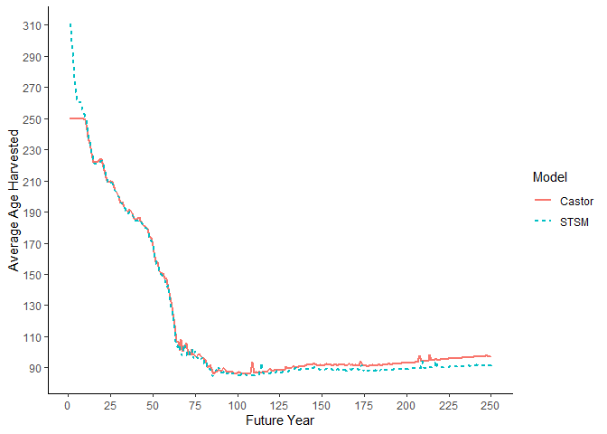<!-- -->

#### Merchantable Growing Stock
The trends in merchantable growing stock (i.e., volume in the THLB available for harvest) were similar between the Castor model and STSM. The amount of growing stock was close to identical between the models for the first 60 years. While the trends were the same after 60 years, the amount of growing stock began to diverge between the models, where growing stock in STSM was increasingly less than growing stock in the Castor model, up to a 9% (645,000 m^3^) difference by year 250. 

<!-- -->

#### Spatial Harvest Location
The spatial harvest sequence was very similar for both models in the first 50 years of the simulation, but not identical. The slight differences in areas that were harvested may have contributed to the divergent harvest flows seen in both models.

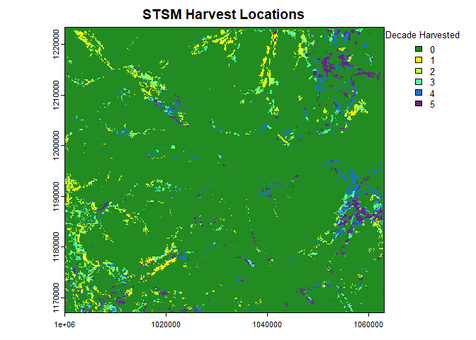<!-- -->

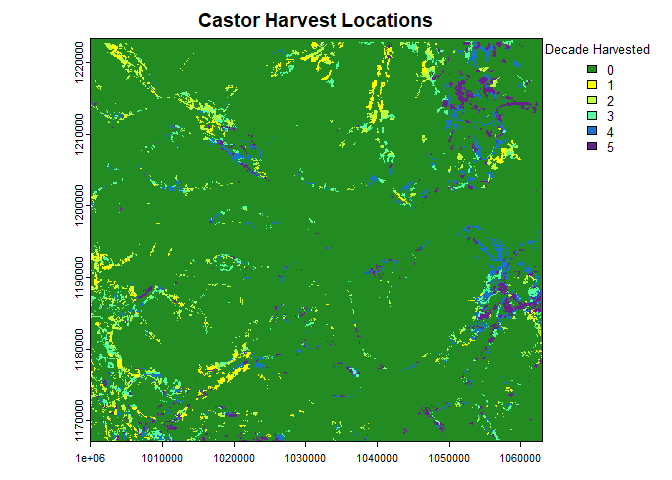<!-- -->

### Decadal Harvest Simulation
#### Harvest Flow
When modeling the maximum non-declining harvest flow of each model on a decadal basis, the Castor model was able to harvest approximately 135,000 m^3^ per year, approximately 1,000 m^3^ per year (<1%) less than in the annual model.
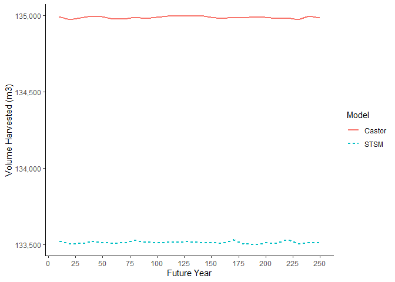<!-- -->

#### Area Harvested 
When modeling a harvest flow of approximately 133,600 m^3^ per year, the Castor model and STSM had comparable harvest area patterns, i.e., peaks and troughs in area harvested over time generally coincided in both models. However, the models began to diverge slightly at approximately year 70, where STSM harvested more area than the Castor model. From that point on, while both models followed a similar general trend in area harvested (i.e., a trough between approximately years 150 to 175 and a peak at approximately year 190), STSM generally harvested more area than Castor.

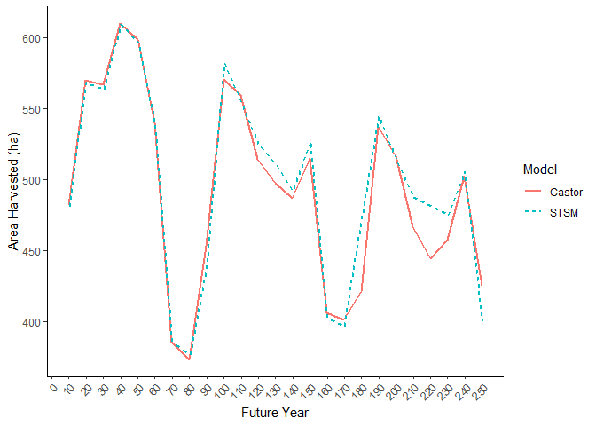<!-- -->

#### Merchantable Growing Stock
The trends in merchantable growing stock were similar between the Castor model and STSM. However, STSM had consistently higher growing stock estimates than the Castor model up to year 80, and then both models began to converge between years 80 to 250. 

<!-- -->

### Blocking Simulation
#### Characteristics of Harvest Blocks 
The spatial distribution of blocks that were predetermined in the Castor model is shown in the map below. 

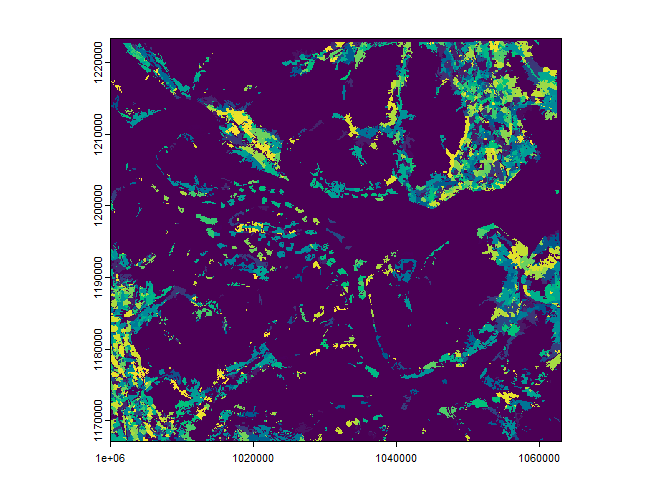<!-- -->

In the Castor model, the predetermined block sizes were right-skewed (i.e., there were many smaller blocks and few large blocks). The Castor initial mean block size was 28 ha, median block size was 7 ha and maximum block size was 320 ha. This block size distribution was used to parameterize STSM and thus average output of harvest block sizes were similar between STSM and Castor. STSM had a mean harvest block size of 20 ha and median block size of 8 ha, and Castor had a mean harvest block size of 22 ha and median block size of 6 ha. Both models harvested a similar distribution of block sizes but STSM harvested more medium sized blocks (20-40 ha in size), fewer large blocks (100-200 ha in size), and more very large blocks (greater than 260 ha in size) than Castor.

<!-- -->

#### Harvest Flow
Both models harvested less volume when blocking was implemented. The Castor model harvested 130,000 m^3^/year with blocking, a 3% decline (3,600 m^3^/year) from the Castor model without blocking. The STSM model with blocking harvested 127,000 m^3^/year, a 5% decline (6,600 m^3^/year) from the STSM model without blocking. There was approximately 2% less volume harvested in STSM compared to the Castor model when blocking was simulated in the models. Therefore, pre-defining blocks resulted in lower timber supply in both models, but the STSM method was slightly more constraining on timber supply.

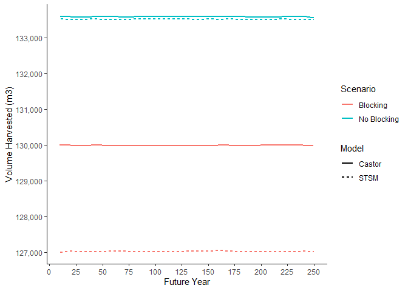<!-- -->

#### Area Harvested 
When blocking was implemented in the models they had similar overall patterns in the amount of area harvested throughout the simulation, with corresponding timing in the peaks and valleys in area harvested. However, there were small differences in the amount of area harvested at a given time period, and the general trend was that Castor consistently harvested more area than STSM, with a few exceptions (e.g., decades 80 and 90).

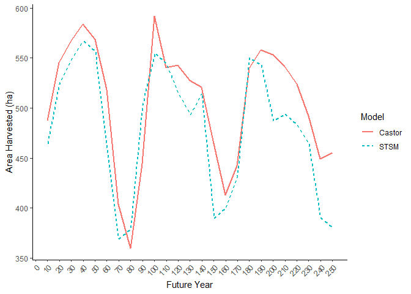<!-- -->

#### Merchantable Growing Stock
The overall trends in merchantable growing stock were similar between the Castor model and STSM. However, the models increasingly diverged, and this divergence increased quite a bit at approximately year 70, where the Castor growing stock reached a plateau at approximately 5M m^3^ compared to STSM which reached approximately 6M m^3^ before increasing to approximately 6.5M m^3^ at year 250.

<!-- -->

#### Spatial Harvest Location
Despite the similarities in harvest volume flows, blocking resulted in some differences in the spatial distribution of harvest between the two models over the first 50 years of the simulation. At the scale of the area-of-interest, the spatial distribution was generally similar, with more harvest in the southwest and northern parts in the first two to three decades of the simulation, shifting to more harvest in the eastern portion of the area in the fourth and fifth decades. However, there were some differences at finer scales. For example, there was more harvest in the northwest portion of the area in later decades in the Castor model compared to STSM.

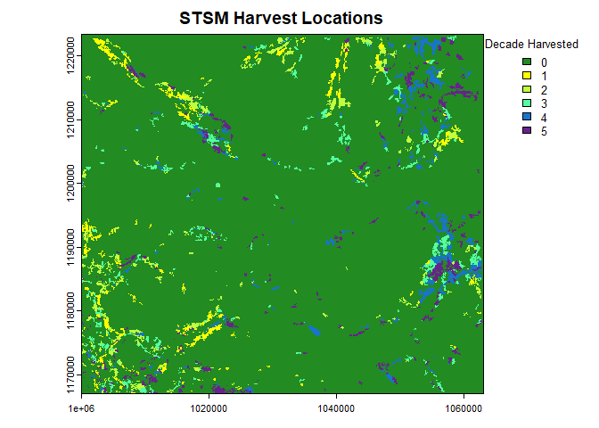<!-- -->

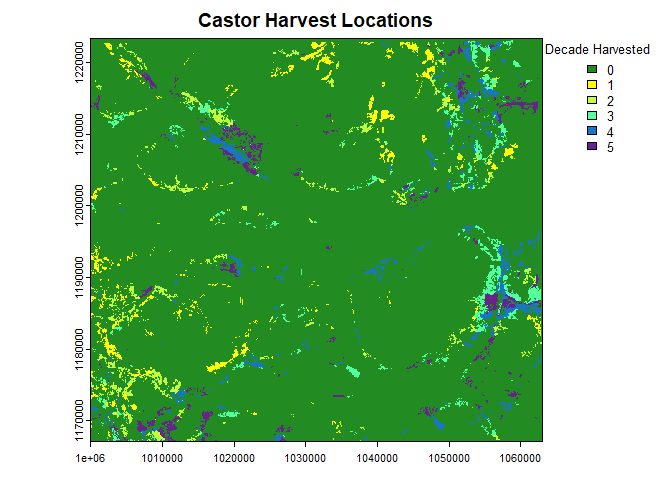<!-- -->

### Roads Simulation
#### Road Development Pattern
In the initial state of the models there were 23,938 ha (7% of the study area) that were classified as being roaded. Existing roads were concentrated in the northeast, central and southwest portions of the area of interest. Few existing roads were located in the northwest portion of the area of interest. 

<!-- -->

At the end of the road simulation, Castor had simulated roads in 38,671 ha (11%) and STSM simulated roads in 39,991 ha (11%) of the area of interest. Thus, STSM simulated slightly more roaded areas than Castor but they were remarkably similar (i.e., a difference of less than 1% of the area of interest).

The difference in road development patterns are illustrated below in the northwest corner of the study area where there were few existing roads at the start of the simulation. Existing roads are indicated in black and roads simulated by Castor are indicated in purple in the top figure. The bottom figure shows all roads in STSM, including existing and simulated. While the branching pattern fo the roads is somewhat different, the overall broad pattern is similar, as roads followed the least-cost path to develop a road system. 

<!-- -->

<!-- -->

Despite the broad-scale similarities in road development, the patterns in the timing of road development were notably different between the two models. Castor built the bulk of its roads early in the simulation, exclusively following the 'oldest first' priority queue, whereas STSM included additional constraints, i.e., blocks must be within 2km of the active road network. This essentially delayed road development in STSM relative to Castor to approximately the middle of the simulation (i.e., years 75 to 125).

<!-- -->

### No Harvest Constraint Simulation
When the models were run with a no harvest zone in the eastern portion of the area of interest (outlined in green over the timber harvest land base), the Castor model harvested 117,500 m^3^/year, 12% less than without the no harvest zone, and the STSM model harvested 120,216 m^3^/year, 10% less than without the no harvest zone. Thus the two models were approximately 2% different, consistent with the harvest flow without constraints.

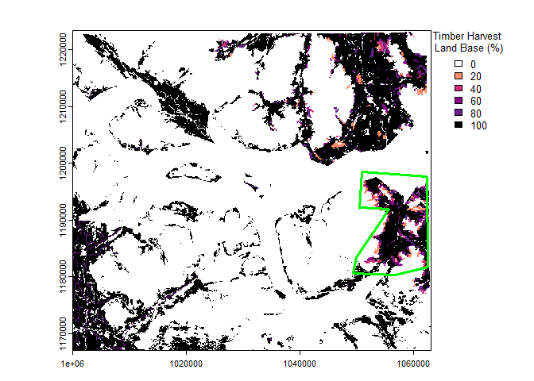<!-- -->

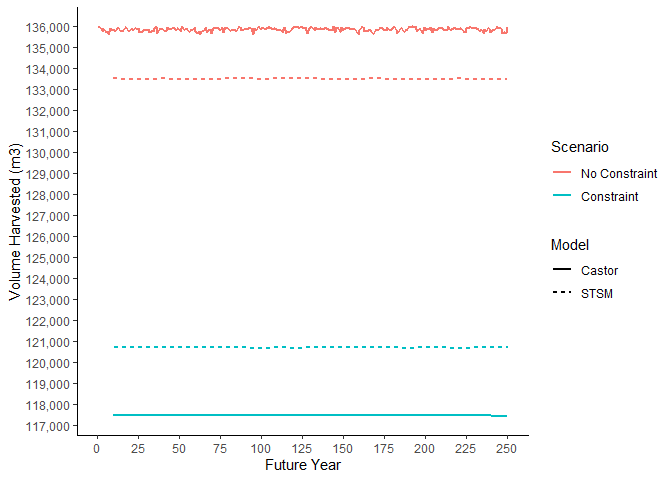<!-- -->

### Forest Cover Constraint Simulation
When the models were run with a modified harvest zone (i.e., at least 75% of the productive forest in the zone greater than 175 year-old forest) in the eastern portion of the area of interest, the Castor model harvested 123,500 m^3^/year, 9% less than without the modified harvest zone, and the STSM model harvested 125,000 m^3^/year, 6% less than without the no modified zone. The difference between the two models was 1,500 m^3^/year (approximately 2%).

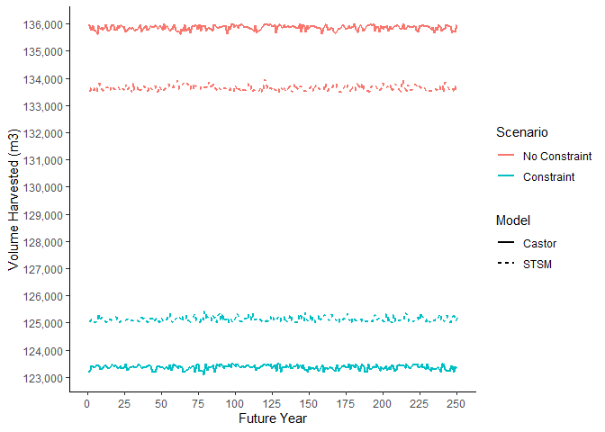<!-- -->

## Conclusions
We conclude that Castor and STSM are similar in terms of estimating long-term timber supply despite the minor differences in logic between both models. However, at its simplest parameterization, Castor was able to harvest ~2% more timber volume per year than STSM, and thus appears to be slightly more optimistic in terms of timber supply estimates. This difference was likely because the models used different methods to update forest stand volumes at each time interval, i.e., Castor updated volume to the midpoint of a time interval, whereas STSM updated volume each year. In all scenarios, growing stock, age and area harvested indicators generally diverged between Castor and STSM as the simulation progressed. While these divergences did not result in significantly different timber supply estimates over a 250 year simulation period, it is worth noting that model outputs are less likely to be the same, the longer that a simulation is run. 

When blocking was implemented, the timber supply was reduced by a similar amount in both models with a 2% difference between them. Again, STSM harvested 2% less timber volume than Castor, suggesting that the different blocking methods used in each model achieved similar results. However, Castor consistently harvested more area when blocking was implemented, suggesting that somehow Castor's pre-blocking algorithm was causing the model to harvest more area to obtain similar volumes as STSM. The homogenization of harvest blocks in Castor may have resulted in the creation of relatively larger and lower volume harvest blocks compared to STSMs spreading approach. 

At a coarse scale, Castor and STSM simulated similar amounts of roads. There were differences in the road development pattern at fine-scales, but these did not appear to result in significant differences in the road pattern across larger areas and over a long-term simulation period. The fine-scale differences in the simulated patterns likely reflect the differences between allowing some dynamic development of roads in response to the harvest queue (Castor) and pre-determination of the entire road network (STSM). The STSM approach assumes perfect information of harvest locations across the simulation time horizon, whereas the Castor approach assumes limited information concerning harvest locations (i.e., a single period of locations). Pre-determination of the entire road network may result in greater efficiency in road development in some cases, whereas a dynamic approach may allow for flexibility, which may be useful in scenarios where other ecological drivers of landscape change, such as fire, influence the harvest queue. The differences in the timing of road development were likely simply due to the additional constraint in STSM to limit the harvest queue to blocks within 2 km of a road. If a similar constraint were applied in Castor it would likely approximate the road development pattern seen in STSM.   

When forest cover constraints were applied, again the models were within 2% of each other in terms of annual timber supply. However, in this case STSM was able to achieve slightly more volume than the Castor model, likely due to the differences in how each model reserved areas to achieve the cover constraints. STSMs approach to reserving pixels in the zone in ascending order above the variable threshold, compared to Castors approach of reserving pixels in descending order from the highest value in the zone likely allowed STSM to harvest slightly older stands and thus achieve greater volume from zones with forest cover constraints 

In summary, with the same data and parameterizations, STSM and Castor were able to achieve remarkably consistent results in terms of timber harvest flow, other forest harvest indicators (e.g., average harvest age, growing stock), and road development. This provides confidence in the approaches used by both models to estimate timber supply. In addition, given the similarity in results to STSM, the results suggest that it would be reasonable to use Castor for timber supply modeling in the province. 
