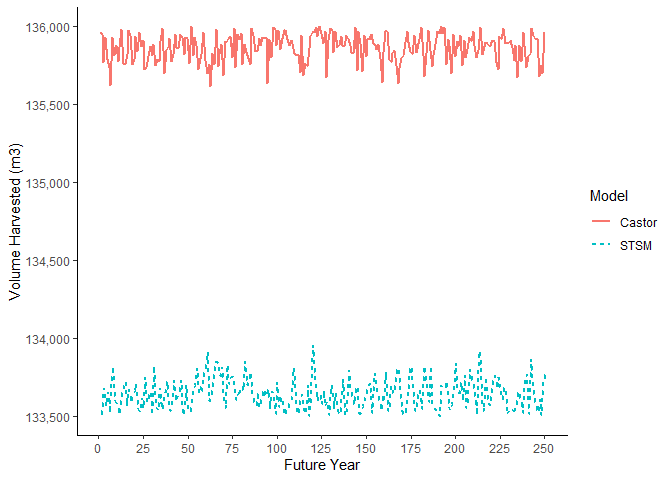
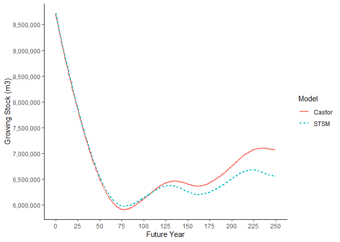
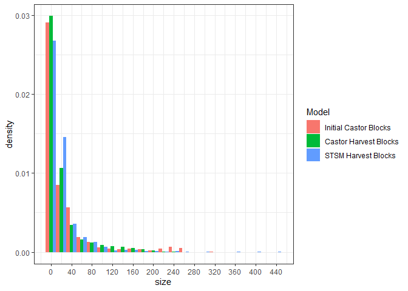
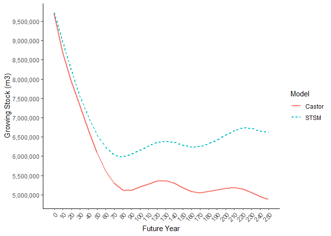
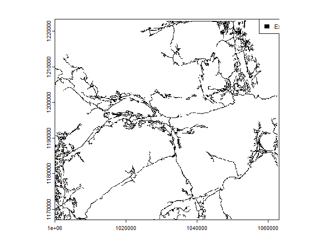
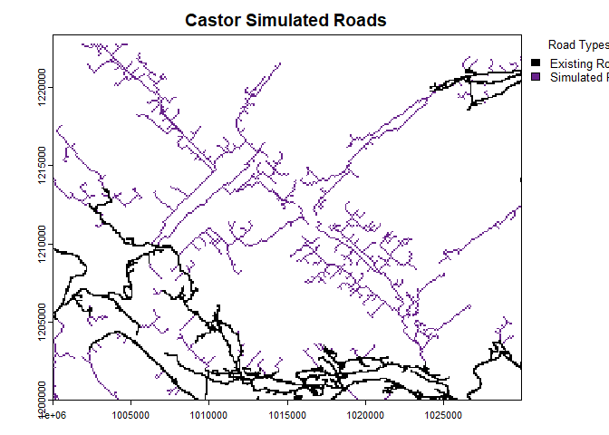
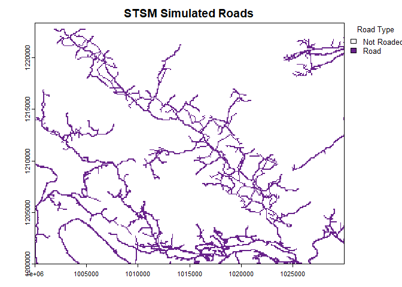
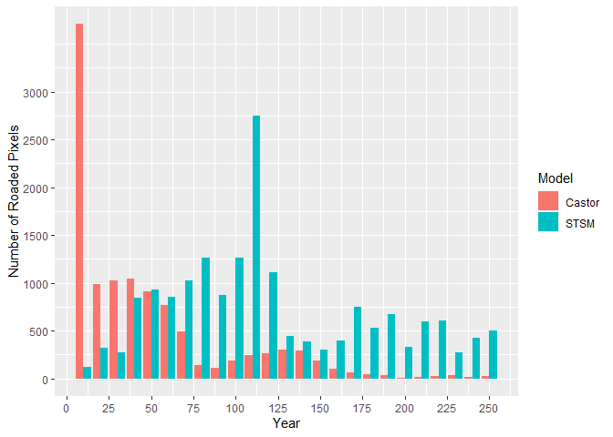

## Introduction
The purpose of this report is to compare [Castor, a forestry and land use simulator model](https://github.com/bcgov/castor) built using the [Spatial Discrete Event Simulation (SpaDES)](https://spades-core.predictiveecology.org/) package in program R, to the Spatially Explicit
Timber Supply Model (STSM) built using the [Spatially Explicit Landscape Event Simulator  (SELES)](https://citeseerx.ist.psu.edu/document?repid=rep1&type=pdf&doi=14729e8f5430035cead9f38e708f4507c543ff9d) platform. These models were compared to test whether the Castor model approximates results from STSM when using the same input data to complete a timber supply analysis. 

STSM has been used to conduct timber supply analyses in support of allowable annual cut (AAC) determinations in British Columbia since the mid-2000's. Therefore, it has been refined over a relatively long-period of time. The high frequency in use cases has deemed it an accepted and valid model for completing timber supply reviews by the government of British Columbia. Castor was more recently developed, starting in 2017, by the Strategic Analysis Team in the Forest Analysis and Inventory Branch as an open source tool using the [R programming language](https://www.r-project.org/), which provides a relatively large user and developer base with a diversity of analytical functions (including data wrangling, statistical analyses and data visualization). To date it has primarily been used to support strategic decisions around habitat protections for species-at-risk such as caribou (*Rangifer taranadus caribou*) and fisher (*Pekania pennanti*). Therefore, Castor has not been as widely used as STSM and has not yet been approved for use in timber supply reviews.

To improve confidence in output results from Castor and support the use of Castor as a model for strategic decision making processes, possibly including timber supply reviews, we compared Castor to STSM. This comparison also provides an opportunity to explore and discuss alternative approaches to simulating timber harvest and future forest conditions. While the comparison between these models could result in numerous metrics and analyses, we focus the comparison on a primary set of metrics commonly used in timber supply modelling, namely: the volume and area harvested, average age of the stand harvested. merchantable growing stock projections, forest cover constraints and road network development.

## Methods
To compare the two models, a small area of interest (approximately 350,000 ha in size) was created in the central part of the Mackenzie timber supply area of British Columbia. Both models used the same data and information within that area, including the same forest inventory to provide current (2022) forest stand characteristics, growth and yield estimates for natural and planted stands in the inventory, estimated from the the Variable Density Yield Projection (VDYP) and Table Interpolation Program for Stand Yields (TIPSY) models, respectively, including their assumptions concerning their transitions following harvesting, and the timber harvest land base (THLB) to define the area of forest available to harvest.

### Model Framework
#### Similarities Between Castor and STSM
Castor and STSM are not optimization models, i.e., they do not search for maximum or minimums of the objective function to find timber harvest patterns that will either maximize the amount of timber volume that can be harvested or minimize the cost to harvest timber volume over time. Instead, they spatially simulate timber harvest patterns based on 'greedy' heuristics regarding harvest practices (i.e., they make short-term optimal choices), and estimate timber volume that can be harvested over time given those practices. The simple heuristic nature of these models omits any information about the future in their decision-making processes, thus these models are reactive to short term information. 

Castor and STSM are a class of model called discrete event-based simulators where events, for example, forest stand growth, forest harvesting, forest cover constraint achievement and roading, are scheduled in discrete time. Technically, any future event can be programmed in either Castor or STSM to represent some process of interest (i.e., fire, wind, drought, insect attack, seed dissemination, etc). Both models are programmed to simulate timber harvest activities based on meeting a timber volume demand, following a harvest priority queue (e.g., oldest stands first), potentially with ‘partitions’ of the volume (i.e., spatial sub-zones or ‘compartments’, or forest stand types), and within the legal requirements of the land base (i.e., satisfy the requirements of zones with rules that restrict forest harvest in some way to meet some other objective, such as wildlife habitat). Both Castor and STSM estimate timber supply outcomes by simulating changes to forests and forest harvest activity over space and time.

#### Differences Between Castor and STSM
Functionally, the models were set up the same way in terms of discrete event based simulations, but it is important to note that there are key differences between how these models are instantiated. STSM uses a combination of raster Tag Image File Format (TIFF) geo-referenced images and text tables, whereas Castor leverages database functionality by using an SQLite database containing relational tables to ease the process of scaling models to very large spatial extents. Both models have flexibility in how things like minimum harvest criteria and the harvest queue are parameterized, but how they interact with data is different due to the fundamental differences in their data structures. 

Castor's approach is to have the user input simple SQL queries of forest stand characteristics (e.g., age, volume, height) for setting model parameters. Specifically, model parameterization leverages SQL injection, which allows users familiar with SQL to navigate the model easily and intuitively. For example, the minimum harvest and age criteria used here was parameterized as ' vol > 149 AND age > 79 '. Similarly, and oldest first priority queue was parameterized as ' age DESC '. These queries were integrated into the model as parameters that were called within functions created in program R, and these functions were organized and scheduled using the SpaDES framework. The benefit of using the SpaDES package in R stems from modelling philosophies common to predictive ecology: reproducibility, reusability, transferability, interoperablility, accessibility, and continuous workflows that are routinely tested ([McIntire et al. 2022](https://besjournals.onlinelibrary.wiley.com/doi/pdfdirect/10.1111/2041-210X.14034)). Modelling outputs from Castor are visualized in a cloud-based application to allow any user with an internet connection to view and compare scenarios. The forest structure being tracked by Castor is limited by the outputs from the growth and yield models which include: forest stand age, height, species, basal area, quadratic mean diameter, and crown closure, and deciduous and coniferous merchantable volume, coarse woody debris, and various forest product yields.

STSMs approach was to use locally stored TIFFs and text files with parameter definitions specific to the [SELES modeling language](http://www.ncgia.ucsb.edu/SANTA_FE_CD-ROM/sf_papers/fall_andrew/fall.html). Data and information were organized in a specific folder structure to allow users to navigate the inputs. These get integrated into functions, and are organized and scheduled within the SELES program. The SELES program provides an interactive graphical user interface to allow users to navigate parameters and view various outputs in real time. SELES has a large library of programmed landscape events for users to leverage which makes it relatively easy to create and customize a landscape simulation. Some of these landscape events include fire, insect infestation, oil and gas development and various wildlife habitat indicators. The forest structures being tracked by STSM includes: forest stand age, height, and species, and deciduous and coniferous merchantable volume.  

Other differences between Castor and STSM worth mentioning are the development of the harvest queue and forest cover constraint achievement. STSM updates its harvest queue four times a year, whereas Castor's harvest queue was calculated once at the start of a time interval. STSM included a 'look-ahead' function, where the model determined whether a pixel (i.e., a 100 m by 100 m square, which was the spatial resolution of both models) or harvest block achieved the minimum harvest criteria (minimum 80 years old and volume 150 m^3^/ha) by the end of the time interval minus 1 year (i.e., t-1). For example, in this case it checked whether the target was achieved at year 9 of a 10 year interval, and if it met the criteria at year 9 of the interval than the stand was available for harvest at any time during the interval, otherwise it was not. Castor did not have this functionality at the time of this analysis. 

Several other important differences exist between these two models such as yield updating, harvest blocking, roading and forest cover constraints. The effects of these differences were explicitly tested in this analysis and therefore these differences are documented in more detail in their respective sections below.

#### Yield Update
The Castor and STSM models had different approaches for updating growth and yield values (e.g., volume, height) of forest stands at simulation period intervals. The effect of these different approaches on timber supply estimates was tested.  

##### Castor
The Castor model updated growth and yield estimates at the mid-point of a simulation interval. Therefore, if a simulation interval was a decade, in the first interval Castor updated the growth and yield estimates of forest stands to year five of the simulation by interpolating the estimates between the initial age and initial plus ten year age from the growth and yield model. For example, if the initial stand volume was 150 m^3^/ha at year 0 of the simulation, and 170 m^3^/ha ten years from year 0, then the Castor model would use 160 m^3^/ha as the volume estimate for the stand at the first simulation interval. Castor then updated stand age and growth and yield estimates at ten year intervals from there. For any stands that were harvested in an interval, Castor updated the stand age to 0 at the mid-point. Therefore, in subsequent mid-points the stand would age 10 years. The key point here is that the amount of volume harvested is first accounted for by Castor at the middle of the first simulation interval, not the beginning or end of the interval. This approach assumes that a stand will be harvested at some point within the interval, which relaxes the assumption around the spatial harvesting sequence within an interval.  

##### STSM
In contrast to Castor, STSM estimated growth and yield at each year of a simulation. When a simulation interval was longer than a year, STSM divided the harvest request equally by the number of years in the interval, and updated growth and yield estimates at each year when a stand was harvested in an interval. Therefore, if a stand was harvested in year one of a ten year interval, volume estimates were interpolated to the first year of the growth and yield estimates. For example, if the initial stand volume was 150 m^3^/ha at year 0 of the simulation, and 170 m^3^/ha ten years from year 0, and the stand was harvested in the first year of the interval, then the STSM model would use 152 m^3^/ha as the volume estimate for the stand at the first simulation interval. The year that each stand was harvested in an interval was then multiplied by -1 (e.g., year 1 = -1, year 2 = -2, year 3 = -3,  etc.) and then in the next interval stands were aged 10 years (i.e., stand ages became 9, 8, 7, etc.) and growth and yield estimates were updated accordingly. Therefore, in STSM the amount of volume harvested in an interval was accounted for annually and then summed across the simulation interval. This approach assumes that a stand will be harvested in a specific year and thus follows a specific spatial harvesting sequence.

#### Harvest Blocking
Scenarios with and without blocking were simulated to compare how the two models created harvest blocks, and their potential effects on harvest flow. When blocking was not simulated, both models selected harvest areas at a 1 ha spatial resolution (a pixel) using the harvest priority criteria (i.e., oldest first). Therefore, each pixel was harvested independently, in order of its age, and there was no defined spatial pattern or aggregation of pixels to form blocks.    

##### Castor
Castor used a graph-based agglomerative hierarchical clustering method to pre-define harvest blocks prior to the simulation. This method searches the landscape and groups pixels with similar forest characteristics (i.e., crown closure and height) and in close spatial proximity (i.e., Euclidean distance) into clusters defined as homogeneous forest types, subject to a patch size distribution. It evaluated whether to cluster pixels together using a multivariate distance metric (i.e., the Mahalanobis distance statistic), which measures how far an individual pixels vector of stand characteristics are from the multivariate distribution of those characteristics in neighbouring pixels. If the Mahalanobis distance was below a threshold (in this case the default value of 6), then a pixel was grouped into a cluster.

Since the method is agglomerative, pixels were iteratively grouped together one at time with neighboring pixels that had the least multivariate distance between them. The agglomeration would continue until there weren’t any similar pixels left or the maximum block size in a distribution was met. Block sizes were determined by drawing from a distribution of block sizes defined for natural disturbance types (see table below). Larger blocks were harder to find and were therefore prioritized on the landscape first and subsequently smaller blocks were added until blocking was complete. 

| Natural Disturbance Type | Size Class (ha) | Frequency |
|:------------------------:|:---------------:|:---------:|
|            1             |       40        |   0.300   |
|            1             |       80        |   0.300   |
|            1             |       120       |   0.100   |
|            1             |       160       |   0.100   |
|            1             |       200       |   0.100   |
|            1             |       240       |   0.100   |
|            2             |       40        |   0.300   |
|            2             |       80        |   0.300   |
|            2             |       120       |   0.100   |
|            2             |       160       |   0.100   |
|            2             |       200       |   0.100   |
|            2             |       240       |   0.100   |
|            3             |       40        |   0.200   |
|            3             |       80        |   0.300   |
|            3             |       120       |   0.125   |
|            3             |       160       |   0.125   |
|            3             |       200       |   0.125   |
|            3             |       240       |   0.125   |
|            4             |       40        |   0.100   |
|            4             |       80        |   0.020   |
|            4             |       120       |   0.020   |
|            4             |       160       |   0.020   |
|            4             |       200       |   0.020   |
|            4             |       240       |   0.800   |
|            5             |       40        |   0.300   |
|            5             |       80        |   0.300   |
|            5             |       120       |   0.100   |
|            5             |       160       |   0.100   |
|            5             |       200       |   0.100   |
|            5             |       240       |   0.100   |

##### STSM
STSM did not pre-define harvest blocks, but instead used a spreading algorithm to create blocks during the simulation. It selected pixels as starting points for the spreading process (i.e., 'seeds'), based on the harvest priority queue. A harvest block size for each seed was selected at random from a uniform distribution (defined using the block size distribution obtained from Castor to facilitate comparison of the models). The spreading algorithm from the seeded pixel to neighbouring pixels was based on age threshold criteria, where it was only able to spread to a neighbouring pixel that was within 20% of the age of the origin pixel, up to the selected block size. Block size targets were considered 'soft', i.e., they were approximate targets, and they were required to be a minimum of 10 ha in size.   

#### Roads
Castor and STSM had different approaches to creating road networks related to forest harvest (i.e., a multiple access target problem). Simulations of both models were run to compare outputs of the roading algorithms and assess whether they achieved similar results. Below provides a description of the different approaches used by each model. 

##### Castor
Castor could simulate roads using multiple approaches, but the preferred method (after comparing and validating the approaches), described here, used a dynamic minimum spanning tree (MST). Castor pre-defined 'landings' (i.e., road targets for hauling timber) as a pixel on the edge of each pre-defined harvest block (see *Harvest Blocking*, above). Castor then simultaneously solved the least-cost path between landings, and the paths from landings to existing roads. Pixels on the edge of the area of interest that were existing roads were connected to the existing road network to work around cases where there were ‘islands’ of existing roads within the area of interest that were connected to areas outside of the area of interest. All least cost paths were solved using a computationally fast bi-directional A* algorithm that allows for multiple target locations (i.e., mills). The least cost paths followed a queen's case, where all eight neighbouring pixels were considered in a path. 

During the simulation, as harvest blocks were selected by the harvest priority queue, Castor 'built' the network of roads dynamically by connecting the landings in the selected blocks to existing roads (or the edge of the area of interest), following the identified least cost path in a MST. The MST connected all of the selected landings using [Kruskal's algorithm](https://en.wikipedia.org/wiki/Kruskal%27s_algorithm), which sorted the potential routes by their cost, and added the least costly road connections, without a loop or cycle, until the network was completed.

The least-cost path required a spatial cost-surface model as its input, where each pixel was attributed a cost of building a road based on factors such as terrain, water and land designations. The same cost-surface model was used in both the Castor model and STSM, but the relative difference in cost values were inflated for use in Castor by taking the square of the cost values. Therefore, instead of values between 1 and 62, the values were scaled between 1 and 3844. We found this was necessary to fit reasonable least-cost paths in Castor based on review of the outputs. Castor roading can be highly sensitive to the cost surface since the objective function is to minimize the cost of building roads. The purpose of this sensitivity was to model highly complex roads in complex terrain by accounting for operational considerations (i.e., switch backs).

##### STSM
STSM also pre-processed the road network, but the network was not dynamically created during a simulation, Instead the entire network was 'built' at the start of the simulation and roads were dynamically activated or deactivated during the simulation as they were needed to access blocks selected in the harvest queue.

Similar to Castor, inputs to the STSM model included a cost-surface and existing road network. In addition, STSM required the location of 'exit points' (i.e., destinations), which were locations where timber hauling ended, such as mills or the exit locations of highways from the area of interest.  

STSM pre-processed a simulated road network by sampling locations in areas of the THLB that were greater than a specified distance from an existing road (in this case 1 km). Locations further from an existing road had a higher probability of being selected. STSM then solved the road network by iteratively connecting the sampled locations to destination points following a least-cost path until all locations were within 1 km from an existing road. Therefore, an entire road network that could connect to all locations within 1 km of any portion of THLB was created prior to the simulation. During the simulation, as blocks were selected in the harvest queue, a landing was selected in the block and a straight line (as a crow flies) road was created to connect it to the road network (existing or simulated roads). The least cost paths could follow a rooks case, where neighbouring pixels in four cardinal directions were considered in a path.   

When running the STSM simulation, an additional constraint was included to weight the harvest queue to prioritize selecting blocks closer to, and within a specified distance from active roads (in this case a distance of 2 km was used) to limit the projection of “long roads”. This had the effect of limiting the extent of road development from one time interval to the next. This constraint was not implemented in Castor. 

#### Forest Cover Constraints
Here we included two scenarios to compare how Castor and STSM set aside areas to meet forest cover constraints. We created a 'dummy' management zone over the THLB in the eastern portion of the area of interest. In one scenario we set this as a no harvest zone, and in a second scenario we created a forest cover constraint where 75% of the productive forest (i.e., forested areas with a site index > 5) within the zone had to be greater than or equal to 175 years old. The no harvest scenario was run on a decadal time step and the forest cover constraint scenario was run with an annual time step to facilitate comparison.  

Both models used the same general approach to defining cover constraints, where a variable of interest (i.e., the forest stand or landscape condition that is desired), must achieve a desired threshold (i.e., greater than or less than a target value for the variable), over a specific percentage of the zone, within a land base definition (i.e., denominator) for the zone. However, there were differences in how each model selected areas to achieve forest cover constraints. These differences are described in more detail below. 

##### Castor
The Castor model set forest cover constraints by creating a binary variable that specified if a pixel in a management zone was above (0) or below (1) the constraint threshold. It then sorted the pixels based on this binary variable, and prioritized reserving pixels that met the threshold and were outside of the THLB, or that were previously reserved to meet another management zone constraint. Lastly, Castor sorted those selected pixels by the constraint parameter and reserved them until the desired threshold for the variable of interest was met. For example, in this analysis Castor prioritized reserving areas of productive forest in the zone that were greater than 175 years old and outside of the THLB, and then, if the constraint was not met (i.e., 75% of the productive forest in the zone had not been reserved), by reserving pixels in the THLB from oldest to youngest until the constraint was met. If the reserve area was not achievable, than it became a *de facto* no harvest area. Otherwise areas in the zone outside of the reserved pixels could be harvested, assuming they met the minimum harvest criteria and were selected in the harvest queue. Constraints were re-calculated at each interval of the simulation period.

##### STSM
STSM used a different approach to reserving pixels in forest cover constraint zones. First, STSM checked to see whether a constraint was met in a zone by summing the pixels above the desired threshold of the variable of interest in the area of interest. If the constraint was met (i.e., a sufficient percentage of area could be achieved to meet the constraint), then the entire reserve area became available to harvest. Otherwise, it was not harvested or it was designated as a recruitment area. In this case, a recruitment area was fully constrained (i.e., a no harvest zone) if the constraint was not met. However, if the constraint was met, then the zone was available to harvest, and harvest occurred freely in the area following the harvest queue (in this case oldest first) and subject to the merchantability criteria (in this case the minimum volume and age requirements) up until the constraint threshold was met (i.e., there was a limit on harvest). 

Consequently, in this case STSM put greater priority on reserving pixels closest to the threshold value by allowing the potential for pixels well above the threshold value to be harvested. Therefore, in this case a key difference between Castor and STSM was that STSM was more likely to allow harvest of areas well above the age threshold, whereas Castor was more likely to allow harvest of areas with a mix of age values. 

In both models, the pixels used to meet forest cover constraints did not meet any spatial configuration requirements. Pixels were reserved based only on their attribution and not their location. This may have the effect of creating fragmented reserved areas within the management zones. In cases where the spatial configuration of reserved areas is important (e.g., to create contiguous patches of habitat for wildlife), it may be valuable to add some spatial consideration to the pixel selection approach used in both models. 

We also note that STSM re-calculated constraints four times a year in a simulation, regardless of the time interval used.

### Model Parameters
In addition to using the same initial and projected forest conditions, the models were set-up with the same timber supply modeling parameters. This included a minimum harvest age of 80 years old, minimum harvest volume of 150 m^3^/ha, and no adjacency constraints. Each timber supply scenario (described below) was simulated to achieve a maximum sustainable harvest flow, i.e., the maximum volume that could be harvested across all time intervals without ever going down, over a 250 year simulation period. 

A non-declining merchantable growing stock was not considered in Castor, but was included in STSM, where the growing stock beyond year 150 could not drop more than 1% by the end of a 250 year time horizon. 

The spatial resolution of both models was 1 ha (also referred to as a *pixel*), and thus the area of interest was represented spatially as a grid of 100m by 100m pixels.

### Model Scenarios
We simulated five scenarios:

| Scenario Number |Scenario Names          | Time Interval | Harvest Blocking | Roading | Constraint Type |
|:---------------:|:-----------------------|:-------------:|:----------------:|:-------:|:---------------:|
|        1        |Annual Harvest          |    Annual     |        No        |   No    |      None       |
|        2        |Decadal Harvest         |    Decadal    |        No        |   No    |      None       |
|        3        |Harvest Blocking        |    Decadal    |       Yes        |   No    |      None       |
|        4        |Roading                 |    Decadal    |       Yes        |   Yes   |      None       |
|        5        |No Harvest Zone         |    Decadal    |        No        |   No    |   No Harvest    |
|        6        |Forest Cover Constraint |    Annual     |        No        |   No    |  Forest Cover   |

The first two scenarios had no roading and no harvest block definition, i.e., each 1 ha pixel was considered a harvest 'block'. Of these two scenarios, one was simulated with an annual time step to compare the two models without the effect of interpolating yield values between decadal periods. A second scenario was simulated with a decadal time step to show the effect of the different yield interpolation methods used by each model. The blocking and road scenarios allowed for comparison of how each model simulated harvest blocks and roads. The no harvest constraint scenario essentially removed a hypothetical forest management zone from the THLB. The forest cover constraint scenario applied an age-based constraint to the same zone.    

##	Results
The initial states of both models were checked to confirm that they were the same. The study area was 355,253 ha in size, of which 73,300 hectares was THLB, and the initial merchantable growing stock was 9,717,000 m^3^. In both models, the long-run sustained yield (LRSY) of current stands was calculated at 108,881 m^3^, the mean volume/ha was 179 m^3^ and the average mean annual increment (MAI) was 1.48 m^3^. The LRSY of managed stands was calculated at 235,930 m^3^. 

Below we compare the maximum non-declining even-flow harvest rate of each model for each scenario. As these harvest flows differed between both models, we also ran scenarios where we adjusted the Castor maximum non-declining harvest flow to fit the STSM harvest flow and compared the outputs, including average harvest age, area harvested and merchantable growing stock (i.e., amount of volume available to be harvested in the THLB).   

### Scenario 1: Annual Harvest Simulation
This scenario used an annual simulation time interval with no blocking and no roads.

#### Harvest Flow
When modeling the maximum non-declining harvest flow of each model on an annual basis, the Castor model was able to harvest approximately 136,000 m^3^ per year. STSM was able to harvest approximately 133,600 m^3^ per year. Thus, Castor was able to harvest slightly more volume (~1,400 m^3^ per year, or 2%).

<!-- -->

#### Area Harvested 
When modeling a harvest flow of approximately 133,600 m^3^ per year, the Castor model and STSM had comparable harvest area patterns, i.e., peaks and troughs in area harvested over time generally coincided in both models. However, the models began to diverge slightly at approximately year 130, where STSM harvested more area than the Castor model. From that point on, while both models followed a similar general trend in area harvested (i.e., a trough between approximately years 150 to 175 and a peak at approximately year 180) there were approximately 5-year differences in the timing of the peaks and troughs. Total area harvested across the 250 year period was 121,726 ha in Castor and 124,632 ha in STSM, a 2% difference.

<!-- -->

#### Average Age Harvested
The Castor model and STSM harvested similar aged stands for the first 100 years when modeling a harvest flow of approximately 133,600 m^3^ per year. However, during the first 10 to 15 years of the simulation, the Castor model appears to harvest stands at maximum 250 years old, compared to STSM which harvested stands 310 to 250 years old. This was a result of the Castor model set-up to make stands greater than 250 years old equal to 250 years old to make stand ages consistent with the yield curves, i.e., the yield curves used in both models only went to 250 years old. Therefore, volumes were the same in both models for stands greater than 250 years old, but Castor tracked these stands as 250 year old stands. Despite this difference, both models harvested essentially identical aged stands from approximately year 15 to 100. The average age of harvested stands differed from years 100 to 250, where the age in the Castor model steadily increased over time, whereas the age in STSM was essentially level. This difference was likely because the Castor model was constrained to harvest at the flow reported by STSM and could potentially have harvested 2% more volume over the long-term, resulting in stands being able to age slightly more in the Castor simulation than in STSM.

<!-- -->

#### Merchantable Growing Stock
The trends in merchantable growing stock (i.e., volume in the THLB available for harvest) were similar between the Castor model and STSM. The amount of growing stock was close to identical between the models for the first 60 years. While the trends were the same after 60 years, the amount of growing stock began to diverge between the models, where growing stock in STSM was increasingly less than growing stock in the Castor model, up to a 9% (645,000 m^3^) difference by year 250. 

<!-- -->

#### Spatial Harvest Location
The spatial harvest sequence was very similar for both models in the first 50 years of the simulation, but not identical. The slight differences in areas that were harvested may have contributed to the divergent harvest flows seen in both models.

<!-- -->

<!-- -->

### Scenario 2: Decadal Harvest Simulation
This scenario used a decadal simulation time interval with no blocking and no roads.

#### Harvest Flow
When modeling the maximum non-declining harvest flow of each model on a decadal basis, the Castor model was able to harvest approximately 135,000 m^3^ per year, approximately 1,000 m^3^ per year (<1%) less than in the annual model.

<!-- -->

#### Area Harvested 
When modeling a harvest flow of approximately 133,600 m^3^ per year, the Castor model and STSM had comparable harvest area patterns, i.e., peaks and troughs in area harvested over time generally coincided in both models. However, the models began to diverge slightly at approximately year 70, where STSM harvested more area than the Castor model. From that point on, while both models followed a similar general trend in area harvested (i.e., a trough between approximately years 150 to 175 and a peak at approximately year 190), STSM harvested more area (124,246 ha) than Castor (122,990 ha) across the 250 period, a 1% difference.

<!-- -->

#### Merchantable Growing Stock
The trends in merchantable growing stock were similar between the Castor model and STSM. However, STSM had consistently higher growing stock estimates than the Castor model up to year 80, and then both models began to converge between years 80 to 250. This was largely driven by Castor finding more harvest volume in less area which resulted in a smaller amount of growing stock.

<!-- -->

### Scenario 3: Harvest Blocking Simulation
This scenario used a harvest blocking algorithm and had a decadal time interval and no roads.

#### Characteristics of Harvest Blocks 
The spatial distribution of blocks that were predetermined in the Castor model is shown in the map below. Note that areas without blocks are indicated in purple.

<!-- -->

In the Castor model, the predetermined block sizes were right-skewed (i.e., there were many smaller blocks and few large blocks). The Castor initial mean block size was 28 ha, median block size was 7 ha and maximum block size was 320 ha. The initial block size distribution was used to parameterize STSM and thus average output of harvest block sizes were similar between STSM and Castor. STSM had a mean harvest block size of 20 ha and median block size of 8 ha, and Castor had a mean harvest block size of 22 ha and median block size of 6 ha. Both models harvested a similar distribution of block sizes but STSM harvested more medium sized blocks (20-40 ha in size), fewer large blocks (100-200 ha in size), and more very large blocks (greater than 260 ha in size) than Castor.

<!-- -->

#### Harvest Flow
Both models harvested less volume when blocking was implemented. The Castor model harvested 130,000 m^3^/year with blocking, a 4% decline (6,000 m^3^/year) from the Castor model without blocking. The STSM model with blocking harvested 127,000 m^3^/year, a 5% decline (6,600 m^3^/year) from the STSM model without blocking. There was approximately 2% less volume harvested in STSM compared to the Castor model when blocking was simulated in the models. Therefore, pre-defining blocks resulted in lower timber supply in both models, but the STSM method was slightly more constraining on timber supply.

<!-- -->

#### Area Harvested 
When blocking was implemented in the models they had similar overall patterns in the amount of area harvested throughout the simulation, with corresponding timing in the peaks and valleys in area harvested. However, there were small differences in the amount of area harvested at a given time period, and the general trend was that Castor consistently harvested more area than STSM, with a few exceptions (e.g., decades 80 and 90). Indeed, overall STSM harvested less area (120,066 ha) than Castor (123,365 ha) across the 250 period. 

<!-- -->

#### Merchantable Growing Stock
The overall trends in merchantable growing stock were similar between the Castor model and STSM. However, the models increasingly diverged, and this divergence increased quite a bit at approximately year 70, where the Castor growing stock reached a plateau at approximately 5M m^3^ compared to STSM which reached approximately 6M m^3^ before increasing to approximately 6.5M m^3^ at year 250.  This again can be explained by the greater amount of volume that could be harvested by Castor. However, this indicates that STSM could have potentially increased to a higher long-term harvest level, and therefore closer to Castor's harvest flow.

<!-- -->

#### Spatial Harvest Location
Despite the similarities in harvest volume flows, blocking resulted in some differences in the spatial distribution of harvest between the two models over the first 50 years of the simulation. At the scale of the area of interest, the spatial distribution was generally similar, with more harvest in the southwest and northern parts in the first two to three decades of the simulation, shifting to more harvest in the eastern portion of the area in the fourth and fifth decades. However, there were some differences at finer scales. For example, there was more harvest in the northwest portion of the area in later decades in the Castor model compared to STSM.

<!-- -->

<!-- -->

### Scenario 4: Roading Simulation
This scenario used a road algorithm with harvest blocking to develop a road network, and had a decadal time interval.

#### Road Development Pattern
Initially there was 23,938 ha (7%) of the area of interest that was classified as having a road. Existing roads were concentrated in the northeast, central and southwest portions of the area of interest. Few existing roads were located in the northwest portion of the area of interest. 

<!-- -->

At the end of the road simulation, Castor had simulated roads in 38,671 ha (11%) and STSM simulated roads in 39,991 ha (11%) of the area of interest. Thus, STSM simulated slightly more roaded areas than Castor but they were essentially the same (i.e., a difference of less than 1% of the area of interest).

The difference in road development patterns are illustrated below in the northwest corner of the study area where there were few existing roads at the start of the simulation. In the top figure, existing roads are indicated in black and roads simulated by Castor are indicated in purple. The bottom figure shows all roads in STSM, including existing and simulated. While the branching pattern of the roads is somewhat different, the overall broad pattern is similar, as roads followed the least-cost paths in Castor and a combination of snapping roads and least cost roads in STSM to develop a road system. A notable difference is the greater level of branching or fractal patterns observed in Castor and the greater level of loops observed in STSM. We assume a more similar road network would be achieved if Castor was constrained to harvest within 2 km of the existing road. 

<!-- -->

<!-- -->

Despite the broad-scale similarities in road development, the patterns in the timing of road development were notably different between the two models. Castor built the bulk of its roads early in the simulation, exclusively following the 'oldest first' priority queue, whereas STSM included additional constraints, i.e., blocks must be within 2km of the active road network. This essentially delayed road development in STSM relative to Castor to approximately the middle of the simulation (i.e., years 75 to 125).

<!-- -->

### Scenario 5: No Harvest Constraint Simulation
This scenario applied a no harvest constraint with decadal time intervals, but no blocking or roads.  When the models were run with a no harvest zone in the eastern portion of the area of interest (outlined in green over the timber harvest land base), the Castor model harvested 117,500 m^3^/year, 14% less than without the no harvest zone, and the STSM model harvested 120,216 m^3^/year, 10% less than without the no harvest zone. Thus the two models were approximately 4% different, but the effect was greater in Castor than STSM.

<!-- -->

<!-- -->

### Scenario 6: Forest Cover Constraint Simulation
This scenario applied a forest cover constraint with decadal time intervals, but no blocking or roads. When the models were run with a modified harvest zone (i.e., at least 75% of the productive forest in the zone greater than 175 year-old forest) in the eastern portion of the area of interest, the Castor model harvested 123,500 m^3^/year, 9% less than without the modified harvest zone, and the STSM model harvested 125,000 m^3^/year, 6% less than without the no modified zone. The difference between the two models was 1,500 m^3^/year (approximately 2%).

<!-- -->

## Discussion
We conclude that Castor and STSM are similar in terms of estimating long-term timber supply. Despite the differences in the analytical frameworks developed for each modeling platform, at their simplest parameterization, Castor harvested only ~2% more timber volume per year than STSM, and thus appears to be slightly more optimistic in terms of timber supply estimates. While it was difficult to determine whether different results from the two models were due to their parameterization or analytical frameworks, we argue the most likely driving factor for the observed differences was that the models used different methods for updating forest stand yields (i.e., merchantable volume) at each time interval, i.e., Castor updated yields to the midpoint of a time interval, whereas STSM updated volume each year and using the “look-ahead" function. While one approach assumes a bias using the mid-point, the other approach assumes a bias from strictly following an annual spatial harvest sequence. The difference between these two approaches remains philosophical, as it was not possible to test their validity using empirical methods. In addition, small differences in rounding (STSM used two decimal places whereas Castor used floating point) and the development of the harvest queue may also have contributed to these differences.

In all scenarios, merchantable growing stock, forest stand age and area harvested indicators generally diverged between Castor and STSM as the simulation progressed past 70 to 100 years. While these divergences did not result in significantly different timber supply estimates over a 250 year simulation period, it is worth noting that model outputs are less likely to be the same, the longer that a simulation is run. This outcome is common for models that simulate decisions conditional on previous decisions (e.g., a Markov process).

When blocking was implemented, the timber supply was reduced by a similar amount in both models with a 2% difference between them. Again, STSM harvested 2% less timber volume than Castor, suggesting that the different blocking methods used in each model achieved similar results. However, Castor consistently harvested more area when blocking was implemented, suggesting that Castor's pre-blocking algorithm was causing the model to harvest more area to obtain similar volumes as STSM. The homogenization of harvest blocks based on stand characteristics that was implemented in Castor may have resulted in the creation of relatively larger and lower volume harvest blocks compared to STSMs spreading approach, which created more medium sized harvest blocks that were likely more diverse in terms of forest stand characteristics. 

At a coarse scale, Castor and STSM simulated similar amounts of roads. There were differences in the road development pattern at fine-scales, but these did not appear to result in significant differences in the road pattern across larger areas and over a long-term simulation period. The fine-scale differences in the simulated patterns likely reflect the differences between allowing some dynamic development of roads in response to the harvest queue (Castor) and pre-determination of the entire road network (STSM). The STSM approach assumes perfect information of harvest locations across the simulation time horizon, whereas the Castor approach assumes limited information concerning harvest locations (i.e., a single period of locations). Pre-determination of the entire road network may result in greater efficiency in road development in some cases, whereas a dynamic approach may allow for flexibility, which may be useful in scenarios where other ecological drivers of landscape change, such as fire, influence the harvest queue. The differences in the timing of road development were likely simply due to the additional constraint in STSM to limit the harvest queue to blocks within 2 km of a road. If a similar constraint were applied in Castor it would likely approximate the road development pattern seen in STSM.   

When a no harvest zone or forest cover constraint zone were applied, the models were similar (within 4%) in terms of annual timber supply. However, the constraint scenarios had a greater effect on timber supply in the Castor model than STSM. This may have been because removing that portion of the THLB exacerbated a pinch point in the age class distribution of harvested stands in the Castor model. In the forest cover constraint scenario, STSM may have also able to achieve slightly more volume than the Castor model due to the differences in how each model reserved areas to achieve the cover constraints. STSMs approach to reserving pixels in the zone in ascending order above the variable threshold, compared to Castors approach of reserving pixels by first prioritizing non-THLB, then areas already reserved, followed by a descending order from the highest value in the zone likely allowed STSM to harvest slightly older stands and thus achieve greater volume from zones with forest cover constraints. This effect may be different in forest types whose yields decline (i.e., due to decay and breakage) at older ages rather than asymptote at older ages.

## Conclusions
In summary, when using the same data and basic parameterizations, STSM and Castor were able to achieve remarkably consistent results in terms of timber harvest flow, other forest harvest indicators (e.g., average harvest age, growing stock), and road development. While Castor seemed to find slightly more merchantable volume to harvest under the annual, decadal and blocking scenarios, it found slightly less merchantable volume to harvest under the forest cover constraints, relative to STSM. We believe these small differences would likely offset each other in more complex simulation scenarios that include blocking, roading and multiple forest cover constraints. 

The results provide confidence in the approaches used by both models to estimate timber supply. While the complexity of each individual process (e.g., roading, blocking) used in each model was different, their conclusions were quite similar. Given the similarity in results between Castor and STSM, we found Castor to be an effective tool for timber supply modeling in British Columbia. 
